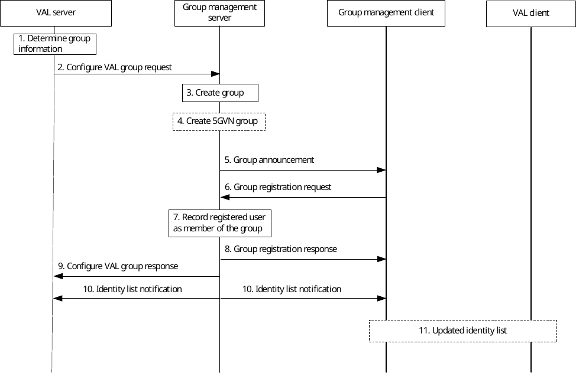

# 10.3.8 Group announcement and join

## 10.3.8.1 General

This subclause describes the procedures for establishing group communication from the group management server to the group management clients.

## 10.3.8.2 Procedure

Pre-conditions:

1\. The group management client, group management server, VAL server and the VAL clients belong to the same VAL system.

2\. The VAL server is aware of the users' identities and is authorized to form a VAL group.

Figure 10.3.8.2-1: Procedure for establishing VAL group communication between the group management server and group management client1.

1\. The VAL server determines group information and the identity list to which the group announcement shall be sent. The decision can be based on the list of authorized UEs and other criteria (e.g. user consent, service, or vehicle driving profile).

2\. The VAL server configures VAL group for Uu communication defined by VAL Group ID for one or more VAL services with list of VAL Service ID with the group management server.

3\. The group management server creates an empty group based on the information provided in the Configure VAL group request. The group management server stores the mapping between the VAL group ID and the external Group Id in the VAL group document, along with a list of GPSIs corresponding to the identity list provided by the VAL server. The group management server also determines whether the group is for 5G LAN-Type communication and whether Ethernet or IP (IPv4 and/or IPv6) transport shall be used for the 5G LAN-Type communication.

4\. If 5G LAN-Type communication is to be used, the group management server creates a 5GVN group in the 5GS via N33 using the create group procedure specified in 3GPP TS 23.501 \[10\] clause 5.29.2 and 3GPP TS 23.502 \[11\] clause 4.15.6. The group management server creates the 5GVN group data and the 5GVN group membership data defined in 3GPP TS 23.502 \[11\] clause 4.15.6.3b to be configured in the 5GS. To create the 5GVN group data the group management server uses the 5G LAN-Type communication type information provided by the VAL server to set the PDU session type (Ethernet or IP) and maps the VAL service IDs to Application descriptors. To create the 5GVN group membership data the group management server maps the VAL group ID to the External Group ID and makes a list of GPSIs corresponding to the identity list provided by the VAL server.

NOTE 1: This step is skipped for the case that a 5G LAN-Type communication is not being used.

NOTE 2: The PDU session type, DNN, S-NSSAI provided within 5GVN group data cannot be modified in the 5GS after the create procedure.

NOTE 3: The 5GS supports only a 1:1 mapping between DNN/S-NSSAI combination and 5GVN group.

NOTE 4: The group management server maintains a mapping between DNN and S-NSSAI of the 5GVN group and the VAL server requester identity based on operator policy. How such mapping is configured is implementation specific and out of the scope of this specification.

5\. The group management server announces the VAL group to the group management clients. For a 5GVN group the announcement includes the communication type (IP or Ethernet), DNN, and S-NSSAI corresponding to the 5GVN group.

6\. The group management client registers to VAL group communication using the VAL Group ID.

7\. The group management server records the users who have registered to be the members of the group.

8\. The group management server sends a VAL group registration response to the group management client.

9\. The group management server sends a configure VAL group response to the VAL server.

NOTE 5: Step 9 may occur any time after step 5.

10\. The group management server sends identity list notification about the newly registered users to the other members of the group and VAL server, whose subscription to receive notifications of newly registered VAL UE IDs is successful in step 8 and step 9 respectively.

11\. The group management client may inform VAL client about the updated identity list.
