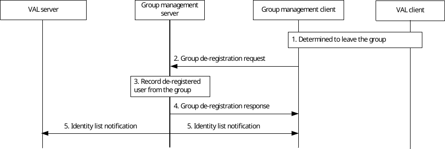

# 10.3.9 Group member leave

## 10.3.9.1 General

This subclause describes the procedures for group member to leave the group by de-registering.

## 10.3.9.2 Procedure

Pre-conditions:

1\. Group is previously defined on the group management server including the list of registered users and each member of the group and VAL server is aware of it.

Figure 10.3.9.2-1: Procedure for group member leaving the group.

1\. The VAL client determines to de-register member from the group and group management client is aware of it.

2\. The group management client initiates the group de-registration request towards the group management server.

3\. The group management server checks the authorization of group de-registration request and updates the group member list.

4\. The group management server sends a group de-registration response to the group management client.

5\. The group management server sends identity list notification about the leaving registered user to the other members of the group and the VAL server, whose subscription to receive notifications of de-registered VAL UE IDs is successful in step 7 and step 8 of the procedure in clause 10.3.8.2 respectively.
