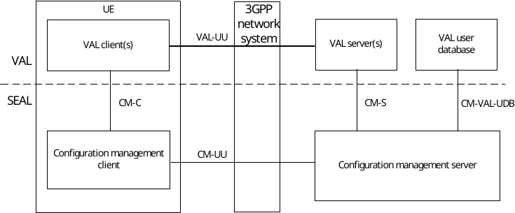
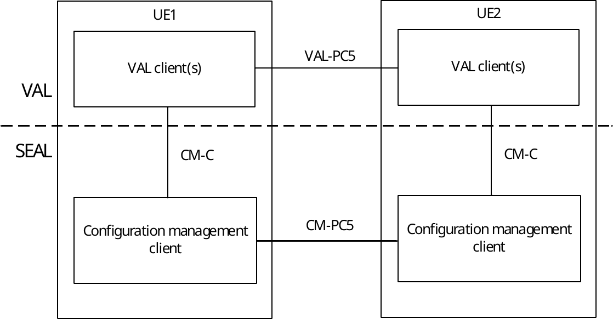

# 11.2 Functional model for configuration management

## 11.2.1 General

The functional model for the configuration management is based on the generic functional model specified in clause 6. It is organized into functional entities to describe a functional architecture which addresses the support for configuration management aspects for vertical applications. The on-network and off-network functional model is specified in this clause.

## 11.2.2 On-network functional model description

Figure 11.2.2-1 illustrates the generic on-network functional model for configuration management.

Figure 11.2.2-1: On-network functional model for configuration management

The configuration management client communicates with the configuration management server over the CM-UU reference point. The configuration management client provides the support for configuration management functions to the VAL client(s) over CM‑C reference point. The VAL server(s) communicate with the configuration management server over the CM-S reference point. The configuration management server communicates with the VAL user database over the CM-VAL-UDB reference point.

## 11.2.3 Off-network functional model description

Figure 11.2.3-1 illustrates the off-network functional model for configuration management.

Figure 11.2.3-1: Off-network functional model for configuration management

The configuration management client of the UE1 communicates with the configuration management client of the UE2 over the CM-PC5 reference point.

## 11.2.4 Functional entities description

### 11.2.4.1 General

The functional entities for configuration management SEAL service are described in the following subclauses.

### 11.2.4.2 Configuration management client

The configuration management client functional entity acts as the application client for configuration related transactions. The configuration management client interacts with the configuration management server and provides and receives configuration data. The configuration management client also supports interactions with the corresponding configuration management client between the two UEs.

The configuration management client functional entity is supported by the signalling user agent and HTTP client functional entities of the signalling control plane.

### 11.2.4.3 Configuration management server

The configuration management server is a functional entity used to configure one or more vertical applications with 3GPP system related vertical applications provisioning information and configure data on the configuration management client. The configuration management server manages vertical application configuration supported within the vertical's service provider. The configuration management server acts as CAPIF's API exposing function as specified in 3GPP TS 23.222 \[8\]. The configuration management server also supports interactions with the corresponding configuration management server in distributed SEAL deployments.

The configuration management server functional entity is supported by the SIP AS and HTTP server functional entities of the signalling control plane.

## 11.2.5 Reference points description

### 11.2.5.1 General

The reference points for the functional model for configuration management are described in the following subclauses.

### 11.2.5.2 CM-UU

The interactions related to configuration management functions between the configuration management client and the configuration management server are supported by CM-UU reference point. This reference point utilizes Uu reference point as described in 3GPP TS 23.401 \[9\] and 3GPP TS 23.501 \[10\].

The CM-UU reference point provides the configuration information required for VAL services and supports:

\- configuration of the VAL UE by the VAL service; and

\- configuration of the VAL application with the VAL service related information e.g. policy information by the VAL UE.

The CM-UU reference point shall use the HTTP-1/HTTP-2 reference points for transport and routing of configuration management related signalling. The CM-UU reference point shall use SIP-1/SIP-2 reference points for subscription/notification related signalling.

### 11.2.5.3 CM-PC5

The interactions related to configuration management functions between the configuration management clients located in different VAL UEs are supported by CM-PC5 reference point. This reference point utilizes PC5 reference point as described in 3GPP TS 23.303 \[12\].

### 11.2.5.4 CM-C

The interactions related to configuration management functions between the VAL client(s) and the configuration management client within a VAL UE are supported by CM-C reference point.

### 11.2.5.5 CM-S

The interactions related to configuration management functions between the VAL server(s) and the configuration management server are supported by CM-S reference point. The CM-S reference point supports VAL server to obtain the VAL service related vertical applications provisioning information. This reference point is an instance of CAPIF‑2 reference point as specified in 3GPP TS 23.222 \[8\].

The CM-S reference point shall use HTTP-1/ HTTP-2 reference points for transport and routing of configuration management related signalling. The CM-S reference point shall use SIP-2 reference point for subscription/notification related signalling.

### 11.2.5.6 CM-E

The interactions related to configuration management functions between the configuration management servers in a distributed deployment are supported by CM-E reference point.

### 11.2.5.7 Reference point CM-VAL-UDB (between the configuration management server and the VAL user database)

The CM-VAL-UDB reference point is an instance of VAL-UDB reference point, which exists between the VAL user database and the configuration management server, is used for:

\- the configuration management server to store the user profile data in the specific VAL user database;

\- the configuration management server to obtain the user profile from the specific VAL user database for further configuration in the VAL UE.

\- the configuration management server to update the user profile data in the specific VAL user database; and

\- the configuration management server to delete the user profile data from the specific VAL user database
