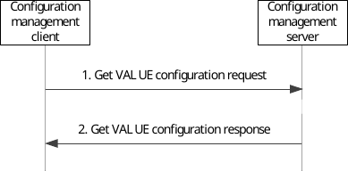
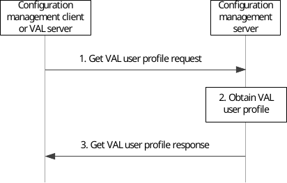
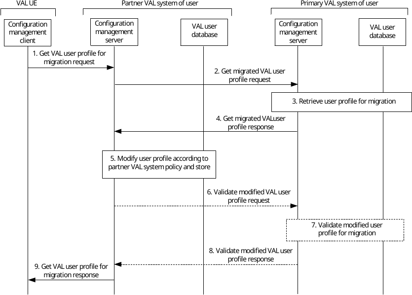
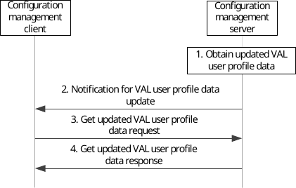
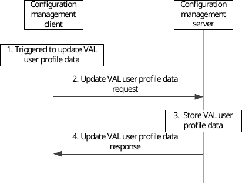
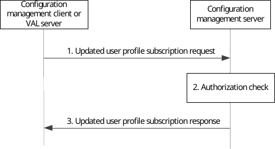
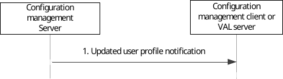
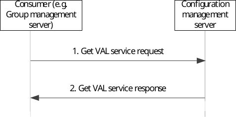

# 11.3 Procedures and information flows for configuration management

## 11.3.1 General

The procedures related to the configuration management are described in the following subclauses.

## 11.3.2 Information flows

### 11.3.2.1 Get VAL UE configuration request

Table 11.3.2.1-1 describes the information flow get VAL UE configuration request from the configuration management client to the configuration management server.

Table 11.3.2.1-1: Get VAL UE configuration request

<table>
<colgroup>
<col style="width: 33%" />
<col style="width: 16%" />
<col style="width: 50%" />
</colgroup>
<thead>
<tr class="header">
<th>Information element</th>
<th>Status</th>
<th>Description</th>
</tr>
</thead>
<tbody>
<tr class="odd">
<td>VAL UE ID</td>
<td>M</td>
<td>Identify of the VAL UE requesting the configuration information.</td>
</tr>
<tr class="even">
<td>VAL service ID</td>
<td>O (see NOTE 1)</td>
<td>Identify of the VAL service for which the configuration information is requested.</td>
</tr>
<tr class="odd">
<td>VAL UE Information (see NOTE 2)</td>
<td>O</td>
<td>Additional UE related information required to identify the configuration data (e.g. device type, device vendor, etc)</td>
</tr>
<tr class="even">
<td colspan="3">
NOTE 1: If the VAL service ID information element is not present, then the default service is service.

NOTE 2: The VAL service provider can configure the VAL UE with different configuration data based on this IE.
</td>
</tr>
</tbody>
</table>

### 11.3.2.2 Get VAL UE configuration response

Table 11.3.2.2-1 describes the information flow get VAL UE configuration response from the configuration management server to the configuration management client.

Table 11.3.2.2-1: Get VAL UE configuration response

<table>
<colgroup>
<col style="width: 33%" />
<col style="width: 16%" />
<col style="width: 50%" />
</colgroup>
<thead>
<tr class="header">
<th>Information element</th>
<th>Status</th>
<th>Description</th>
</tr>
</thead>
<tbody>
<tr class="odd">
<td>Result</td>
<td>M</td>
<td>Indicates the success or failure of getting the configuration information</td>
</tr>
<tr class="even">
<td>VAL UE configuration data</td>
<td>
O

(see NOTE)
</td>
<td>The VAL UE configuration data as specified in the corresponding VAL service specification and outside the scope of the present document</td>
</tr>
<tr class="odd">
<td colspan="3">NOTE: If the Result information element indicates failure then VAL UE configuration data information element is not included.</td>
</tr>
</tbody>
</table>

### 11.3.2.3 Get VAL user profile request

Table 11.3.2.3-1 describes the information flow get VAL user profile request from the configuration management client or VAL server to the configuration management server.

Table 11.3.2.3-1: Get VAL user profile request

|                     |        |                                                                                           |
|---------------------|--------|-------------------------------------------------------------------------------------------|
| Information element | Status | Description                                                                               |
| Requester Identity  | M      | The identity of the configuration management client or VAL server performing the request. |
| Identity            | M      | The VAL user ID of the VAL user or VAL UE ID.                                             |

### 11.3.2.4 Get VAL user profile response

Table 11.3.2.4-1 describes the information flow get VAL user profile response from the configuration management server to the configuration management client or VAL server.

Table 11.3.2.4-1: Get VAL user profile response

<table>
<colgroup>
<col style="width: 33%" />
<col style="width: 16%" />
<col style="width: 50%" />
</colgroup>
<tbody>
<tr class="odd">
<td>Information element</td>
<td>Status</td>
<td>Description</td>
</tr>
<tr class="even">
<td>VAL user profile data</td>
<td>
M

(see NOTE)
</td>
<td>One or more VAL user profiles associated with the VAL user ID or VAL UE ID provided in the associated get VAL user profile request.</td>
</tr>
<tr class="odd">
<td>Result</td>
<td>M</td>
<td>Indicates the success or failure for the operation</td>
</tr>
<tr class="even">
<td colspan="3">NOTE: If the Result information element indicates failure then the value of VAL user profile data information element has no meaning.</td>
</tr>
</tbody>
</table>

### 11.3.2.5 Notification for VAL user profile data update

Table 11.3.2.5-1 describes the information flow notification for VAL user profile data update from the configuration management server to the configuration management client.

Table 11.3.2.5-1: Notification for VAL user profile data update

|                                            |        |                                                |
|--------------------------------------------|--------|------------------------------------------------|
| Information element                        | Status | Description                                    |
| Pointer to modified VAL user profile data. | M      | Pointer to the modified VAL user profile data. |

### 11.3.2.6 Get updated VAL user profile data request

Table 11.3.2.6-1 describes the information flow get updated VAL user profile data request from the configuration management client to the configuration management server.

Table 11.3.2.6-1: Get updated VAL user profile data request

|                                            |        |                                                           |
|--------------------------------------------|--------|-----------------------------------------------------------|
| Information element                        | Status | Description                                               |
| Identity                                   | M      | The VAL user ID of the originating VAL user or VAL UE ID. |
| Pointer to modified VAL user profile data. | M      | Pointer to the modified VAL user profile data.            |

### 11.3.2.7 Get updated VAL user profile data response

Table 11.3.2.7-1 describes the information flow get updated VAL user profile data response from the configuration management server to the configuration management client.

Table 11.3.2.7-1: Get updated VAL user profile data response

<table>
<colgroup>
<col style="width: 33%" />
<col style="width: 16%" />
<col style="width: 50%" />
</colgroup>
<tbody>
<tr class="odd">
<td>Information element</td>
<td>Status</td>
<td>Description</td>
</tr>
<tr class="even">
<td>Updated VAL user profile data</td>
<td>
M

(see NOTE)
</td>
<td>VAL user profile data that has been modified.</td>
</tr>
<tr class="odd">
<td>Result</td>
<td>M</td>
<td>Indicates the success or failure for the operation</td>
</tr>
<tr class="even">
<td colspan="3">NOTE: If the Result information element indicates failure then the value of Updated VAL user profile data information element has no meaning.</td>
</tr>
</tbody>
</table>

### 11.3.2.8 Update VAL user profile data request

Table 11.3.2.8-1 describes the information flow update VAL user profile data request from the configuration management client to the configuration management server.

Table 11.3.2.8-1: Update VAL user profile data request

|                               |        |                                                           |
|-------------------------------|--------|-----------------------------------------------------------|
| Information element           | Status | Description                                               |
| Identity                      | M      | The VAL user ID of the originating VAL user or VAL UE ID. |
| Updated VAL user profile data | M      | The contents of the user profile data to be updated.      |

### 11.3.2.9 Update VAL user profile data response

Table 11.3.2.9-1 describes the information flow update VAL user profile data response from the configuration management server to the configuration management client.

Table 11.3.2.9-1: Update VAL user profile data response

|                     |        |                                  |
|---------------------|--------|----------------------------------|
| Information element | Status | Description                      |
| Result              | M      | Indicates the success or failure |

### 11.3.2.10 Updated user profile subscription request

Table 11.3.2.10-1 describes the information flow from the VAL server to the configuration management server for updated user profile subscription request.

Table 11.3.2.10-1: Updated user profile subscription request

|                                               |        |                                                                          |
|-----------------------------------------------|--------|--------------------------------------------------------------------------|
| Information element                           | Status | Description                                                              |
| Requester Identity                            | M      | The identity of the VAL server performing the request.                   |
| Identities list                               | M      | List of VAL users or VAL UEs whose updates on user profile is requested. |
| Time between consecutive user profile updates | M      | It indicates the interval time between consecutive user profile updates  |

### 11.3.2.11 Updated user profile subscription response

Table 11.3.2.11-1 describes the information flow from the configuration management server to the VAL server for updated user profile subscription response.

Table 11.3.2.11-1: Updated user profile subscription response

<table>
<colgroup>
<col style="width: 33%" />
<col style="width: 16%" />
<col style="width: 50%" />
</colgroup>
<tbody>
<tr class="odd">
<td>Information element</td>
<td>Status</td>
<td>Description</td>
</tr>
<tr class="even">
<td>Subscription status</td>
<td>
M

(see NOTE)
</td>
<td>It indicates the subscription result</td>
</tr>
<tr class="odd">
<td>Result</td>
<td>M</td>
<td>Indicates the success or failure for the operation</td>
</tr>
<tr class="even">
<td colspan="3">NOTE: If the Result information element indicates failure then the value of the Subscription status information element has no meaning.</td>
</tr>
</tbody>
</table>

### 11.3.2.12 Updated user profile notification

Table 11.3.2.12-1 describes the information flow updated user profile notification from the configuration management server to the VAL server.

Table 11.3.2.12-1: Notify updated user profile event

|                           |        |                                                              |
|---------------------------|--------|--------------------------------------------------------------|
| Information element       | Status | Description                                                  |
| Identities list           | M      | List of VAL users or VAL UEs whose user profile is modified. |
| Updated user profile data | M      | User profile data that has been modified.                    |

### 11.3.2.13 Get VAL service request

Table 11.3.2.13-1 describes the information flow get VAL service request from the consumer (e.g. group management) server to the configuration management server.

Table 11.3.2.13-1: Get VAL service request

<table>
<colgroup>
<col style="width: 33%" />
<col style="width: 16%" />
<col style="width: 50%" />
</colgroup>
<tbody>
<tr class="odd">
<td>Information element</td>
<td>Status</td>
<td>Description</td>
</tr>
<tr class="even">
<td>Requester Identity</td>
<td>M</td>
<td>The identity of the entity performing the request.</td>
</tr>
<tr class="odd">
<td>Identity list</td>
<td>
O

(see NOTE)
</td>
<td>The VAL user IDs or VAL UE IDs.</td>
</tr>
<tr class="even">
<td>VAL service ID list</td>
<td>
O

(see NOTE)
</td>
<td>The requested VAL service IDs for the identity list.</td>
</tr>
<tr class="odd">
<td colspan="3">NOTE: At least one of Identity list or VAL service ID list shall be included. With both Identity list and VAL service ID in the request, the response only contains common VAL services (as requested) for the requested VAL users or VAL UEs.</td>
</tr>
</tbody>
</table>

### 11.3.2.14 Get VAL service response

Table 11.3.2.14-1 describes the information flow get VAL service response from the configuration management server to the consumer (e.g. group management server).

Table 11.3.2.14-1: Get VAL service response

<table>
<colgroup>
<col style="width: 33%" />
<col style="width: 16%" />
<col style="width: 50%" />
</colgroup>
<tbody>
<tr class="odd">
<td>Information element</td>
<td>Status</td>
<td>Description</td>
</tr>
<tr class="even">
<td>A list of VAL service data</td>
<td>
O

(see NOTE 1)
</td>
<td>One or more VAL service data associated with the VAL user ID or VAL UE ID.</td>
</tr>
<tr class="odd">
<td>&gt; Identity</td>
<td>M</td>
<td>The VAL user ID or VAL UE ID.</td>
</tr>
<tr class="even">
<td>&gt; VAL service IDs</td>
<td>M</td>
<td>The supported VAL service IDs.</td>
</tr>
<tr class="odd">
<td>&gt; VAL service specific information</td>
<td>
O

(see NOTE 2)
</td>
<td>Placeholder for VAL service specific information.</td>
</tr>
<tr class="even">
<td>Result</td>
<td>M</td>
<td>Indicates the success or failure for the operation.</td>
</tr>
<tr class="odd">
<td colspan="3">
NOTE 1: It is valid when the Result information element indicates success.

NOTE 2: The details of this information element are specified in VAL service specific specification and are out of scope of the present document.
</td>
</tr>
</tbody>
</table>

## 11.3.3 VAL UE configuration data

### 11.3.3.1 General

The VAL UE configuration data has to be known by the VAL UE before it can use the VAL service.

### 11.3.3.2 Procedures

The procedure for VAL UE obtaining the VAL UE related configuration data is illustrated in figure 11.3.3.2-1.

Pre-conditions:

\- The VAL UE has the secure access to the configuration management server.

Figure 11.3.3.2-1: VAL UE obtains the configuration data

1\. The configuration management client sends a get VAL UE configuration request to the configuration management server for obtaining VAL UE configuration data.

2\. The configuration management server sends get VAL UE configuration response to the configuration management client. This message carries the VAL UE configuration data.

### 11.3.3.3 Structure of VAL UE configuration data

NOTE: For a VAL service, the VAL UE configuration data is listed in the corresponding VAL service specification and outside the scope of the present document.

## 11.3.4 VAL user profile data

### 11.3.4.1 General

The VAL user profile procedures are described in the following subclauses.

### 11.3.4.2 Obtaining the VAL user profile(s) from the network

#### 11.3.4.2.1 Obtaining the VAL user profile(s) in primary VAL system

The procedure for the VAL user or VAL server obtaining VAL user profiles in the primary VAL system of that VAL user is illustrated in figure 11.3.4.2.1-1.

Pre-conditions:

\- The VAL user has performed user authentication in the identity management server.

\- The VAL UE or VAL server has secure access to the configuration management server.

Figure 11.3.4.2.1-1: VAL user obtains the VAL user profile(s) from the network

1\. The configuration management client or VAL server sends a get VAL user profile request message to the configuration management server, which includes the VAL user ID or VAL UE ID.

2\. The configuration management server obtains the VAL user profile information.

3\. The configuration management server sends get VAL user profile response message to the configuration management client or VAL server. When a download is necessary, this message includes all VAL user profiles that are associated with the VAL user ID or VAL UE ID.

#### 11.3.4.2.2 VAL user receiving VAL service from a partner VAL system

Figure 11.3.4.2.2-1 below illustrates mechanism for the configuration management client to retrieve the VAL user profile for the migrating VAL user from the partner VAL system.

NOTE: Any proxy servers at the edges of the primary and partner VAL systems which are used to hide the topology of the VAL systems from external entities are not shown in this procedure.

Preconditions

\- The VAL user is permitted to migrate to the partner VAL system, and the relevant authorizations are configured in both the primary and partner VAL systems of that VAL user

\- The VAL user has performed VAL user authentication in the partner VAL system, and has received the necessary credentials to retrieve configuration information and to request service authorization.

\- The VAL UE has been provided with addressing information to allow the configuration management client in the VAL UE to access the configuration management server in the partner VAL system.

Figure 11.3.4.2.2-1: Retrieval of user profile in partner VAL system

1\. The configuration management client in the VAL UE of the migrating VAL user requests the VAL user profile for migration from the configuration management server in the partner VAL system.

2\. The configuration management server in the partner VAL system requests the VAL user profile from the configuration management server in the primary VAL system of the VAL user.

3\. The configuration management server in the primary VAL system of the VAL user retrieves the VAL user profile from the VAL user database in that primary VAL system. The identification of the partner VAL system to which the VAL user is attempting to migrate is used to determine which VAL user profile is retrieved for that VAL user for migration to that partner VAL system.

4\. The configuration management server in the primary VAL system provides the VAL user profile to the configuration management server in the partner VAL system of the VAL user, optionally requesting validation of the modified VAL user profile.

5\. The partner VAL system of the VAL user modifies the VAL user profile according to local configuration information and stores the modified VAL user profile in the VAL user database in the partner VAL system.

6\. If the primary VAL system requested validation of the VAL user profile in step 4, the configuration management server in the partner VAL system of the migrating VAL user may send the modified VAL user profile to the configuration management server of the primary VAL system of the VAL user to allow the primary VAL system of the VAL user to validate the modified VAL user profile.

7\. The primary VAL system of the migrated VAL user validates the modified VAL service profile of the migrated VAL user.

8\. The primary VAL system of the migrated VAL user responds to the partner VAL system with the results of the validation process.

9\. The configuration management server in the partner VAL system provides the VAL user profile to the configuration management client of the migrating VAL user,

NOTE: Step 9 is not followed if the validation process fails.

### 11.3.4.3 VAL user receives updated VAL user profile data from the network

The procedure for VAL user obtaining updated VAL user profile data that is initiated by the network is illustrated in figure 11.3.4.3-1.

Pre-conditions:

\- The VAL user has performed user authentication in identity management server.

\- The VAL UE has secure access to the configuration management server.

\- The VAL UE has already obtained one or more VAL user profiles.

\- The configuration management server has access to the VAL user profile(s) associated with the VAL user ID of the VAL user or VAL UE ID.

Figure 11.3.4.3-1: VAL user receives updated VAL user profile data from the network

1\. The configuration management server obtains updated VAL user profile data.

2\. The configuration management server sends a notification for VAL user profile data update to the configuration management client.

3\. The configuration management client sends get updated VAL user profile data request to the configuration management server, which includes the VAL user ID or VAL UE ID.

4\. The configuration management server sends get updated VAL user profile data response to the configuration management client which includes the updated VAL user profile data requested in step 3.

NOTE: The updated VAL user profile data could be for a specific VAL user profile, a specific parameter in an VAL user profile, a set of VAL user profiles, or all the VAL user profiles for the VAL user ID or VAL UE ID. VAL user profile data is defined per VAL service.

### 11.3.4.4 VAL user updates VAL user profile data to the network

The procedure for VAL user updating the VAL user profile data is illustrated in figure 11.3.4.4-1.

Pre-conditions:

\- The VAL user has performed user authentication in identity management server.

\- The VAL UE has secure access to the configuration management server.

\- The VAL UE has already obtained one or more VAL user profiles.

Figure 11.3.4.4-1: VAL user updates VAL user profile data to the network

1\. The configuration management client is triggered (e.g. by user interaction operation) to update the VAL user profile data on the configuration management server.

2\. The configuration management client sends update VAL user profile data request to the configuration management server, which includes the VAL user profile data to be updated.

3\. The configuration management server stores the received VAL user profile data.

4\. The configuration management server sends update VAL user profile data response to the configuration management client to confirm the VAL user profile data update is complete.

NOTE: The updated VAL user profile data could be for a specific VAL user profile, a specific parameter in an VAL user profile, a set of VAL user profiles, or all the VAL user profiles for the VAL user ID and VAL UE ID. VAL user profile data is defined per VAL service.

### 11.3.4.5 Updated user profile subscription procedure

Figure 11.3.4.5-1 illustrates the high level procedure for obtaining updated user profile data based on subscription request.

Figure 11.3.4.5-1: Updated user profile subscription procedure

1\. Configuration management client or VAL server sends an updated user profile subscription request to the configuration management server to subscribe any updates to user profile of one or more VAL users or VAL UEs.

2\. The configuration management server shall check if the configuration management client or VAL server is authorized to initiate the updated user profile subscription request.

3\. The configuration management server replies with a updated user profile subscription response indicating the subscription status.

Figure 11.3.4.5-2 illustrates the high level procedure of updated user profile notification event.

Figure 11.3.4.5-2: Updated user profile notification

1\. The configuration management server sends the updated user profile notification including the changes to user profile of one or more VAL users or VAL UEs to the configuration management client or VAL server.

NOTE: Updated user profile notification is based on the subscription.

## 11.3.5 VAL service data

### 11.3.5.1 General

The VAL service data related procedures are described in the following subclauses.

### 11.3.5.2 Procedures

The procedure for consumer (e.g. group management server) obtaining the VAL service data is illustrated in figure 11.3.5.2-1.

Pre-conditions:

\- The consumer has the secure access to the configuration management server.

\- The configuration management server has VAL service data maintained for VAL UE or user.

Figure 11.3.5.2-1: Obtains the VAL service data for VAL UE(s) or VAL user(s)

1\. The consumer (e.g. group management server) sends a get VAL service request to the configuration management server for obtaining VAL service data. The request includes a list of VAL UE IDs or VAL user IDs and/or a VAL service ID list as service data retrieval filters.

2\. The configuration server retrieves the VAL service data for the requested VAL UEs or users or VAL services and sends get VAL service response to the consumer (e.g. group management server) with the discovered list of VAL service data.
