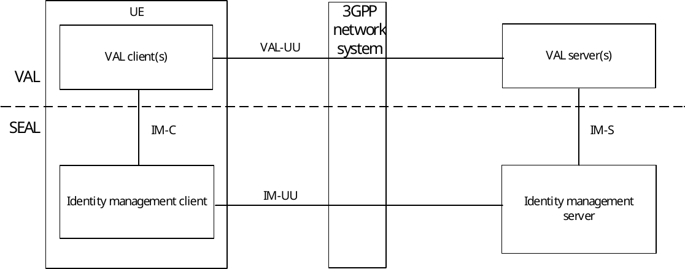
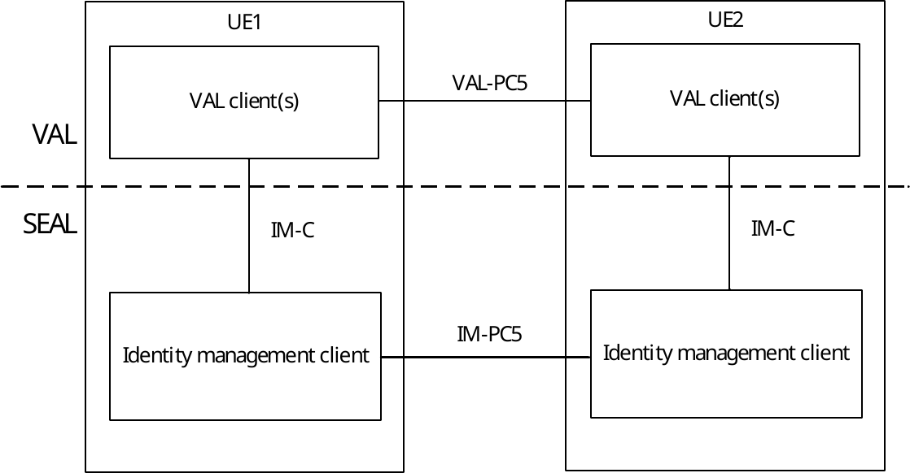
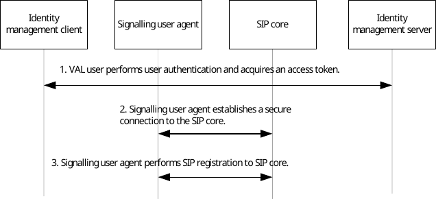
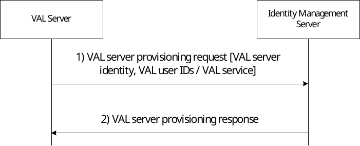
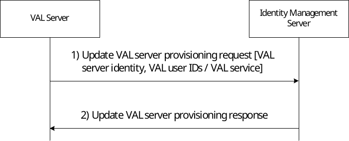
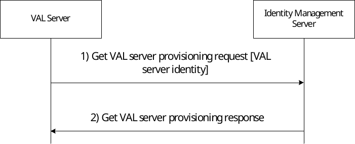
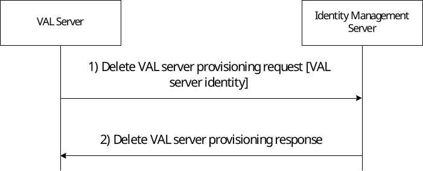

# 12 Identity management

## 12.1 General

The identity management is a SEAL service that offers the identity management related capabilities to one or more vertical applications.

## 12.2 Functional model for identity management

### 12.2.1 General

The functional model for the identity management is based on the generic functional model specified in clause 6. It is organized into functional entities to describe a functional architecture which addresses the support for identity management aspects for vertical applications. The on-network and off-network functional model is specified in this clause.

### 12.2.2 On-network functional model description

Figure 12.2.2-1 illustrates the generic on-network functional model for identity management.

Figure 12.2.2-1: On-network functional model for identity management

The identity management client communicates with the identity management server over the IM-UU reference point. The identity management client provides the support for identity management functions to the VAL client(s) over IM‑C reference point. The VAL server(s) communicate with the identity management server over the IM-S reference point.

### 12.2.3 Off-network functional model description

Figure 12.2.3-1 illustrates the off-network functional model for identity management.

Figure 12.2.3-1: Off-network functional model for identity management

The identity management client of the UE1 communicates with the identity management client of the UE2 over the IM‑PC5 reference point.

### 12.2.4 Functional entities description

#### 12.2.4.1 General

The functional entities for identity management SEAL service are described in the following subclauses.

#### 12.2.4.2 Identity management client

The identity management client functional entity acts as the application client for vertical applications layer user identity related transactions. The identity management client interacts with the identity management server. The identity management client also supports interactions with the corresponding identity management client between the two UEs.

#### 12.2.4.3 Identity management server

The identity management server is a functional entity that authenticates the vertical application layer user identity. The authentication is performed by verifying the credentials provided by the vertical applications' user. The identity management server acts as CAPIF's API exposing function as specified in 3GPP TS 23.222 \[8\]. The identity management server also supports interactions with the corresponding identity management server in distributed SEAL deployments.

### 12.2.5 Reference points description

#### 12.2.5.1 General

The reference points for the functional model for identity management are described in the following subclauses.

#### 12.2.5.2 IM-UU

The interactions related to identity management functions between the identity management client and the identity management server are supported by IM-UU reference point. This reference point utilizes Uu reference point as described in 3GPP TS 23.401 \[9\] and 3GPP TS 23.501 \[10\].

#### 12.2.5.3 IM-PC5

The interactions related to identity management functions between the identity management clients located in different VAL UEs are supported by IM-PC5 reference point. This reference point utilizes PC5 reference point as described in 3GPP TS 23.303 \[12\].

#### 12.2.5.4 IM-C

The interactions related to identity management functions between the VAL client(s) and the identity management client within a VAL UE are supported by IM-C reference point.

#### 12.2.5.5 IM-S

The interactions related to identity management functions between the VAL server(s) and the identity management server are supported by IM-S reference point. This reference point is an instance of CAPIF-2 reference point as specified in 3GPP TS 23.222 \[8\].

#### 12.2.5.6 IM-E

The interactions related to identity management functions between the identity management servers in a distributed deployment are supported by IM-E reference point.

## 12.3 Procedures and information flows for identity management

### 12.3.1 General

The procedures related to the identity management are described in the following subclauses.

### 12.3.2 Information flows

NOTE: The procedure for identity management is specified in subclause 5.2.3 and 5.2.4 of 3GPP TS 33.434 \[29\].

#### 12.3.2.1 VAL server provisioning request

Table 12.3.2.1-1 describes the information flow from the VAL server to the identity management server for providing provisioning configuration.

Table 12.3.2.1-1: VAL server provisioning request

|                                          |        |                                                                                           |
|------------------------------------------|--------|-------------------------------------------------------------------------------------------|
| Information element                      | Status | Description                                                                               |
| Requester Identity                       | M      | The identity of the VAL server performing the request.                                    |
| List of VAL service specific information | M      | Provides the list of VAL service specific information                                     |
| \> VAL service ID                        | M      | Identify of the VAL service for which the configuration information is provided.          |
| \> identity list                         | M      | Identify list of VAL users for the specific VAL service (i.e. VAL User IDs or VAL UE IDs) |

#### 12.3.2.2 VAL server provisioning response

Table 12.3.2.2-1 describes the information flow from the identity management server to the VAL server as a response for providing provisioning configuration.

Table 12.3.2.2-1: VAL server provisioning response

|                     |        |                                             |
|---------------------|--------|---------------------------------------------|
| Information element | Status | Description                                 |
| Result              | M      | Indicates success or failure of the request |

#### 12.3.2.3 Update VAL server provisioning request

Table 12.3.2.3-1 describes the information flow from the VAL server to the identity management server for updating provisioning configuration.

Table 12.3.2.3-1: Update VAL server provisioning request

|                                                      |        |                                                                                           |
|------------------------------------------------------|--------|-------------------------------------------------------------------------------------------|
| Information element                                  | Status | Description                                                                               |
| Requester Identity (see NOTE)                        | M      | The identity of the VAL server performing the request.                                    |
| List of VAL service specific information             | M      | Provides the list of VAL service specific information                                     |
| \> VAL service ID                                    | M      | Identify of the VAL service for which the configuration information is to be updated.     |
| \> identity list                                     | O      | Identify list of VAL users for the specific VAL service (i.e. VAL User IDs or VAL UE IDs) |
| NOTE: The IE shall not be updated by the VAL server. |        |                                                                                           |

#### 12.3.2.4 Update VAL server provisioning response

Table 12.3.2.4-1 describes the information flow from the identity management server to the VAL server as a response for updating provisioning configuration.

Table 12.3.2.4-1: Update VAL server provisioning response

|                     |        |                                             |
|---------------------|--------|---------------------------------------------|
| Information element | Status | Description                                 |
| Result              | M      | Indicates success or failure of the request |

#### 12.3.2.5 Get VAL server provisioning request

Table 12.3.2.5-1 describes the information flow from the VAL server to the identity management server to get provisioning configuration.

Table 12.3.2.5-1: Get VAL server provisioning request

|                     |        |                                                        |
|---------------------|--------|--------------------------------------------------------|
| Information element | Status | Description                                            |
| Requester Identity  | M      | The identity of the VAL server performing the request. |

#### 12.3.2.6 Get VAL server provisioning response

Table 12.3.2.6-1 describes the information flow from the identity management server to the VAL server as a response to get provisioning configuration.

Table 12.3.2.6-1: Get VAL server provisioning response

|                                                       |        |                                                                                           |
|-------------------------------------------------------|--------|-------------------------------------------------------------------------------------------|
| Information element                                   | Status | Description                                                                               |
| Result                                                | M      | Indicates success or failure of the request                                               |
| List of VAL service specific information (NOTE 1)     | M      | Provides the list of VAL service specific information                                     |
| \> VAL service ID                                     | M      | Identify of the VAL service for which the configuration information is provided.          |
| \> identity list                                      | M      | Identify list of VAL users for the specific VAL service (i.e. VAL User IDs or VAL UE IDs) |
| NOTE 1: This IE is included only for success response |        |                                                                                           |

#### 12.3.2.7 Delete VAL server provisioning request

Table 12.3.2.7-1 describes the information flow from the VAL server to the identity management server for deleting provisioning configuration.

Table 12.3.2.7-1: Delete VAL server provisioning request

|                     |        |                                                        |
|---------------------|--------|--------------------------------------------------------|
| Information element | Status | Description                                            |
| Requester Identity  | M      | The identity of the VAL server performing the request. |

#### 12.3.2.8 Delete VAL server provisioning response

Table 12.3.2.8-1 describes the information flow from the identity management server to the VAL server as a response for deleting provisioning configuration.

Table 12.3.2.8-1: Delete VAL server provisioning response

|                     |        |                                             |
|---------------------|--------|---------------------------------------------|
| Information element | Status | Description                                 |
| Result              | M      | Indicates success or failure of the request |

### 12.3.3 General user authentication and authorization for VAL services

#### 12.3.3.1 General

The high level user authentication and authorization procedure is described in the following subclause.

#### 12.3.3.2 Primary VAL system

Figure 12.3.3.2-1 is a high level user authentication and authorization flow.

NOTE: The specific user authentication and authorization architecture required by the VAL services in order to realize the VAL user authentication and authorization is specified in subclauses 5.2.3, 5.2.4 and 5.2.5 of 3GPP TS 33.434 \[29\].

The user authentication process shown in figure 12.3.3.2-1 may take place in some scenarios as a separate step independently from a SIP registration phase, for example if the SIP core is outside the domain of the VAL server.

A procedure for user authentication is illustrated in figure 12.3.3.2-1. Other alternatives may be possible, such as authenticating the user within the SIP registration phase.

Figure 12.3.3.2-1: VAL user authentication and registration with Primary VAL system, single domain

1\. In this step the identity management client begins the user authorization procedure. The VAL user supplies the user credentials (e.g. biometrics, secureID, username/password) for verification with the identity management server. This step may occur before or after step 3. In a VAL system with multiple VAL services, a single user authentication as in step 1 can be used for multiple VAL service authorizations for the user.

2\. The signalling user agent establishes a secure connection to the SIP core for the purpose of SIP level authentication and registration.

3\. The signalling user agent completes the SIP level registration with the SIP core (and an optional third-party registration with the VAL service server(s)).

NOTE 1: The VAL client(s) perform the corresponding VAL service authorization for the user by utilizing the result of this procedure.

NOTE 2: Steps 2 and 3 are not required to be performed if the VAL service does not use SIP.

#### 12.3.3.3 Interconnection partner VAL system

Where communications with a partner VAL system using interconnection are required, user authorization takes place in the serving VAL system of the VAL service user, using the VAL user service authorization procedure specified in subclauses 5.2.5 and 5.2.6 of 3GPP TS 33.434 \[29\].

### 12.3.4 VAL server provisioning for identity management service

#### 12.3.4.1 General

The high level procedure for VAL server to provision required information to SEAL identity management server in order to support VAL user authentication is described in the following subclause.

#### 12.3.4.2 Procedure

The procedure for VAL server to provision required information to SEAL identity management server in order to support VAL user authentication is illustrated in figure 12.3.4.2-1.

Figure 12.3.4.2-1: VAL Server provisioning to SEAL Identity Management Server

1\. The VAL server sends a request message to identity management server to provision required information. The request message includes identity of the VAL server, security credentials of the VAL server, and service provider specific information like identity list per VAL service.

2\. Upon receiving the request, the identity management server authorizes the request based on the security credentials provided in the request and considering the service level agreement between VAL service provider and SEAL service provider. If VAL server is authorized to use the SEAL service, then the identity management server stores the details about the VAL server including the list of VAL user IDs per VAL service. The identity management server sends the response message to the VAL server.

#### 12.3.4.3 Update VAL server provisioning procedure

The procedure for VAL server to update the required provisioning information to SEAL identity management server is illustrated in figure 12.3.4.3-1.

Figure 12.3.4.3-1: VAL Server updating provisioning to SEAL Identity Management Server

1\. The VAL server sends a request message to identity management server to update the required provisioning information. The request message includes identity of the VAL server, security credentials of the VAL server, and service provider specific information like identity list per VAL service.

2\. Upon receiving the request, the identity management server authorizes the request based on the security credentials provided in the request and considering the service level agreement between VAL service provider and SEAL service provider. If VAL server is authorized to use the SEAL service and if there exists provisioning information, then the identity management server updates the details about the VAL server for the provided VAL service IDs, including the list of VAL user IDs per VAL service. The provisioning information corresponding to a VAL server ID can be updated to add, remove or update VAL service IDs and its related information. The identity management server sends the response message to the VAL server.

#### 12.3.4.4 Get VAL server provisioning procedure

The procedure for VAL server to get the required provisioning information to SEAL identity management server is illustrated in figure 12.3.4.4-1.

Figure 12.3.4.4-1: VAL Server requesting provisioning information to SEAL Identity Management Server

1\. The VAL server sends a request message to identity management server to get the required provisioning information. The request message includes identity of the VAL server whose provisioning information is requested.

2\. Upon receiving the request, the identity management server authorizes the request based on the security credentials provided in the request and considering the service level agreement between VAL service provider and SEAL service provider. If VAL server is authorized to use the SEAL service and if there exists provisioning information, then the identity management server sends success response including the list of VAL user IDs per VAL service. Otherwise, the identity management server sends failure response message to the VAL server.

#### 12.3.4.5 Delete VAL server provisioning procedure

The procedure for VAL server to delete the provisioning information to SEAL identity management server is illustrated in figure 12.3.4.5-1.

Figure 12.3.4.5-1: VAL Server deleting provisioning information to SEAL Identity Management Server

1\. The VAL server sends a request message to identity management server to delete the provisioning information. The request message includes identity of the VAL server.

2\. Upon receiving the request, the identity management server authorizes the request based on the security credentials provided in the request and considering the service level agreement between VAL service provider and SEAL service provider. If VAL server is authorized to use the SEAL service and if there exists provisioning information, then the identity management server deletes the provisioning information for given VAL server ID and sends success response. Otherwise, the identity management server sends failure response message to the VAL server.

## 12.4 SEAL APIs for identity management

### 12.4.1 General

Table 12.4.1-1 illustrates the SEAL APIs for identity management.

Table 12.4.1-1: List of SEAL APIs for identity management

| API Name                    | API Operations        | Known Consumer(s) | Communication Type |
|-----------------------------|-----------------------|-------------------|--------------------|
| SS_IdmParameterProvisioning | Provide_Configuration | VAL server        | Request /Response  |
|                             | Update_Configuration  |                   |                    |
|                             | Get_Configuration     |                   |                    |
|                             | Delete_Configuration  |                   |                    |

### 12.4.2 Void

#### 12.4.2.1 Void

#### 12.4.2.2 Void

### 12.4.3 SS_IdmParameterProvisioning API

#### 12.4.3.1 General

**API description:** This API enables the VAL server to provision configuration for the VAL service to the SEAL IM-S.

#### 12.4.3.2 Provide_Configuration operation

**API operation name:** Provide_Configuration

**Description:** Provisioning of VAL service configuration to IM-S.

**Known Consumers:** VAL server.

**Inputs:** See subclause 12.3.2.1

**Outputs:** See subclause 12.3.2.2

See subclause 12.3.4.2 for the details of usage of this API operation.

#### 12.4.3.3 Update_Configuration operation

**API operation name:** Update_Configuration

**Description:** Updating the provisioning of VAL service configuration to IM-S.

**Known Consumers:** VAL server.

**Inputs:** See subclause 12.3.2.3

**Outputs:** See subclause 12.3.2.4

See subclause 12.3.4.3 for the details of usage of this API operation.

#### 12.4.3.4 Get_Configuration operation

**API operation name:** Get_Configuration

**Description:** Get provisioning of VAL service configuration from IM-S.

**Known Consumers:** VAL server.

**Inputs:** See subclause 12.3.2.5

**Outputs:** See subclause 12.3.2.6

See subclause 12.3.4.4 for the details of usage of this API operation.

#### 12.4.3.5 Delete_Configuration operation

**API operation name:** Delete_Configuration

**Description:** Deleting the provisioning of VAL service configuration on IM-S.

**Known Consumers:** VAL server.

**Inputs:** See subclause 12.3.2.7

**Outputs:** See subclause 12.3.2.8

See subclause 12.3.4.5 for the details of usage of this API operation.
