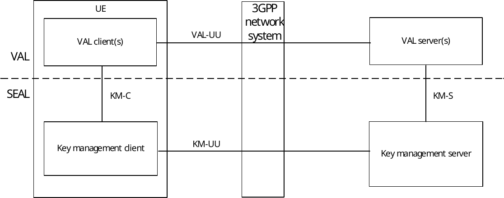
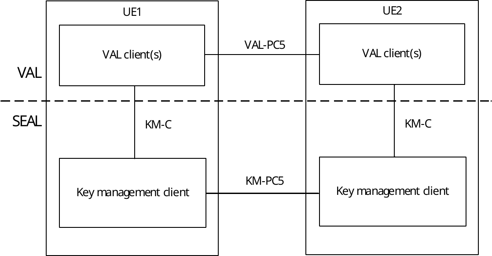

# 13 Key management

## 13.1 General

The key management is a SEAL service that offers the key management related capabilities to one or more vertical applications.

## 13.2 Functional model for key management

### 13.2.1 General

The functional model for the key management is based on the generic functional model specified in clause 6. It is organized into functional entities to describe a functional architecture which addresses the support for key management aspects for vertical applications. The on-network and off-network functional model is specified in this clause.

### 13.2.2 On-network functional model description

Figure 13.2.2-1 illustrates the generic on-network functional model for key management.

Figure 13.2.2-1: On-network functional model for key management

The key management client communicates with the key management server over the KM-UU reference point. The key management client provides the support for key management functions to the VAL client(s) over KM‑C reference point. The VAL server(s) communicate with the key management server over the KM-S reference point.

### 13.2.3 Off-network functional model description

Figure 13.2.3-1 illustrates the off-network functional model for key management.

Figure 13.2.3-1: Off-network functional model for key management

The key management client of the UE1 communicates with the key management client of the UE2 over the KM-PC5 reference point.

### 13.2.4 Functional entities description

#### 13.2.4.1 General

The functional entities for key management SEAL service are described in the following subclauses.

#### 13.2.4.2 Key management client

The key management functional entity acts as the application client for key management functions. It interacts with the key management server. The key management client also supports interactions with the corresponding key management client between the two UEs.

NOTE: The functionality of the key management client is specified in subclause 5.3 of 3GPP TS 33. 434 \[29\].

#### 13.2.4.3 Key management server

The key management server is a functional entity that stores and provides security related information (e.g. encryption keys) to the key management client, group management server and vertical application server to achieve the security goals of confidentiality and integrity of media and signalling. The key management server acts as CAPIF's API exposing function as specified in 3GPP TS 23.222 \[8\]. The key management server also supports interactions with the corresponding key management server in distributed SEAL deployments.

NOTE: The functionality of the key management server is specified in subclause 5.3 of 3GPP TS 33.434 \[29\].

### 13.2.5 Reference points description

#### 13.2.5.1 General

The reference points for the functional model for key management are described in the following subclauses.

#### 13.2.5.2 KM-UU

The interactions related to key management functions between the key management client and the key management server are supported by KM-UU reference point. This reference point utilizes Uu reference point as described in 3GPP TS 23.401 \[9\] and 3GPP TS 23.501 \[10\].

KM-UU reference point provides a means for the key management server to provide security related information (e.g. encryption keys) to the key management client. The KM-UU reference point shall use the HTTP-1 and HTTP-2 signalling control plane reference points for transport and routing of security related information to the key management client.

NOTE: KM-UU reference point is specified in subclause 5.1.1.4 of 3GPP TS 33.434 \[29\].

#### 13.2.5.3 KM-PC5

The interactions related to key management functions between the key management clients located in different VAL UEs are supported by KM-PC5 reference point. This reference point utilizes PC5 reference point as described in 3GPP TS 23.303 \[12\].

#### 13.2.5.4 KM-C

The interactions related to key management functions between the VAL client(s) and the key management client within a VAL UE are supported by KM-C reference point.

#### 13.2.5.5 KM-S

The interactions related to key management functions between the VAL server(s) and the key management server are supported by KM-S reference point. This reference point is an instance of CAPIF-2 reference point as specified in 3GPP TS 23.222 \[8\].

KM-S reference point provides a means for the key management server to provide security related information (e.g. encryption keys) to the VAL server. The KM-S reference point shall use the HTTP-1 and HTTP-2 signalling control plane reference points for transport and routing of security related information to the VAL server.

NOTE: KM-S is specified in subclause 5.1.1.4 of 3GPP TS 33.434 \[29\].

#### 13.2.5.6 KM-E

The interactions related to key management functions between the key management servers in a distributed deployment are supported by KM-E reference point.

#### 13.2.5.7 SEAL-X1

NOTE: SEAL-X1 reference point between the key management server and the group management server is described in subclause 6.5.9.2.

## 13.3 Procedures and information flows for key management

NOTE: The procedure for key management is specified in subclause 5.3 of 3GPP TS 33.434 \[29\].

### 13.3.1 Information flows

#### 13.3.1.1 void

#### 13.3.1.2 void

### 13.3.2 VAL server provisioning for key management service

#### 13.3.2.1 General

The high level procedure for VAL server to provision required information to SEAL key management server in order to provide the format and content of a key management record is described in clause 5.8 of 3GPP TS 33.434 \[29\].

#### 13.3.2.2 void

## 13.4 SEAL APIs for key management

### 13.4.1 General

Table 13.4.1-1 illustrates the SEAL APIs for key management.

Table 13.4.1-1: List of SEAL APIs for key management

| API Name                   | API Operations        | Known Consumer(s) | Communication Type |
|----------------------------|-----------------------|-------------------|--------------------|
| SS_KmParameterProvisioning | Provide_Configuration | VAL server        | Request /Response  |

The other SEAL APIs for Key Management are specified in subclauses 5.7.1 and 7.6.1 of 3GPP TS 29.549 \[30\].

### 13.4.2 Void

#### 13.4.2.1 Void

#### 13.4.2.2 Void

### 13.4.3 void
