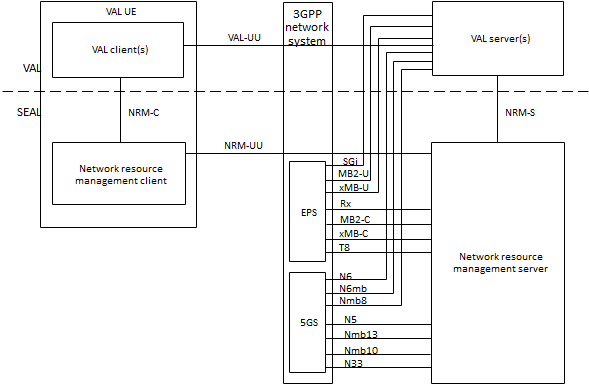
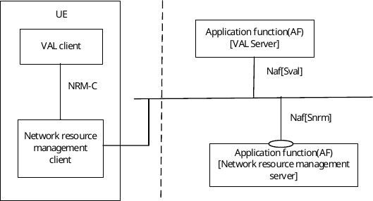
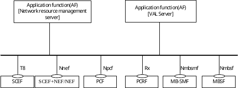
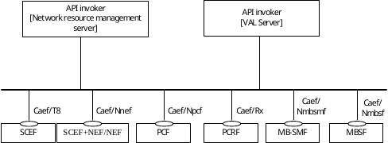
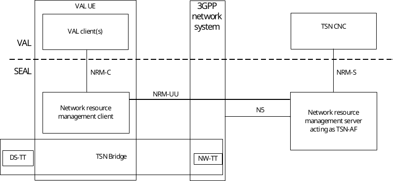
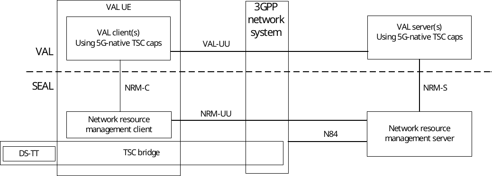
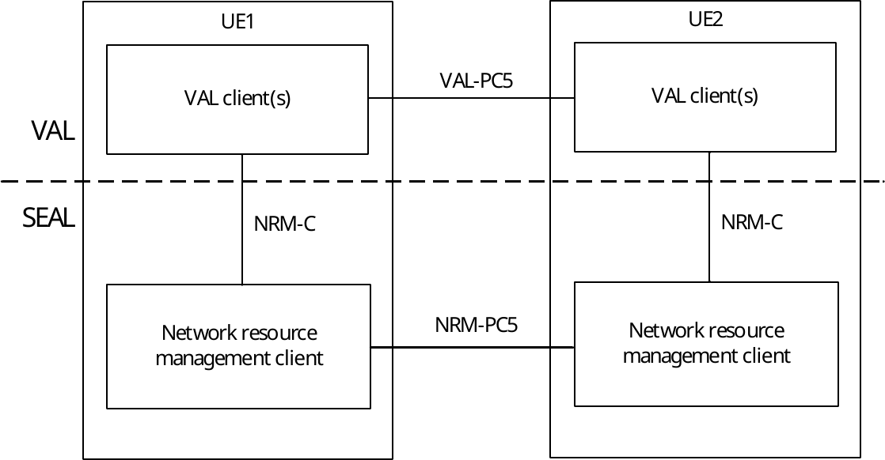

# 14.2 Functional model for network resource management

## 14.2.1 General

The functional model for the network resource management is based on the generic functional model specified in clause 6. It is organized into functional entities to describe a functional architecture which addresses the support for network resource management aspects for vertical applications. The on-network and off-network functional model is specified in this clause.

## 14.2.2 On-network functional model description

### 14.2.2.1 Generic on-network functional model for network resource management

Figure 14.2.2-1 illustrates the generic on-network functional model for network resource management.

Figure 14.2.2.1-1: On-network functional model for network resource management

The network resource management client communicates with the network resource management server over the NRM-UU reference point. The network resource management client provides the support for network resource management functions to the VAL client(s) over NRM‑C reference point. The VAL server(s) communicate with the network resource management server over the NRM-S reference point.

The network resource management server obtains and controls the multicast/broadcast resource from the underlaying 3GPP network system by communicating with the BM-SC via MB2-C and xMB-C reference points towards LTE eMBMS and with the 5G MBS control plane functions via Nmb13, Nmb10 or N33 towards the 5GS. The network resource management server communicates with the PCRF via Rx reference point or communicates with the PCF via N5 reference point to control the unicast resources from the underlying 3GPP network system. The network resource management server communicates with the SCEF via T8 reference point or communicates with the NEF via N33 reference point to perform event monitoring procedures from the underlying 3GPP network system. The network resource management server interacts with NEF via N33 to obtain QoS monitoring information from the 5GS.

Figure 14.2.2.1-2 exhibits the service-based interfaces for providing and consuming group management services. The network resource management server could provide service to VAL server and network resource management client through interface Snrm.

Figure 14.2.2.1-2: Architecture for network resource management – Service based representation

Figure 14.2.2.1-3 illustrates the service-based representation for utilization of the 5GS network services based on the 5GS SBA specified in 3GPP TS 23.501 \[10\].

Figure 14.2.2.1-3: Architecture for network resource management utilizing the 5GS network services based on the 5GS SBA – Service based representation

Figure 14.2.2.1-4 illustrates the service-based representation for utilization of the Core Network northbound APIs via CAPIF.

Figure 14.2.2.1-4: Utilization of Core Network Northbound APIs via CAPIF – service based representation

The Network resource management server and VAL server act as authorized API invoker to consume services from the Core Network northbound API entities like NEF which act as API Exposing Function as specified in 3GPP TS 23.222 \[8\].

### 14.2.2.2 On-network functional model for network resource management for TSN

The architecture for integration of the 5G with TSN \[36\] is depicted in Figure 14.2.2.2-1. The SEAL Network Resource Management (NRM) server acts as a TSN AF (defined in \[10\] in clause 5.28.1). TSN CNC (defined in \[35\]) via the NRM-S reference point configures the TSN flows in the 5GS. In this case the NRM-S supports the IEEE 802.1Qcc management protocol. As a TSN AF the SEAL NRM server interacts with the 5GS PCF over the N5 reference point to configure the 5G QoS and TSCAI parameters in the 5GS.

Figure 14.2.2.2-1: On-network functional model for network resource management for TSN

NOTE: Whether DS-TT and UE are combined or are separate is up to implementation.

Acting as the TSN AF the NRM server collects 5GS TSN Bridge information by interaction with the 5GS via the N5 reference point, as described in in TS 23.502 \[11\] Annex F.1.

NRM server triggers via N5 the AF request procedure as described in 3GPP TS 23.502 \[11\] Annex F.2.

### 14.2.2.3 On-network functional model for network resource management for 5G TSC

5G TSC refers to time sensitive communication service offered within the 5G system (i.e. without integration with a TSN system) by the 5GS for the UEs connected to the 5GS. The architecture for the 5G TSC is depicted in Figure 14.2.2.3-1. The SEAL NRM server acts as an AF towards the 5G Core Network and performs coordination of QoS flows to fulfill the end-to-end QoS requirements for the UEs involved in the TSC communication. It combines the roles of TSCTSF and TSC CNC (similar to the TSN CNC in the TSN integration case), which means that it controls the allocation of resources of TSC communication within the boundaries of the 5G domain.

Upon request from a VAL server via the NRM-S reference point it configures the TSC end-to-end QoS flows in the 5GS. In line with other SEAL service enablers the SEAL NRM server provides a RESTful interface on the NRM-S reference point. As a TSCTSF the SEAL NRM server interacts with the 5GS PCF over the N84 reference point to configure the 5G QoS and TSCAI parameters in the 5GS.

Figure 14.2.2.3-1: On-network functional model for network resource management for 5G TSC

## 14.2.3 Off-network functional model description

Figure 14.2.3-1 illustrates the off-network functional model for network resource management.

Figure 14.2.3-1: Off-network functional model for network resource management

The network resource management client of the UE1 communicates with the network resource management client of the UE2 over the NRM‑PC5 reference point.

## 14.2.4 Functional entities description

### 14.2.4.1 General

The functional entities for network resource management SEAL service are described in the following subclauses.

### 14.2.4.2 Network resource management client

The network resource management client functional entity acts as the application client for the management of network resources. The network resource management client interacts with the network resource management server.

### 14.2.4.3 Network resource management server

The network resource management server functional entity provides for management of 3GPP system network resources (e.g. unicast, multicast) and monitoring events to support the VAL applications. The network resource management server acts as CAPIF's API exposing function as specified in 3GPP TS 23.222 \[8\]. The network resource management server also supports interactions with the corresponding network resource management server in distributed SEAL deployments. The NRM server's role may be assumed by the VAL server in some deployments, in which case, the VAL server performs the procedures for network resource management of the NRM server.

## 14.2.5 Reference points description

### 14.2.5.1 General

The reference points for the functional model for network resource management are described in the following subclauses.

### 14.2.5.2 NRM-UU

The interactions related to network resource management functions between the network resource management client and the network resource management server are supported by NRM-UU reference point. This reference point utilizes Uu reference point as described in 3GPP TS 23.401 \[9\] and 3GPP TS 23.501 \[10\].

### 14.2.5.3 NRM-PC5

The interactions related to network resource management functions between the network resource management clients located in different VAL UEs are supported by the NRM-PC5 reference point. This reference point utilizes PC5 reference point as described in 3GPP TS 23.303 \[12\].

### 14.2.5.4 NRM-C

The interactions related to network resource management functions between the VAL client(s) and the network resource management client within a VAL UE are supported by the NRM-C reference point.

### 14.2.5.5 NRM-S

The interactions related to network resource management functions between the VAL server(s) and the network resource management server are supported by the NRM-S reference point. This reference point is an instance of CAPIF-2 reference point as specified in 3GPP TS 23.222 \[8\].

### 14.2.5.6 NRM-E

The interactions related to network resource management functions between the network resource management servers in a distributed deployment are supported by NRM-E reference point.

### 14.2.5.7 MB2-C

The reference point MB2-C supports the control plane interactions between the network resource management server and the BM-SC and is specified in 3GPP TS 29.468 \[22\].

### 14.2.5.8 xMB-C

The reference point xMB-C supports the control plane interactions between the network resource management server and the BM-SC and is specified in 3GPP TS 26.348 \[20\].

### 14.2.5.9 Rx

The reference point Rx supports the interactions between the network resource management server and the PCRF and is specified in 3GPP TS 29.214 \[21\].

### 14.2.5.10 N5

The reference point N5 supports the interactions between the network resource management server and the PCF and is specified in 3GPP TS 23.501 \[10\].

### 14.2.5.11 N33

The reference point N33 supports the interactions between the network resource management server and the NEF and is specified in 3GPP TS 23.501 \[10\].

### 14.2.5.12 Nmb13

The reference point Nmb13 supports the interactions between the network resource management server and the MB-SMF is specified in 3GPP TS 23.247 \[39\].

### 14.2.5.13 Nmb10

The reference point Nmb10 supports the interactions between the network resource management server and the MBSF is specified in 3GPP TS 23.247 \[39\].

### 14.2.5.14 N6mb

The reference point N6mb supports the interactions between the VAL server and the MB-UPF is specified in 3GPP TS 23.247 \[39\].

### 14.2.5.15 Nmb8

The reference point Nmb8 supports the interactions between the VAL server and the MBSTF is specified in 3GPP TS 23.247 \[39\].

### 14.2.5.16 N6

The reference point N6 supports the interactions between the VAL server and the UPF is specified in 3GPP TS 23.501 \[10\].
