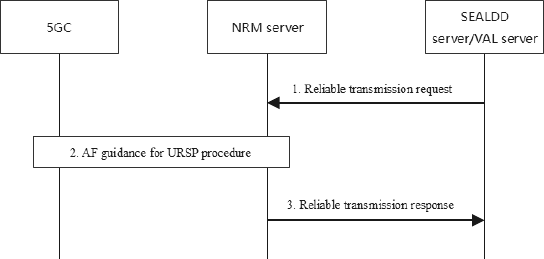

# 14.3.10 AF influence URSP procedure for reliable transmission

## 14.3.10.1 General

The procedures related to the AF influence URSP for reliable transmission are described in the following subclauses.

## 14.3.10.2 AF influence URSP procedure for reliable transmission

Pre-conditions:

1\. The SEALDD server (or VAL server) has decided to use reliable transmission for a specific SEALDD client (or VAL client) and has got the UE address or UE ID.

Figure 14.3.10.2-1: AF influence URSP procedure for reliable transmission

1\. The NRM server receives from the SEALDD server (or VAL server) about the request for reliable transmission service with the application descriptors for the two redundant transmission paths. The SEALDD client's current UE address or UE ID is also provided to identify the affected UE.

2\. After receiving the request from SEALDD server (or VAL server), the NRM server associates the available DNN and S-NSSAI information for the two application descriptors. NRM server triggers via N5/N33 with the AF guidance for URSP procedure as described in 3GPP TS 23.502 \[11\] clause 4.15.6.10. The AF request includes the application traffic descriptors and the associated DNN, S-NSSAI, and also includes UE address or UE ID received in step 1.

3\. NRM server sends response about reliable transmission service.
