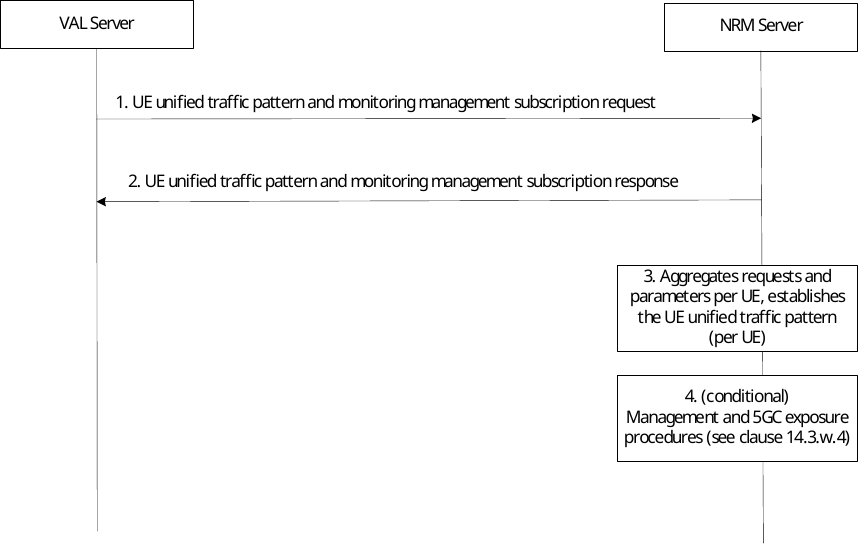
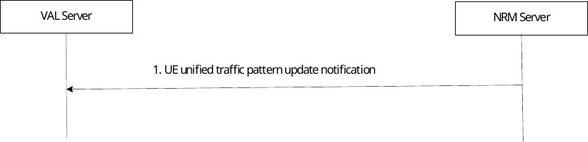
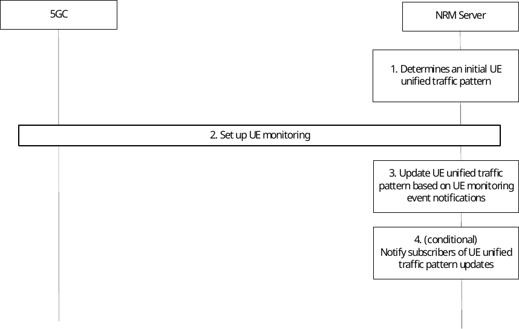
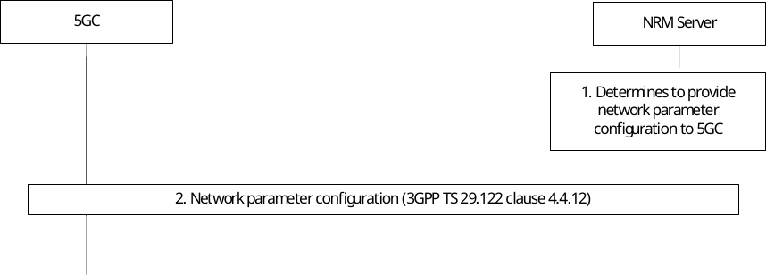

# 14.3.12 UE unified traffic pattern and monitoring management

## 14.3.12.1 General

UE unified traffic pattern and monitoring management procedures allow NRM to offer services leveraging CN exposure APIs for network parameter values configuration and UE monitoring event management.

## 14.3.12.2 UE unified traffic pattern and monitoring management subscription procedure

VAL servers can indicate to the NRM server interest in receiving UE unified traffic patterns and monitoring management services by sending the UE unified traffic pattern and monitoring management subscription requests.

The subscription requests from each VAL server also include the traffic pattern configuration of the requester, which refers to application-level patterns of data traffic. The NRM server aggregates the traffic patterns obtained from the requestors (and described in Table 14.3.2.53-2) to determine the UE unified traffic patterns per UE. The UE unified traffic patterns are described via Table 14.3.2.55-1 for the UE unified traffic pattern update notification. These aggregated traffic patterns per UE (termed UE unified traffic pattern) are updated/adjusted by the NRM Server based on information obtained from UE monitoring.

Figure 14.3.12.2-1: UE unified traffic pattern and monitoring management subscription procedure

1\. In order to subscribe to the NRM Server services, the VAL server sends the UE unified traffic pattern and monitoring management subscription request, as detailed in clause 14.3.2.53. The subscription request may include traffic pattern configuration, which provides the traffic patterns of the specific VAL Server. The request may also include Management subscription indications which indicate to the NRM Server which management and 5GC exposure procedures the VAL server allows the NRM Server to perform on its behalf.

2\. Upon receipt of the request, the NRM server sends a UE unified traffic pattern and monitoring management subscription response as detailed in clause 14.3.2.54.

3\. The NRM Server aggregates UE unified traffic pattern and monitoring management subscription requests from different VAL servers and determines the UE unified traffic pattern per UE (using the traffic patterns of all the communicating with the UE).

4\. Depending on the subscription requests received and local policies, the NRM Server executes one or more management and 5GC exposure procedure (per UE). Management and 5GC exposure procedures are detailed in clause 14.3.12.4.

> The NRM Server determines the management procedures required to be executed on behalf of the VAL Servers based on the received management subscription indications as follows:

\- If the UE unified traffic pattern monitoring management indication is provided, the NRM Server executes steps 1-3 of the UE unified traffic pattern monitoring procedure detailed in clause 14.3.12.4.2.

\- If the UE unified traffic pattern monitoring update notification indication is provided, the NRM Server executes the steps 1-4 of the UE unified traffic pattern monitoring procedure detailed in clause 14.3.12.4.2.

\- If the Network parameter coordination indication is provided, the NRM executes the network parameter coordination procedure detailed in clause 14.3.12.4.3.

NOTE: The NRM Server translates the management subscription indications received from different VAL Servers into per-UE management indications based on local policies and configurations. For example, an NRM Server may be configured to execute a management procedure for a UE if at least one VAL Server indicates it. Another NRM Server may be configured to provide all the management procedures for the UEs using the platform independent of VAL Server subscription indications.

## 14.3.12.3 UE unified traffic pattern update notification procedure

An NRM Server can provide updated UE unified traffic pattern information to VAL servers by sending UE unified traffic pattern update notifications as shown in figure 14.3.12.3-1. The UE unified traffic pattern management procedure detailed in clause 14.3.12.4.2. is an example of procedure which may result in UE unified traffic pattern updates at the NRM server, based on which UE unified traffic pattern update notifications are provided.

Pre-conditions:

1\. The VAL server has subscribed for UE unified traffic pattern and monitoring management services, requesting to receive UE unified traffic pattern update notifications

Figure 14.3.12.3-1: UE unified traffic pattern update notification procedure

1\. The NRM server sends the UE unified traffic pattern update notification when either of the following occurs:

\- Monitoring events lead to updates in the UE unified traffic pattern (e.g., to schedule elements in Table 14.3.2.55-1) the NRM server sends a corresponding notification to the VAL server. Other notifications may be provided, e.g., if the stationary indication changes.

\- An NP Configuration Notification is received with a new set of applied network parameters and if the NRM Server determines that the new configuration is incompatible with the current UE unified traffic pattern (see also clause 14.3.12.4.2 step 3).

## 14.3.12.4 Management and 5GC exposure procedures

### 14.3.12.4.1 General

The management and 5GC exposure procedures in this clause show NRM processing and its interactions with 5GC in support of the functionality described in clause 14.3.12.2

### 14.3.12.4.2 UE unified traffic pattern management procedure

The UE unified traffic pattern management procedure is used to determine and manage a unified traffic pattern applicable to a specified UE. The NRM Server then uses the 5GC exposure of UE monitoring events to update the UE unified traffic pattern.

Pre-conditions:

1\. The NRM Server determines to provide the service for a specific UE if either of the following conditions is true:

a\) It receives UE unified traffic pattern monitoring management indications in UE unified traffic pattern and monitoring management subscription requests; or

b\) It determines to provide Network parameter coordination services for the UE.

Figure 14.3.12.4.2-1: UE unified traffic pattern and monitoring management subscription procedure

1\. The NRM Server determines an initial UE unified traffic pattern, e.g. by using all Traffic pattern configurations received for the UE .

2\. The NRM Server determines, based on local policy that UE monitoring events are to be configured and executes the corresponding Monitoring procedure as described in 3GPP TS 29.122 \[54\] clause 4.4.2.

3\. The NRM Server updates the UE unified traffic pattern based on the received monitoring events as follows:

\- If a Monitoring Notification report for UE_REACHABILITY is received, and *idleStatusInfo* information is provided in the report, the NRM Server changes the schedule element of the UE unified traffic pattern such that the duration of activity is set to the value of the *activeTime* parameter configured in the *idleStatusInfo*.

\- If a Monitoring Notification report for AVAILABILITY_AFTER_DDN_FAILURE is received after UEs transition to idle mode, the NRM Server updates the schedule element of the UE unified traffic pattern such that: the start of an activity window is based on the Idle Timestamp, with a periodicity equal to the TAU/RAU Timer; the duration of the activity window indicates the Active Time value.

\- If a Monitoring Notification report for COMMUNICATION_FAILURE is received The NRM updates the schedule element of the UE unified traffic pattern to indicate that no communications are currently available (e.g. by using a keyword such as "NULL"). Local policies may specify events/ thresholds further defining when the NRM may provide a UE unified traffic pattern update based on monitoring events. For example, the update may be provided only after repeated communication failures are received within a timespan, or only if high reliability communications are expected. It is recommended that UE Reachability monitoring is also enabled in conjunction with the Communication Failure monitoring. This enables the NRM to provide updated timing information once the UE becomes reachable again.

\- If a Monitoring Notification report for LOSS_OF_CONNECTIVITY is received, the NRM Server changes the schedule element of the UE unified traffic pattern to indicate that no communications are currently available

4\. Conditional: The NRM Server notifies subscribers of the UE unified traffic pattern updates, as described in clause 14.3.2.55

### 14.3.12.4.3 Network parameter coordination procedure

The network parameter coordination procedure uses UE unified traffic pattern information to influence aspects of UE/network behaviour such as the UE's PSM and extended idle mode DR14. For this purpose, parameter values may be suggested for Maximum Latency and Maximum Response Time for a UE. 5GC may choose to accept, reject or modify the suggested configuration parameter value.

Pre-conditions:

1\. The NRM Server determines to provide the service for a specific UE after receiving Network parameter coordination indications in UE unified traffic pattern and monitoring management subscription requests, subject to policy.

2\. The NRM Server determines and manages UE unified traffic patterns as described in clause 14.3.12.4.2.

Figure 14.3.12.4.3-1: Network parameter coordination procedure

1\. The NRM Server determines to provide Network parameter configuration to 5GC. This determination can be based on updates to the UE unified traffic patterns resulting from interactions with VAL Servers (e.g. Traffic pattern configuration updates), on local policies, etc.

> The NRM Server determines parameters the needed for NpConfiguration data structure as specified in 3GPP TS 29.122 \[54\] from the UE unified traffic patterns as follows:

*- maximumLatency* – This value tells the network how long the UE is allowed to sleep. Setting it to 0 will disable PSM, extended idle mode DRX, and extended buffering. The NRM Server can extract the periodicity derived from the UE unified traffic pattern, which includes the schedule elements for the UEs communications with all VAL servers. The NRM Server sets *Maximum Latency* to be approximately the periodicity of the active periods derived from the schedule element of the UE unified traffic pattern.

*- maximumResponseTime* – When the UE uses PSM, Maximum Response Time tells the network how long the UE should stay reachable after a transition to idle. When the UE uses eDRX, Maximum Response Time is used by the network to determine when to send a reachability notification before a UE's paging occasion. The NRM Server extracts a duration of activity from the schedule element of the UE unified traffic pattern and sets *Maximum Response Time* to reflect the duration of activity, indicating how long the UE should stay reachable for downlink communications.

2\. The NRM Server performs the Network Parameter Configuration procedure as described in 3GPP TS 29.122 \[54\] clause 4.4.12.

NOTE: The values provided by NRM Server to 5GC in the Network parameter configuration procedure may or may not be accepted by the network. If they are not accepted, 5GC responds accordingly and the previous values apply, or new values are provided. The new values are used by NRM Server as described in this clause when they were provided via monitoring event notifications.
