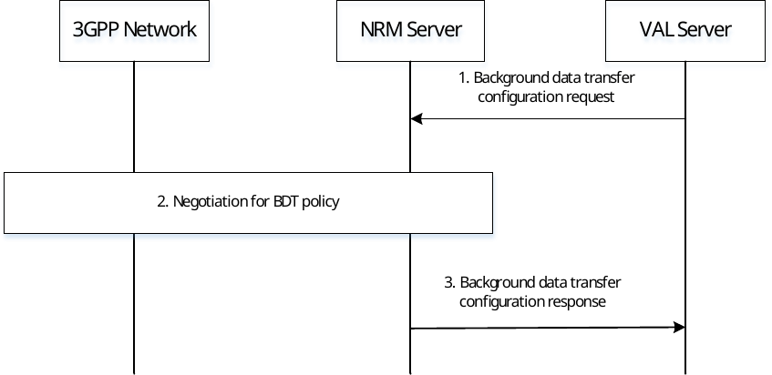
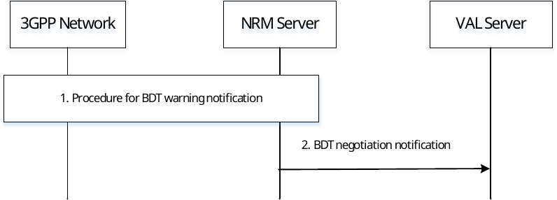
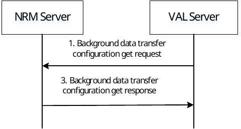
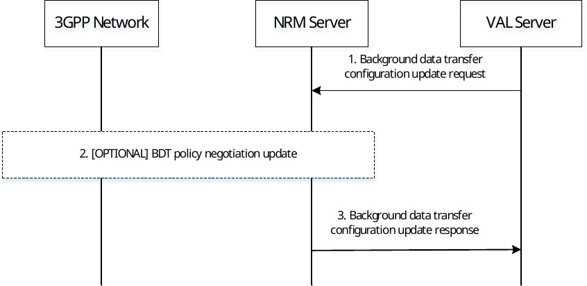
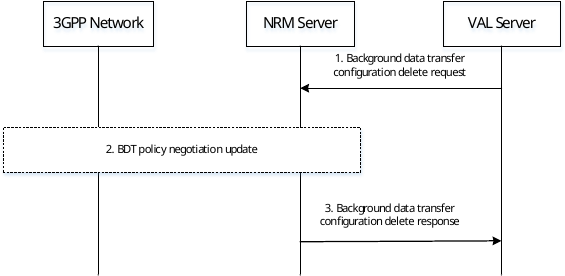

# 14.3.13 Background Data Transfer configuration

## 14.3.13.1 General

The Background Data Transfer (BDT) feature requires an initial step in which BDT policies are requested and negotiated. BDT Policy requests to the 3GPP network are based on an expected time window, expected data volume per UE and UE set, with additional optional information e.g., network area information. The UE set is indicated as an expected number of UEs, and optionally a VAL group ID or a list of VAL UE IDs.

The feature allows for the NRM server involved to negotiate the BDT policies proposed by the network. It also allows the NRM server to enable notifications to be sent, should network conditions affect future BDT policies.

Based on the BDT policies obtained using the procedures detailed in this clause, a VAL server can initiate a data transfer to the client and/or the VAL client can initiate a data transfer to the VAL server at the negotiated time and with the negotiated charging rates. The data transfer between the VAL Server and the VAL Client is performed without NRM Server enablement. Service layer functionality for the purpose of facilitating the data transfer with the negotiated BDT policy is not in scope of this specification.

## 14.3.13.2 Request and Select Background Data Transfer Policy

Figure 14.3.13.2-1 depicts a general procedure for the request and configuration of traffic policies for BDT initiated by a request from a VAL Server.

Figure 14.3.13.2-1: General Procedure for configuration of Background Data Transfer

1\. A VAL Server requests the NRM Server to negotiate with the 3GPP network a background data transfer policy using the BDT_Configuration_request (see clause 14.4.2.15).

> The request includes expected data volume per UE, expected number of UEs, expected time window for the background data transfer. The request may also include group ID, geographic information for the UEs, application traffic descriptors, a request expiration time, guidance for policy selection. If guidance for policy selection is not included, the NRM Server may choose independently from among multiple transfer policies, depending on local and ASP-provided policies.

2\. Based on the request expiration time and Service Provider policies, NRM Server may determine to delay interactions with the 3GPP network in order to negotiate on behalf of multiple VAL Servers.

> The NRM Server performs the procedure for negotiation of background data transfer policy as described in 3GPP TS 23.502 \[11\] clause 4.16.7.2. The procedure requires that expected data volume per UE, expected number of UEs, and expected time window are provided by the NRM Server. If the NRM Server determines to negotiate on behalf of multiple VAL Servers, the parameters included reflects a superset of the individual VAL Server requests.
>
> NOTE 1: The NRM Server determines to negotiate on behalf of multiple VAL Servers based on implementation options and local policies. For example, if the request expiration time and expected time window are sufficiently large and, respectively, far away in time, the NRM Server may be allowed to delay the negotiations with the 3GPP network in case another request is received, targeting the same group of UEs. If another request is received with expected time windows sufficiently close and if the guidance for policy selection allows, a single policy/time window may be negotiated instead. This allows the UE group to wake up only once for multiple background data transfers.
>
> The 3GPP network determines one or more applicable BDT policies based on the requesting Background Data Transfer parameters. A list of BDT policies and a mandatory BDT Reference ID is provided to the NRM Server. Each BDT policy includes charging rating group reference and allocated time window and optional maximum UL and DL aggregated bandwidth as specified by 3GPP TS 23.503 \[12\]. The NRM Server uses ASP policies and the transfer selection guidance (if available) to select a BDT policy. The NRM Server informs the 3GPP Network of the selected BDT policy.
>
> NOTE 2: Based on 3GPP TS 23.503 \[12\] clause 6.1.2.4. it is assumed that the NRM server is configured to understand the charging rating group reference based on agreements with the operator.
>
> NOTE 3: The NRM server utilizes the BDT warning notification from 3GPP network based on local policies.

3\. The NRM Server stores the BDT configuration information with the information received from VAL server in step 1 along with the BDT Reference ID and selected BDT policy. The NRM server responds to the VAL Server, providing the BDT Reference ID and allocated time window of the selected background data transfer policy.

## 14.3.13.3 Reselect Background Data Transfer Policy

Figure 14.3.13.3-1 depicts a procedure for reselecting BDT policies after BDT warning.

Figure 14.3.13.3-1: Reselecting BDT policies after BDT warning

1\. The 3GPP Network, via NEF, sends the BDT warning (BDT Policy negotiate) notification to the NRM server as specified in step 10, clause 4.16.7.3 of 3GPP TS 23.502 \[11\]. The notification includes the affected BDT Reference ID and list of candidate BDT policies.

> Each of the BDT policies in the candidate BDT list includes charging rating group reference and time window, as well as optional maximum UL and DL aggregated bandwidth.

The NRM Server checks the new BDT policies included in the candidate list of the BDT warning notification. The NRM Server determines whether the notification affects multiple VAL Servers or not. The NRM Server uses ASP policies and the transfer selection guidance (if available) provided with the initial VAL Server request to select a policy.

> The NRM Server informs the 3GPP Network of the selected transfer policy or that no new policy has been selected by using steps 11-16 of the procedure for BDT warning notification in 3GPP TS 23.502 \[11\] clause 4.16.7.3.

2 The NRM server updates the BDT configuration information with the newly selected BDT policy or no BDT policy is selected for the BDT Reference ID. The NRM Server sends a BDT_Negotiation_notification (see clause 14.4.2.16), to the VAL server, providing information about the newly selected BDT policy, , if the granted time window changes or that no BDT policy is selected for the BDT Reference ID. If a new BDT policy affecting the granted time window is selected by the NRM server, the information provided to the VAL Server includes the BDT Reference ID and the granted time window.

## 14.3.13.4 BDT configuration get

Figure 14.3.13.4-1 illustrates a procedure for retrieving the BDT configuration on the NRM server by the VAL server.

Pre-conditions:

1\. The VAL server has performed the BDT configuration request as specified in clause 14.3.13.2.

Figure 14.3.13.4-1: BDT configuration get

1\. A VAL Server requests the NRM Server to retrieve its background data transfer policy configuration using the BDT_Configuration_Get_request (see clause 14.4.2.19).

> The request includes identifier for the BDT policy configuration stored at the NRM server.

2\. The NRM Server provides a response to the VAL server indicating success or failure of the operation and the BDT configuration data available at the NRM server.

## 14.3.13.5 BDT configuration update

Figure 14.3.13.5-1 illustrates a procedure for updating the BDT configuration on the NRM server by the VAL server.

Pre-conditions:

1\. The VAL server has performed the BDT configuration request as specified in clause 14.3.13.2.

Figure 14.3.13.5-1: BDT configuration update

1\. A VAL Server requests the NRM Server to update its background data transfer policy configuration using the BDT_Configuration_Update_request (see clause 14.4.2.20).

> The request includes identifier for the BDT policy configuration stored at the NRM server and one or more updated information like expected data volume per UE, expected number of UEs, expected time window for the background data transfer, geographic information for the UEs, a request expiration time, guidance for policy selection.

2\. The NRM Server may perform the BDT policy negotiation as specified in 3GPP TS 23.502 \[11\] clause 4.16.7.2. The request for update of the BDT policy configuration by the VAL server may impact the selected BDT policy.

3\. The NRM Server provides a response to the VAL server indicating success or failure of the operation.

## 14.3.13.6 BDT configuration delete

Figure 14.3.13.6-1 illustrates a procedure for deleting the BDT configuration on the NRM server by the VAL server.

Pre-conditions:

1\. The VAL server has performed the BDT configuration request as specified in clause 14.3.13.2.

Figure 14.3.13.6-1: BDT configuration delete

1\. A VAL Server requests the NRM Server to delete its background data transfer policy configuration using the BDT_Configuration_delete_request (see clause 14.4.2.21).

> The request includes identifier for the BDT policy configuration stored at the NRM server.

2\. The NRM Server may perform the BDT policy negotiation update as specified in 3GPP TS 23.502 \[11\] clause 4.16.7.2. If NRM server is currently serving only one VAL server, then BDT policy update is performed as specified in 3GPP TS 23.502 \[11\] clause 4.16.7.3. The request for deletion of the BDT policy configuration by the VAL server removes the requirement of the VAL server and/or the VAL UE or group of VAL UEs to perform BDT.

3\. The NRM Server provides a response to the VAL server indicating success or failure of the operation.
