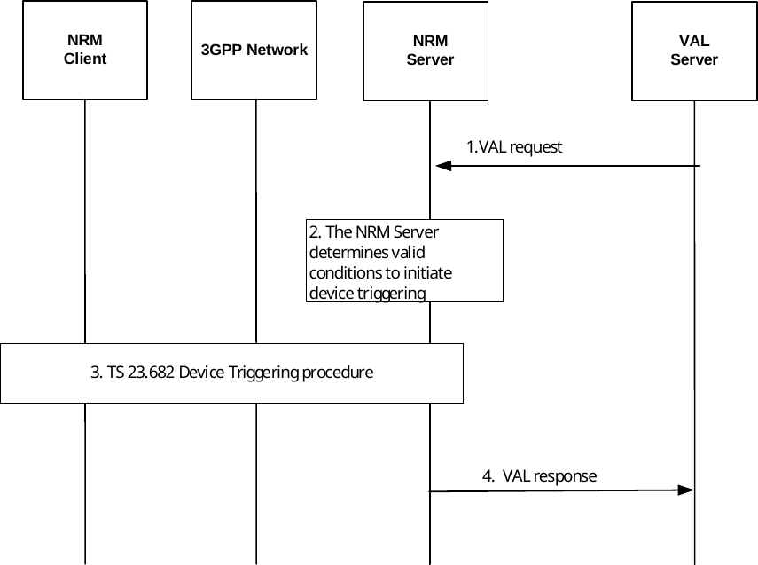

# 14.3.14 Device triggering

## 14.3.14.1 General

A service may initiate a device trigger to a UE to cause it, for example, to connect to a VAL server, to provide updated information, etc.

## 14.3.14.2 Device Triggering via NRM procedure

Figure 14.3.14.2-1: Device Triggering via NRM Procedure

1\. The device triggering procedure is initiated by an API request from a VAL Server.

2\. The NRM Server determines the valid conditions to initiate the device triggering procedure with the CN. The determination is based on request parameters as follows:

a\) If “Time Window” IE is present, the NRM Server includes its value to limit the conditions considered as valid based on step a) and/or to determine the trigger validity time value for the CN API request .

b\) If “Area information” IE is present, the NRM Server includes its value to limit the conditions considered as valid based on step b)

3\. The NRM Server performs the device triggering procedure described in 3GPP TS 23.682 \[7\] clause 5.2. The procedure requires that the UE Identifier, port number(s) and protocol information are available at the NRM Server. The trigger may be sent to ensure that a target UE in PSM mode is reachable when application communications resume.

As part of the procedure, the NRM Server receives a Device Triggering delivery status report from SCEF/NEF indicating the success of the delivery.

4\. The NRM Server responds to the step 1 request.

Based on the trigger purpose derived from the payload, the targeted NRM Client or VAL Client performs the corresponding actions (e.g., connect to the VAL Server).
