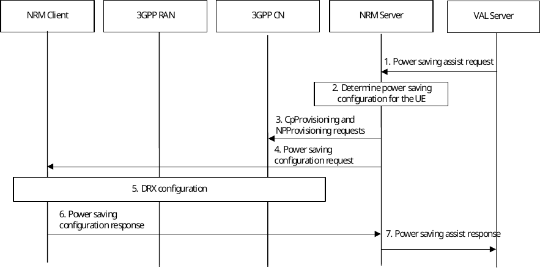
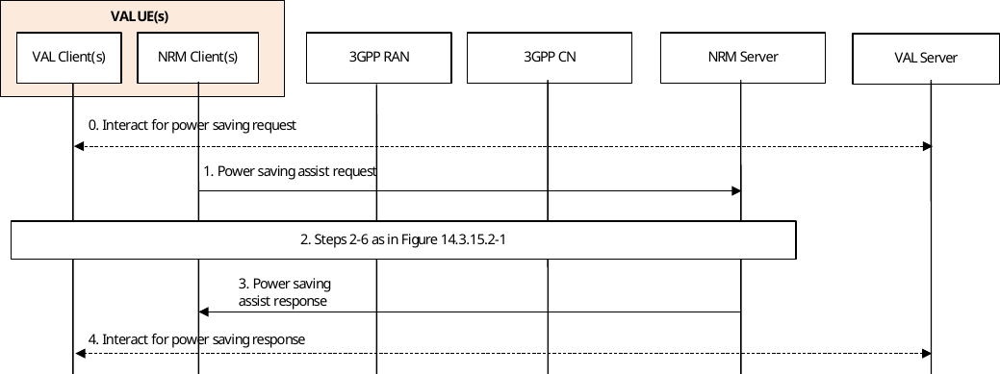

# 14.3.15 Power saving configuration

## 14.3.15.1 General

This clause discusses the possibility for the VAL server or VAL client (via the NRM server or NRM client, respectively) to influence the power saving configurations of a VAL UE(s), e.g., by configuring their DRX and eDRX parameters, through e.g., CpProvisioning, NpConfiguration and/ or MonitorEvent APIs to meet the application requirement, e.g., IoT application requirements.

For this purpose, the NRM server may be configured with DRX and eDRX parameters that influences different power saving modes, which for example extend the battery lifetime.

NOTE 1: It is up to the PLMN operator to determine which parameters the NRM server may request to reconfigure the VAL UEs.

NOTE 2: It is up to the PLMN operator to accepted, modify, or reject the requested configurations by the NRM server.

The power saving configurations may either be triggered by the VAL server as described in clause 14.3.15.2, or by the VAL UE as described in clause 14.3.15.3.

## 14.3.15.2 VAL server triggers power saving configuration

Figure 14.3.15.2-1 describes the procedure when the VAL server triggers power saving assist service for power saving in IoT devices.

Figure 14.3.15.2-1: Procedure for VAL server triggers power saving assist service

1\. VAL server requests the NRM Server to assist power saving of the VAL user(s) that are part of VAL Service using the Power_Saving_Assist_Request (see clause 14.4.6.2). The request contains the list of VAL UEs and VAL Users that are targets for the power saving, VAL service ID, power saving requirements, e.g., mode (economy, balanced, performance).

2\. NRM server determines, based on the VAL service ID, UE(s) access type and power saving mode, the power saving configuration, network parameters and communication pattern parameters for each requested VAL UE(s). Furthermore, the SEAL Server may determine the VAL UE ID(s) associated with the VAL user(s) included in step 1.

3\. NRM Server interacts with 3GPP CN (e.g., CpProvisioning, NpConfiguration and/or MonitorEvent APIs) to provision the VAL UE(s) network parameters and communication pattern parameters determined in step 2.

4\. NRM Server interacts with NRM Client with recommended power saving configuration for the UE (e.g., the determined power saving configuration in step 2).

5\. The target UE interacts with 3GPP network as per clause 4.2.2.2.2 of 3GPP TS 23.502 \[11\], to indicate the desired power saving configuration, e.g., DRX or eDRX configuration. The UE receives from 3GPP RAN the accepted power saving configuration.

NOTE: It is up to the 3GPP system to determine the final DRX configurations to be reconfigured in the VAL UE.

6\. NRM Client responds to the NRM Server with power saving configuration response and indicates the accepted power saving configuration.

7\. NRM Server responds to the VAL Server with power saving assist response.

## 14.3.15.3 VAL client triggers power saving configuration

Figure 14.3.15.3-1 describes the procedure when the VAL client triggers power saving assist service for power saving in IoT devices.

Figure 14.3.15.3-1: Procedure for VAL client triggers power saving assist service

0\. VAL Server may interact with VAL UE(s) that are part of VAL Service for power saving request.

1\. NRM Client requests the NRM Server to assist power saving of the VAL UE(s). The NRM client indicates the desired power saving configuration to the NRM Server.

2\. Steps 2-6 as in Figure 14.3.15.2-1.

3\. The NRM Server responds to the NRM Client with power saving assist response.

4\. The VAL UE may interact with VAL Server for power saving response.
