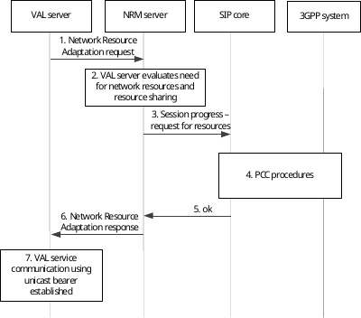
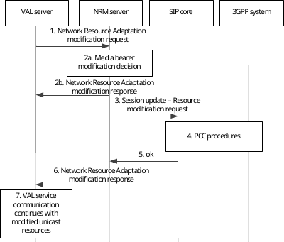
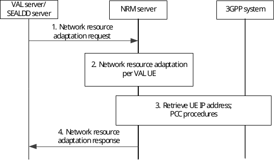
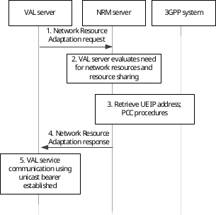
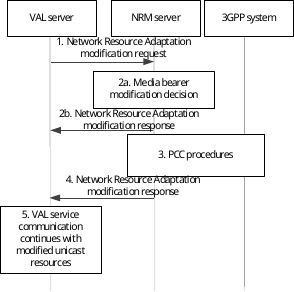
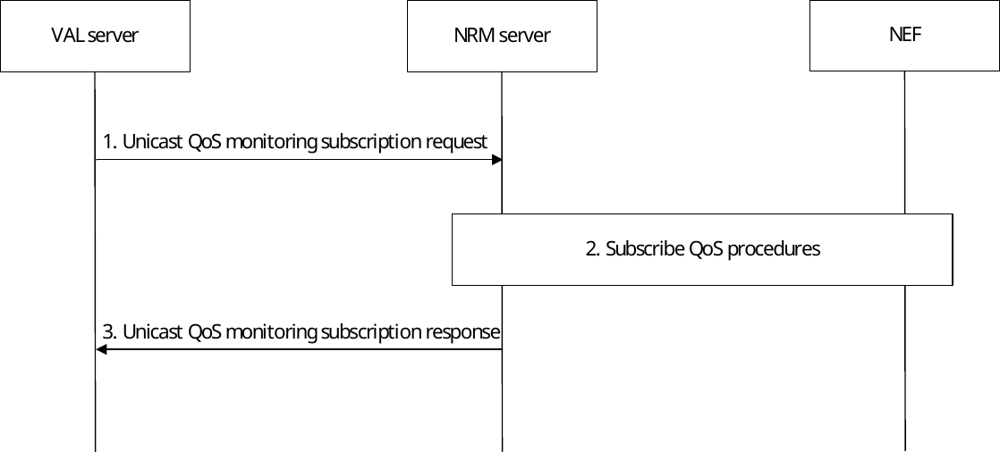
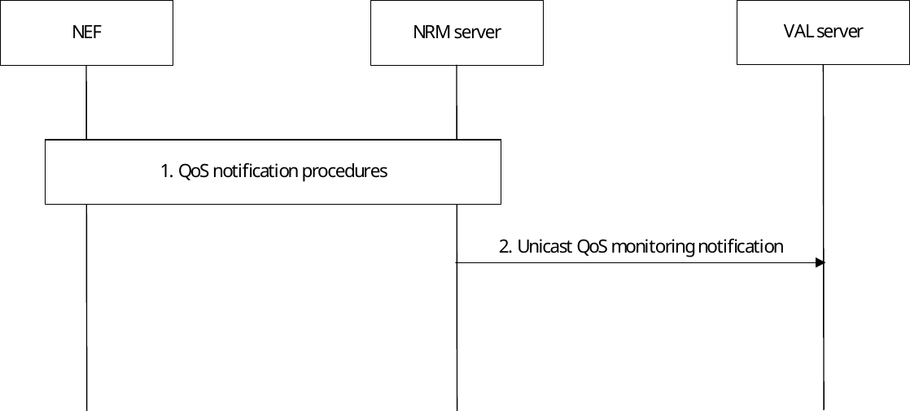
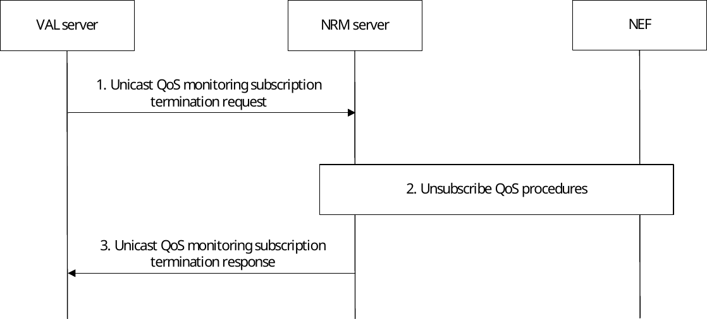
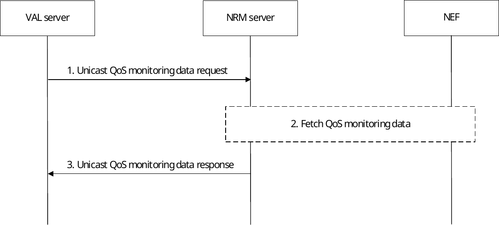
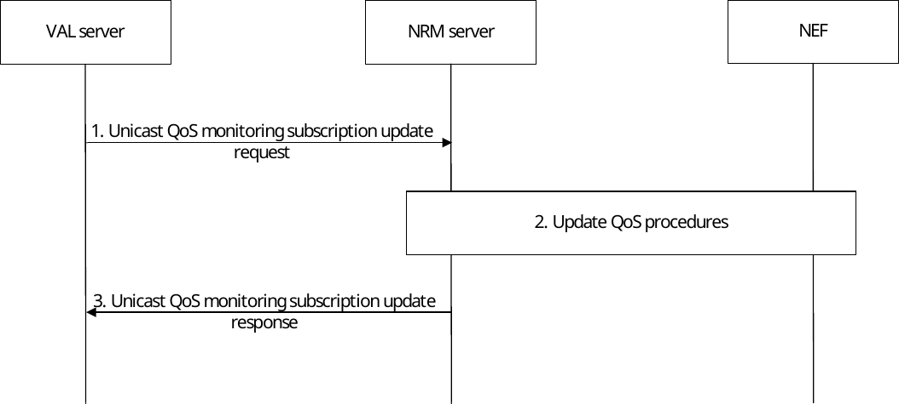

# 14.3.3 Unicast resource management

## 14.3.3.1 General

The following subclauses specify the procedures for unicast resource management for vertical application layer. The NRM server sets up bearers and may need to modify the bearers for an already established VAL service communication.

Characteristics that may need to be modified include:

\- activation and deactivation of the bearer;

\- modification of the QoS characteristics of the bearer (e.g. bearer priority adjustment); and

\- modification of GBR due to application requirement

NOTE: A VAL service communication can consist of both unicast and multicast bearers which can all need modification due to the same event.

Vertical application layer specific pre-requisites and resultant behaviour by functional entities in performing these procedures are specified in the respective vertical application layer TS (e.g. for V2X application layer, see 3GPP TS 23.286 \[7\]).

Unicast resource management is supported with NRM server interactions with SIP core and NRM server interactions with PCC. The PCC procedures for EPS are specified in 3GPP TS 23.203 \[18\] and the PCC procedures for 5GS are specified in 3GPP TS 23.503 \[19\].

## 14.3.3.2 Unicast resource management with SIP core

### 14.3.3.2.1 Request for unicast resources at VAL service communication establishment

#### 14.3.3.2.1.1 General

The procedure defined in this subclause specifies how network resources are requested at VAL service communication establishment. If concurrent sessions are used the NRM server may utilize the capability of resource sharing specified for underlying network policy and charging functions. The request for resources includes application type, bandwidth, priority, application identifier and resource sharing information.

#### 14.3.3.2.1.2 Procedure

The procedure is generic to any type of session establishment that requires requests for network resources.

Procedures in figure 14.3.3.2.1.2-1 are the signalling procedures for the requesting resource at session establishment.

Pre-condition:

\- The VAL client has requested VAL service communication with the VAL server.

Figure 14.3.3.2.1.2-1: Resource request at VAL service communication establishment

1\. The VAL server sends request for network resource adaptation to the NRM server. The request includes a VAL UE ID or a VAL user ID.

2\. The NRM server evaluates the need for network resources and use of resource sharing.

3\. The NRM server sends a session progress request containing request for resources.

4\. PCC procedures are initiated from SIP core local inbound/outbound proxy.

5\. The SIP core local inbound / outbound proxy sends a OK message to the NRM server.

6\. The NRM server sends a network resource adaptation response to the VAL server.

7\. The VAL service communication is established, and resources have been allocated.

### 14.3.3.2.2 Request for modification of unicast resources

#### 14.3.3.2.2.1 General

To modify unicast bearers, the NRM server shall send a network resource adaptation request containing the parameters to be modified for the UE.

Possible scenarios when this procedure may be used are:

\- Modify the allocation and retention priority for unicast resources;

\- Release and resume resources in-between VAL service communications; or

\- Release and resume resources when a UE is able to receive the VAL service communications over multicast transmission

#### 14.3.3.2.2.2 Procedure

Procedures in figure 14.3.3.2.2.2-1 are the signalling procedures for the modification of a unicast:

Pre-condition:

\- A VAL service communication is already in progress;

\- The VAL server requested network resources for the VAL UE ID, VAL User ID.

Figure 14.3.3.2.2.2-1: Bearer modification request

1\. The VAL server sends a network resource adaptation modification request to the NRM server. The request includes a VAL UE ID or a VAL user ID whose resources need to be modified.

2a. The NRM server decides to modify the parameters of a unicast bearer.

2b. If the media bearer modification is not required, the NRM server sends a adaptation resource adaptation modification response to the VAL server.

3\. The NRM server sends a session update which includes a resource modification request containing the modified parameters of the unicast bearer.

4\. PCC procedures are initiated from SIP core local inbound/outbound proxy.

5\. The SIP core local inbound / outbound proxy sends a OK message to the NRM server.

6\. The NRM server sends a network resource adaptation modification response to the VAL server.

7\. The VAL service communication continues with the modified unicast resources.

NOTE 1: If the VAL service communication is transferred to multicast transmission, the unicast resources could be temporarily released.

NOTE 2: If multiple VAL service communication streams are sent to the UE, additional bearer resources could be required during an established VAL service communication. Pre-allocation of additional bearer resources already at VAL service communication establishment could be useful.

## 14.3.3.3 Unicast resource management without SIP core

### 14.3.3.3.1 Network resource adaptation

#### 14.3.3.3.1.1 General

This subclause describes the procedure for network resource adaptation using PCC procedures. This procedure satisfies the requirements for requesting unicast resources and modification to already allocated unicast resources to VAL communications.

#### 14.3.3.3.1.2 Procedure

Figure 14.3.3.3.1.2-1 illustrates the procedure for the network resource adaptation.

Pre-conditions:

SLA on QoS service type as defined in table 14.3.2.1-1 has been signed as part of agreement between ASP and MNO.

Figure 14.3.3.3.1.2-1: Network resource adaptation

1\. The VAL server (or SEALDD server) sends a network resource adaptation request to the NRM server for one or more users belonging to one or more VAL services, and may comprise one or more VAL UEs that will have updated resource requirement. This requirement may be in the form of exact resources /resource pools to be used or indication of bandwidth increase/decrease for the corresponding VAL UEs or group of VAL UEs. The BDT Reference ID may also be included for setting BDT policies.

> The SLA on the QoS service type indication may be included if there is SLA agreement for the QoS service type between VAL provider and NRM service provider. For example, VAL server may include the Nrm_QosCtrlHighDataRateLowLatency type to request the network transport resource with high data rate and low latency QoS guarantee. The high data rate requirements include the respective parameters in the QoS requirement e.g., requested maximum bitrate, requested guaranteed bitrate, media type, media format, bandwidth, and the low latency requirements include parameters e.g., UL, DL and/or round-trip latency).
>
> The resource adaptation requirement may also include the traffic type to indicate the different types of traffic flows involved (for e.g. audio, video, haptic), priority of the traffic types (the VAL server can set the priority of the traffic types involved using the priority IE) .

NOTE: The SEALDD server can use the NRM netwok resource adaption service as per the procedure defined in 3GPP TS 23.433 clause 9.11 SEALDD Background data transfer.

2\. The NRM server processes the request and applies / enforces the resource adaptation per VAL UE. If SLA on the QoS service type indication is included, the NRM checks whether the value of QoS requirement is aligned with what indicated by QoS service type indication). If yes, NRM will proceed with step 3. Otherwise, in case of conflict (i.e., no alignment) between the mandatory IE (QoS requirement) and the optional IE (SLA on QoS service type indication), then the NRM server will reject the request and the procedure is terminated.

3\. The NRM server retrieves UE IP address by using event monitoring capability for PDU session status (or PDN connectivity status) if not provided in step 1 and initiates the PCC procedures for each VAL UEby invoking the Nef_AFsessionwithQoS_create request (if the NRM server is owned by 3rd party and outside the MNO trust domain) or Npcf_PolicyAuthorization_create request (if the NRM server is within MNO trust domain). The 3GPP network processes the network service invocation from the NRM server and returns the Nef_AFsessionwithQoS_create response and the Npcf_PolicyAuthorization_create response if NRM is deployed within MNO trusted domain.

4\. The NRM server provides a network resource adaptation response to the VAL server, providing information on the fulfilment of the network resource adaptation request. This will include information either per VAL UE or per set of VAL UEs, as indicated by the request of the VAL server in step 1. If the QoS requirement cannot be satisfied, the cause of failure may be included in the response.

### 14.3.3.3.2 Request for unicast resources at VAL service communication establishment

#### 14.3.3.3.2.1 General

The procedure defined in this subclause specifies how network resources are requested at VAL service communication establishment. If concurrent sessions are used the NRM server may utilize the capability of resource sharing specified for underlying network policy and charging functions. The request for resources includes application type, bandwidth, priority, application identifier and resource sharing information.

#### 14.3.3.3.2.2 Procedure

The procedure is generic to any type of session establishment that requires requests for network resources.

Procedures in figure 14.3.3.3.2.2-1 are the signalling procedures for the requesting resource at session establishment.

Pre-condition:

\- The VAL client has requested VAL service communication with the VAL server.

Figure 14.3.3.3.2.2-1: Resource request at VAL service communication establishment

1\. The VAL server sends a network resource adaptation request to the NRM server for a VAL UE or a VAL user ID.

2\. The NRM server evaluates the need for network resources and use of resource sharing.

3\. The NRM server retrieves UE IP address by using event monitoring capability for PDU session status (or PDN connectivity status) if not provided in step 1, and then PCC procedures are initiated from NRM server.

4\. The NRM server sends a network resource adaptation response to the VAL server.

5\. The VAL service communication is established, and resources have been allocated.

### 14.3.3.3.3 Request for modification of unicast resources

#### 14.3.3.3.3.1 General

To modify unicast resources, the NRM server shall send a network resource adaptation modification request containing the parameters to be modified for the UE.

Possible scenarios when this procedure may be used are:

\- Modify the allocation and retention priority for unicast resources;

\- Release and resume resources in-between VAL service communications; or

\- Release and resume resources when a UE is able to receive the VAL service communications over multicast transmission

#### 14.3.3.3.3.2 Procedure

Procedures in figure 14.3.3.3.3.2-1 are the signalling procedures for the modification of a unicast:

Pre-condition:

\- A VAL service communication is already in progress;

\- The VAL server requested network resources for the VAL UE ID, VAL User ID.

Figure 14.3.3.3.3.2-1: Bearer modification request

1\. The VAL server sends a network resource adaptation modification request for a VAL UE ID or VAL user ID to the NRM server.

2a. The NRM server decides to modify the parameters of a unicast bearer.

2b. If the media bearer modification is not required, the NRM server sends a network resource adaptation modification response to the VAL server.

3\. PCC procedures are initiated from NRM server.

4\. The NRM server sends a network resource adaptation modification response to the VAL server.

5\. The VAL service communication continues with the modified unicast resources.

NOTE 1: If the VAL service communication is transferred to multicast transmission, the unicast resources could be temporarily be released.

NOTE 2: If multiple VAL service communication streams are sent to the UE, additional bearer resources could be required during an established VAL service communication. Pre-allocation of additional bearer resources already at VAL service communication establishment could be useful.

## 14.3.3.4 Unicast QoS monitoring

### 14.3.3.4.1 Unicast QoS monitoring subscription procedure

#### 14.3.3.4.1.1 General

This subclause describes the high level procedure for unicast QoS monitoring subscription. This procedure satisfies the requirements for monitoring of unicast QoS for already allocated unicast resources to VAL communications.

#### 14.3.3.4.1.2 Procedure

Figure 14.3.3.4.1.2-1 illustrates the high level procedure for unicast QoS monitoring subscription.

Pre-conditions:

\- The VAL UE has an established connection in the 5GS

\- The VAL server may have Monitoring profile ID pre-configured in the NRM server local configuration.

Figure 14.3.3.4.1.2-1: Unicast QoS monitoring subscription

1\. The VAL server sends a unicast QoS monitoring subscription request to the NRM server either in conjunction with a request for unicast network resources requiring QoS or when the unicast QoS connection is already established. The NRM server checks if the VAL server is authorized to initiate the unicast QoS monitoring request for the requested target VAL UEs, VAL group ID, or VAL stream IDs. The request may include monitoring profile (represents the monitoring and reporting requirements) or list of monitoring profile identifiers.

NOTE: It is left for stage 3 to decide whether to combine the QoS monitoring subscription request with the request for unicast resources.

2\. If the the monitoring profile ID and monitoring profile information elements are not provided, the NRM server shall determine the monitoring profile including the QoS measurement requirements and reporting requirements with subscription termination criteria based on the VAL service identifier and/or requester identity received in step 1. If monitoring profile ID is provided in step 1, the NRM server shall obtain the corresponding monitoring profile internally and apply for the subscription. The NRM server interacts with the NEF to establish relevant QoS monitoring subscriptions. The NRM server uses the NEF procedures for the AFsessionWithQoS described in clause 5.2.6.9 of 3GPP TS 23.502 \[11\] and the NEF procedures for the AnalyticsExposure described in clause 5.2.6.16 of 3GPP TS 23.502 \[11\] and in particular the UE Communication Analytics described in clause 6.7.3 of 3GPP TS 23.288 \[34\] and DN Performance Analytics described in clause 6.14 of 3GPP TS 23.288 \[34\]. Based on the input received from the VAL server in step 1, the NRM server determines the relevant NEF subscription procedures and the parameters for these subscriptions, such as the QoS parameters to be measured (e.g. packet delay, data rate, traffic volume), the frequency of reporting etc. For the frequency of reporting which can be event triggered, periodic, or when the PDU Session is released, the NRM server determines the following:

a\) if the reporting frequency is event triggered:

> i\) the corresponding reporting threshold to each QoS parameter;
>
> ii\) minimum waiting time between subsequent reports;

b\) if the reporting frequency is periodic, the reporting period.

3\. The NRM server responds with a unicast QoS monitoring subscription response indicating the subscription status. If the monitoring profile is not provided in step 1, the NRM server shall provide the proposed termination of reporting condition.

### 14.3.3.4.2 Unicast QoS monitoring notification procedure

#### 14.3.3.4.2.1 General

This subclause describes the high level procedure for unicast QoS monitoring notification.

#### 14.3.3.4.2.2 Procedure

Figure 14.3.3.4.2.2-1 illustrates the high level procedure of unicast QoS monitoring notification event.

Pre-conditions:

\- The VAL server has an active unicast QoS monitoring subscription with the NRM server

Figure 14.3.3.4.2.2-1: Unicast QoS monitoring notification procedure

1\. The NRM server receives QoS monitoring data by means of notifications provided by the NEF. The NRM server coordinates and combines the information from the NEF notifications and determines whether to send a notification to the VAL server based on the VAL server subscription's frequency of reporting. For a VAL group or a list of VAL UEs, the NRM server aggregates QoS monitoring data for each UE belonging to the group or the list; for a VAL stream, the NRM server aggregates the QoS monitoring data for the stream. The NRM server stores the QoS monitoring data as needed for later retrieval.

2\. The NRM server sends a unicast QoS monitoring notification including the measured QoS data and monitoring profile identifier whose reporting requirements triggered notification to the VAL server. If the reporting termination criteria is met (e.g. number of reports reached, threshold reached), NRM server shall also terminate the subscription and notify the VAL server about the subscription termination.

### 14.3.3.4.3 Unicast QoS monitoring subscription termination procedure

#### 14.3.3.4.3.1 General

This subclause describes the high level procedure for unicast QoS monitoring subscription termination.

#### 14.3.3.4.3.2 Procedure

Figure 14.3.3.4.3.2-1 illustrates the high level procedure of unicast QoS monitoring subscription termination.

Pre-conditions:

\- The VAL server has an active unicast QoS monitoring subscription with the NRM server

Figure 14.3.3.4.3.2-1: Unicast QoS monitoring subscription termination procedure

1\. When the VAL server decides to terminate a unicast QoS monitoring subscription, it sends a QoS monitoring unsubscribe request to the NRM server.

2\. The NRM server interacts with the NEF to terminate the related QoS monitoring subscriptions.

3\. The NRM server sends a QoS monitoring unsubscribe response to the VAL server.

### 14.3.3.4.4 Unicast QoS monitoring data retrieval procedure

#### 14.3.3.4.4.1 General

This subclause describes the high level procedure for unicast QoS monitoring data retrieval.

#### 14.3.3.4.4.2 Procedure

Figure 14.3.3.4.4.2-1 illustrates the high level procedure of unicast QoS monitoring data retrieval.

Figure 14.3.3.4.4.2-1: Retrieval of unicast QoS monitoring data

1\. The VAL server sends a unicast QoS monitoring data request to the NRM server specifying the details of the requested data and the time period of interest. The NRM server checks if the VAL server is authorized to initiate the unicast QoS monitoring data request for the requested target VAL UEs, VAL group ID, or VAL stream IDs.

2\. The NRM server determines if it has the requested data stored internally or whether it needs to interact with the NEF to fetch the data using the AnalyticsExposure described in clause 5.2.6.16 of 3GPP TS 23.502 \[11\] and in particular the UE Communication Analytics described in clause 6.7.3 of 3GPP TS 23.288 \[34\] and DN Performance Analytics described in clause 6.14 of 3GPP TS 23.288 \[34\]. The NRM server collects and processes the collected data to match the measurement data requirement provided in the VAL server request.

3\. The NRM server responds with a unicast QoS monitoring data response with the requested data or with a failure indication, and optionally the cause of the failure, in case the requested data is not available.

### 14.3.3.4.5 Unicast QoS monitoring subscription update procedure

#### 14.3.3.4.5.1 General

This subclause describes the high-level procedure to update unicast QoS monitoring subscription. This procedure updates the parameters to be monitored of an already existing unicast QoS monitoring subscription.

#### 14.3.3.4.5.2 Procedure

Figure 14.3.3.4.5.2-1 illustrates the high level procedure for unicast QoS monitoring subscription update.

Pre-conditions:

\- The VAL UE has an established connection in the 5GS

\- Unicast QoS monitoring subscription has successfully been ~~invoked~~ established for the VAL UE

Figure 14.3.3.4.5.2-1: Unicast QoS monitoring subscription update

1\. The VAL server sends a unicast QoS monitoring subscription update request to the NRM server. It shall refer to an existing subscription, identified by the list of VAL UEs, VAL UE group or VAL stream IDs included into the message.

2\. The NRM server interacts with the NEF to update the relevant QoS monitoring subscription parameters and reporting frequency as specified in step 2 of clause 14.3.3.4.1.2 of this document.

3\. The NRM server responds with a unicast QoS monitoring subscription update response indicating the subscription status.
