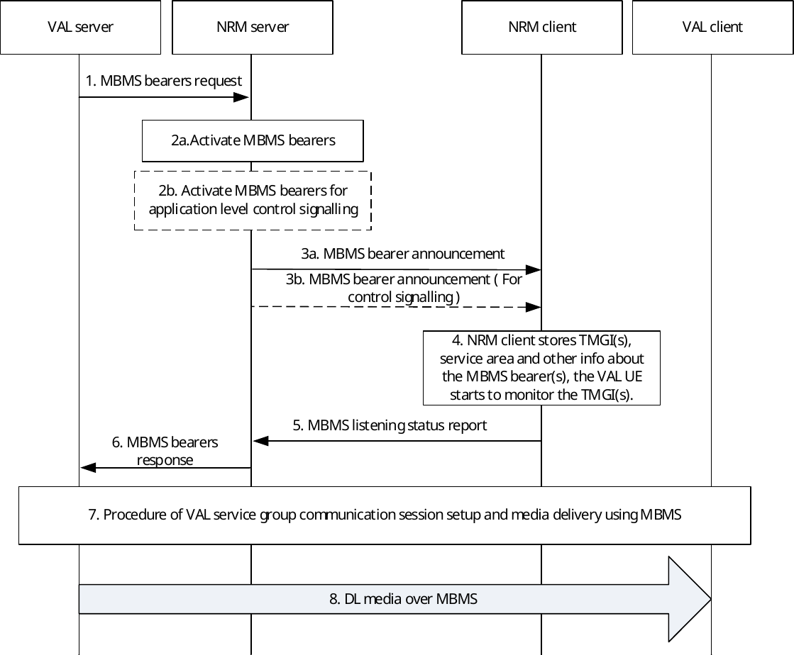

# 14.3.4.2 Use of pre-established MBMS bearers

## 14.3.4.2.1 General

In this scenario, upon triggered by VAL server, the NRM server pre-establishes MBMS bearer(s) in certain pre-configured areas before the initiation of the VAL service group communication session. When a user originates a request for a VAL service group communication session for one of these areas, the pre-established MBMS bearer(s) is used for the DL VAL service communication.

The following steps need to be performed prior to the start of the VAL service group communication session over pre-established MBMS bearer:

\- Pre-establish MBMS bearer(s)

\- Announce the pre-established MBMS bearer to the NRM clients

When these preparation steps have been done the VAL service group communication session using MBMS bearer can start.

The vertical application level communications are sent on the MBMS bearer. Optionally a separate MBMS bearer could be used for the application level control messages, due to different bearer characteristic requirements.

## 14.3.4.2.2 Procedure

The procedure figure 14.3.4.2.2-1 shows only one of the receiving VAL clients using an MBMS bearer. There might also be VAL clients in the same VAL service group communication session that receive the communication on unicast bearers.

Figure 14.3.4.2.2-1: Use of pre-established MBMS bearers

1\. The VAL server sends a MBMS bearers request to the NRM server including service description(s) for which the MBMS bearers are requested.

2a. The NRM server determines to activate MBMS bearer. The activation of the MBMS bearer in EPS is done on the MB2-C reference point and according to 3GPP TS 23.468 \[16\]. This bearer will be used for the VAL service communication. If local MBMS is requested in step 1, the NRM server uses the local MBMS information provided by VAL server in step 1 or the local MBMS information configured locally in the NRM server to activate the MBMS bearers. The NRM server performs local MBMS procedures in line with the procedure of L.MBMS based MBMS data delivery defined in 3GPP TS 23.285 \[31\].

2b. Optionally, the NRM server may also activate an MBMS bearer dedicated for application level control signalling. The activation of the MBMS bearer is done on MB2-C reference point and according to 3GPP TS 23.468 \[16\]. If local MBMS is requested in step 1, the NRM server uses the local MBMS information provided by VAL server in step 1 or the local MBMS information configured locally in the NRM server to activate the MBMS bearers. The NRM server performs local MBMS procedures in line with the procedure of L.MBMS based MBMS data delivery defined in 3GPP TS 23.285 \[31\].

NOTE 1: The procedure to determine the activation of MBMS bearers is implementation specific.

3a. The NRM server passes the MBMS bearer info for the service description associated with the pre-established MBMS bearer to the NRM client. The NRM client obtains the TMGI, identifying the MBMS bearer, from the service description.

3b. The NRM server may pass the MBMS bearer info for the service description associated with the application control MBMS bearer to the NRM client. The NRM client obtains the TMGI, identifying the MBMS bearer, from the service description.

NOTE 2: Step 3a and step 3b can be done in one MBMS bearer announcement message.

4\. The NRM client stores the information associated with the TMGI(s). The NRM service client uses the TMGI and other MBMS bearer related information to activate the monitoring of the MBMS bearer by the VAL UE. The NRM client shares the MBMS bearer related information with the VAL client.

5\. The NRM client that enters or is in the service area of at least one announced TMGI indicates to the NRM server that the VAL UE is able to receive VAL service communication over MBMS, whereby the NRM server may decide to use the MBMS bearer instead of unicast bearer for VAL service communication sessions based on available information at the NRM server including the MBMS listening status report as described in clause 14.3.4.5.

NOTE 3: Step 5 is optional for the VAL UE on subsequent MBMS bearer announcements.

6\. The NRM server provides a MBMS bearers response to the VAL server.

7\. A VAL service group communication session is established.

8\. As the VAL server transmits the VAL service communication over the MBMS bearer, the VAL service communication packets are detected and delivered to the VAL client.
