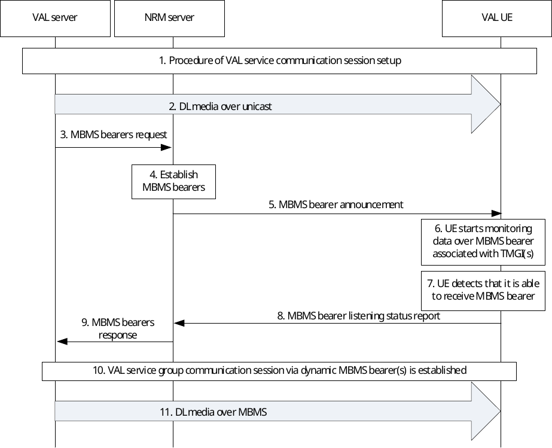

# 14.3.4.3 Use of dynamic MBMS bearer establishment

## 14.3.4.3.1 General

In this scenario, the VAL server uses a unicast bearer for communication with the UE on the DL at the start of the group communication session. When the VAL server triggers to use an MBMS bearer in EPS for the DL VAL service communication, the NRM server decides to establish an MBMS bearer in EPS using the procedures defined in 3GPP TS 23.468 \[16\]. The NRM server provides MBMS service description information associated with MBMS bearer(s), obtained from the BM-SC, to the UE. The UE starts using the MBMS bearer(s) to receive DL VAL service and stops using the unicast bearer for the DL VAL service communication.

## 14.3.4.3.2 Procedure

Figure 14.3.4.3.2-1 illustrates the use of dynamic MBMS bearer establishment.

Figure 14.3.4.3.2-1: Use of dynamic MBMS bearer establishment

1\. A VAL service group communication session is established.

2\. The downlink data is sent by unicast delivery.

3\. The VAL server sends MBMS bearers request to the NRM server.

4\. The NRM server establishes the MBMS bearer(s) for the VAL service group communication session according to the procedures defined in 3GPP TS 23.468 \[16\]. Service description associated with the MBMS bearer(s) is returned from the BM-SC. If local MBMS is requested in step 3, the NRM server uses the local MBMS information provided by VAL server in step 3 or the local MBMS information configured locally in the NRM server to activate the MBMS bearers. The NRM server performs local MBMS procedures in line with the procedure of L.MBMS based MBMS data delivery defined in 3GPP TS 23.285 \[31\].

5\. The NRM server provides service description information associated with the MBMS bearer to the UE. The VAL UE obtains the TMGI from the announcement message. This message may be sent on an application level control signalling bearer.

6\. The VAL UE starts monitoring data over MBMS associated with the TMGI, while in the service area associated with the TMGI.

7\. The VAL UE detects that it is able to receive data over MBMS associated with the TMGI.

8\. The NRM client notifies the NRM server the MBMS listening status associated to the monitored TMGI, (e.g. that it is successfully receiving the TMGI). The NRM client may also notify the MBMS reception quality level of the TMGI. The NRM server may decide to use the MBMS bearer instead of unicast bearer for VAL service communication sessions based on available information at the NRM server including the MBMS listening status report as described in clause 14.3.4.5.

9\. The NRM server provides an MBMS bearer response to the VAL server with the dynamic MBMS bearer(s) information. The VAL server stops sending VAL service communication data over unicast way to the VAL client.

NOTE: The MBMS reception quality level may be used by the NRM server to make an efficient decision to switch again to a unicast transmission or to take measures to prepare such a switch (e.g. when the quality level indicates that the reception quality of the MBMS bearer is decreasing or reaching an insufficient quality level for the reception of VAL services).

10\. A VAL service group communication session via dynamic MBMS bearer(s) is established.

11\. The VAL server sends the downlink VAL service communication for the VAL service group communication session over the MBMS.
