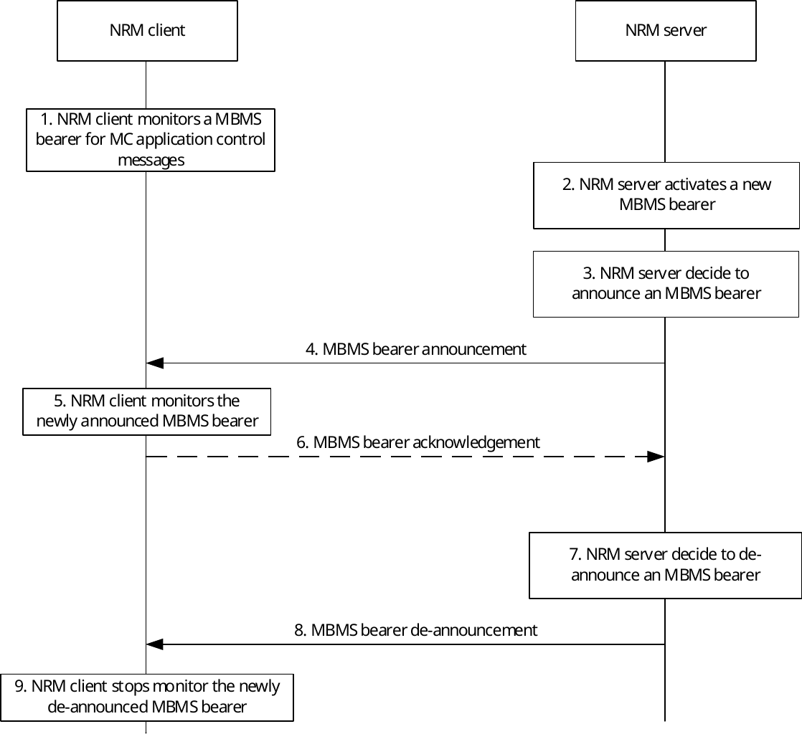

# 14.3.4.4 MBMS bearer announcement over MBMS bearer

## 14.3.4.4.1 General

The MBMS announcement may be done on either a unicast bearer or a MBMS bearer. Using a unicast bearer for MBMS bearer announcement provides an interactive way of doing announcement. The NRM server will send the MBMS bearer announcement message to the NRM client regardless if there is an MBMS bearer active or the VAL client can receive the data on the MBMS bearer with sufficient quality. The benefit of the existing procedure is that it gives a secure way to inform the NRM client about the MBMS bearer and how to retrieve the data on the MBMS bearer.

When there is more than one MBMS bearer active in the same service area for VAL service, there are not the same reasons to use unicast bearer for additional MBMS bearer announcement. Instead a MBMS bearer for application level control signalling can be used to announce additional MBMS bearers.

The MBMS bearer announcement messages are sent on an MBMS bearer used for application control messages. This bearer will have a different QoS setting compared to an MBMS bearer used for VAL service communication, since application signalling messages are more sensitive to packet loss.

## 14.3.4.4.2 Procedure

Figure 14.3.4.4.2-1 illustrates a procedure that enables the NRM server to announce a new MBMS bearer.

Pre-conditions:

1\. An MBMS bearer used for VAL service application control messages must have been pre-established and announced to the NRM client.

2\. Additional MBMS bearer information may have already been announced to the NRM client.

Figure 14.3.4.4.2-1: MBMS bearer announcement over an MBMS bearer used for application control messages

1\. The NRM client monitors an MBMS bearer that is used for VAL service application signalling messages, such as bearer announcement messages.

2\. The NRM server activates a new MBMS bearer.

3\. The NRM server announces the MBMS bearer to the NRM client. The bearer may have just been activated or may have already been running for some time. The step may be repeated as needed.

4\. The NRM server sends a MBMS bearer announcement on the MBMS bearer used for VAL application control messages. The MBMS bearer announcement contains the identity of the MBMS bearer (i.e. the TMGI) and may optionally include additional information about the newly announced bearer. Required and optional MBMS bearer announcement details may have already been provided. In this case the MBMS bearer identity could be used as a key for such MBMS bearer details.

5\. The NRM client start to monitor the newly announced MBMS bearer.

6\. If requested by the NRM server, the NRM client sends an acknowledgement of the MBMS bearer to the NRM server.

7\. The NRM server de-announce the MBMS bearer.

8\. The NRM server sends a MBMS bearer de-announcement message that contains the identity of the MBMS bearer.

9\. The NRM client stops monitoring the de-announced MBMS bearer.

The same procedure can also be used to modify existing MBMS bearer announcement information. Example of such modification could be addition of UDP ports or modification of codec in the SDP.
