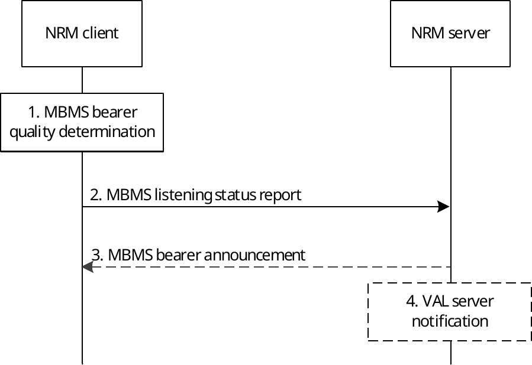

# 14.3.4.5 MBMS bearer quality detection

## 14.3.4.5.1 General

The NRM client and NRM server use this procedure to report and take action on the MBMS bearer quality towards VAL service communications. A NRM client monitors an MBMS bearer to enable receiving VAL service communication. Based on the received quality (e.g. radio level quality, transport level quality), the NRM client needs to inform the NRM server that the VAL UE is able to receive the VAL service communication on the MBMS bearer with sufficient quality or not able to receive the VAL service communication on the MBMS bearer with sufficient quality. Furthermore, based on the received quality, the NRM client may notify the NRM server at which MBMS reception quality level it has received the VAL service communication on the MBMS bearer.

The issue can be more complex since the NRM client needs to estimate the quality of the bearer even in the scenario when there are no data currently transmitted on the MBMS bearer. The reason for this is that an NRM client that has entered an area with significantly degraded MBMS quality, might not even notice that a VAL service communication is ongoing, meanwhile the NRM server still assumes that the VAL UE can receive the VAL service communication being broadcasted.

To estimate the MBMS bearer quality, for example as an equivalent BLER (Block Error Rate), when no data is sent is implementation specific. This estimation can be dependent on for example the modulation and coding scheme (MCS) and measurements from the reference signals from the eNB(s). Other metrics (e.g. RTP packet loss) may be used to estimate the MBMS bearer quality.

Based on the MBMS bearer quality reported from the NRM clients, the NRM server may decide to use the MBMS bearer for a group communication if a certain number of NRM clients located in the MBMS service area are able to receive the VAL service communication. And if a NRM client is not able to receive the VAL service communication on the MBMS bearer, the NRM server may decide to switch the user plane deliver mode for the NRM client from MBMS bearer to unicast bearer.

## 14.3.4.5.2 Procedure

The NRM client shall indicate the ability of the NRM client to receive the MBMS bearer.

Pre-conditions:

1\. There is an MBMS bearer activated and the MBMS bearer information is announced to the NRM client

2\. The NRM client is located in the MBMS broadcasting area

3\. The VAL UE monitors SIB-13 (or SIB-20) and (SC-)MCCH to receive the modulation and coding scheme

4\. The VAL UE monitors the cell specific reference signal and when MBSFN transmission is used, the MBSFN specific reference signals

Figure 14.3.4.5.2-1: MBMS bearer quality detection

1\. The NRM client determines that the MBMS bearer quality shall be reported to the NRM server. The NRM client may determine the MBMS bearer quality by using the BLER of the received data. When no data is received, the quality estimation can consider the reference signals and the modulation and coding scheme (MCS). The UE may also use predictive methods to estimate the expected MBMS bearer quality (e.g. speed and direction) to proactively inform the NRM server of an expected loss of the MBMS bearer quality. The NRM client may also map the determined MBMS bearer quality to a MBMS reception quality level. The MBMS reception quality level indicates at which specific MBMS bearer quality level the VAL service communication has been received.

NOTE 1: The set of MBMS reception quality levels and the mapping of the determined MBMS bearer quality to those levels are upto implementation.

NOTE 2: When MBSFN transmission is used, the MBSFN reference signal needs to be used and when SC-PTM is used the cell specific reference signal needs to be used. With the measured reference signal, the reference signal received quality (RSRQ) can be calculated.

2\. If the MBMS bearer quality reaches a certain threshold, the NRM client sends an MBMS listening status report. The threshold is used to define the MBMS listening status, which indicates if the MBMS bearer quality has been acceptable or not to receive a specific VAL service communication. If the MBMS bearer quality is mapped to a different MBMS reception quality level, the NRM client may send an MBMS listening status report including the MBMS reception quality level. Based on the MBMS listening status, if MBMS reception quality level is received, then the NRM server may efficiently decide to switch to another bearer (e.g., MBMS bearer or unicast bearer) or to take measures to prepare such a switch and further notify the VAL server.

NOTE 3: Prior sending the MBMS listening status report, it could be beneficial to also include information for different alternatives e.g. another MBMS bearer might have better quality and could be a better option than a transfer of the communication to unicast.

NOTE 4: The threshold used to indicate MBMS bearer quality depends on VAL service type (i.e. V2X, MCPTT, MCVideo or MCData) and the metrics used. The metrics used and the associated thresholds are out of scope of this specification.

3\. The NRM server may send additional proposal for measurements e.g. information about neighbouring MBMS bearers. This message may be an MBMS bearer announcement message.

4\. The NRM server may send user plane delivery mode to VAL server based on the MBMS listening status to preserve the service continuity as described in clause 14.3.4.6 and clause 14.3.4.9.
