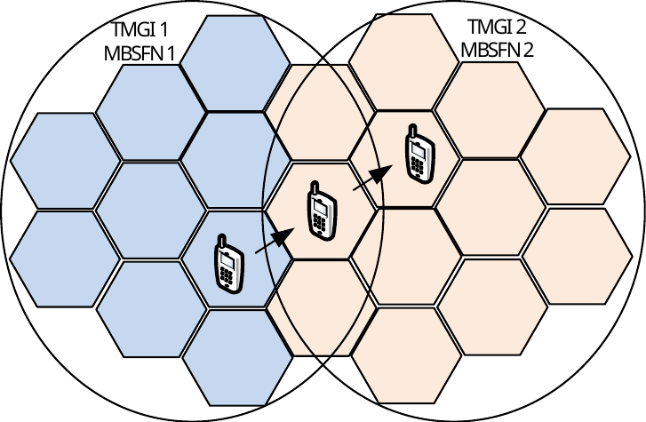
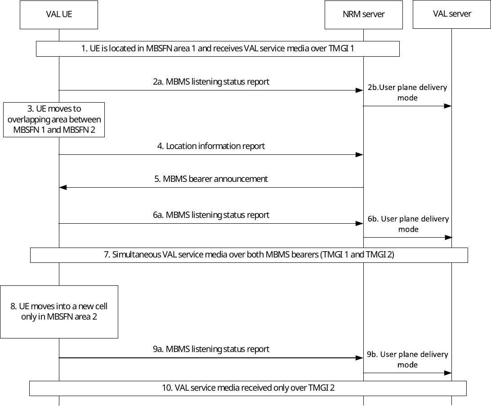
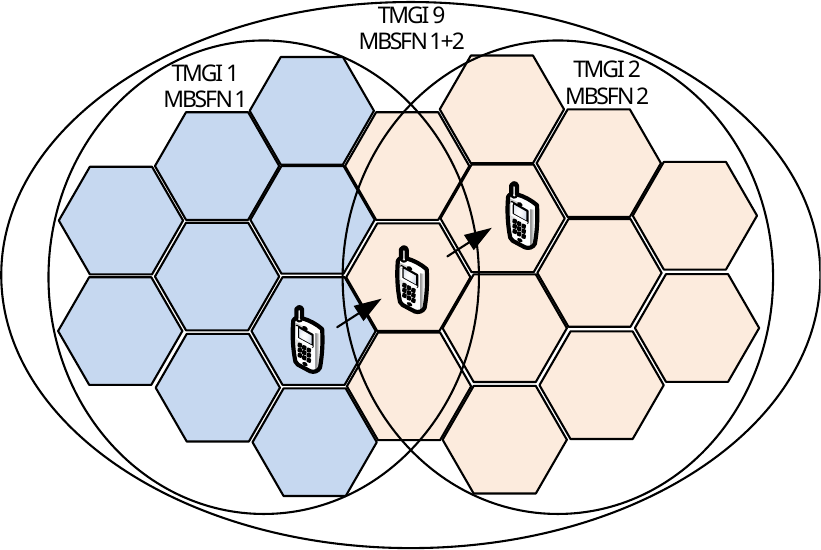

# 14.3.4.6 Service continuity in MBMS scenarios

## 14.3.4.6.1 General

This subclause specifies service continuity scenarios when MBMS bearers are used. There are different solutions for different scenarios.

## 14.3.4.6.2 Service continuity when moving from one MBSFN to another

The service continuity solution described in this subclause is suitable in the scenario when multiple MBMS bearers are used with the purpose to cover a larger area. In VAL communications several VAL service communication streams may be multiplexed in one MBMS bearer. Furthermore, one VAL service communication stream may be sent on more than one MBMS bearer if the receiving users are distributed over more than one MBMS service area. A VAL UE that is interested in receiving a VAL service communication stream that is broadcasted in both MBMS bearers is a candidate for this service continuity procedure.

Figure 14.3.4.6.2-1 illustrates a deployment scenario that provides service continuity between two MBSFN areas. Two different MBMS bearers are activated (TMGI 1 and TMGI 2), the activation of the bearers is done in the two MBSFN areas (MBSFN 1 and MBSFN 2). The MBSFN areas 1 and 2 are partially overlapping, meaning that some transmitting cells belong to both MBSFN area 1 and MBSFN area 2.

Figure 14.3.4.6.2-1: Two MBMS bearer using overlapping MBSFN areas

Figure 14.3.4.6.2-2 illustrates the procedure:

Figure 14.3.4.6.2-2: Service continuity when moving from one MBSFN to another

1\. The VAL UE is located in MBSFN 1 and can listen to TMGI 1. No additional MBMS bearers that the NRM client is interested in are active in the current cell.

2a. The NRM client notifies the NRM server that the VAL UE is successfully receiving the VAL service communication over TMGI 1. The NRM client may also notify the MBMS reception quality level of TMGI 1.

2b. The NRM server notifies a user plane delivery mode to the VAL server.

NOTE: The MBMS reception quality level may be used by the NRM server to make an efficient decision to switch to another MBMS bearer or to a unicast bearer, or to take measures to prepare such a switch (e.g. when the quality level indicates that the reception quality of the MBMS bearer is decreasing or reaching an insufficient quality level for the reception of VAL services).

3\. The VAL UE moves into a new cell in which both TMGI 1 and TMGI 2 are active. This cell is part of both MBSFN area 1 and MBSFN area 2, and broadcast the same service on both TMGIs.

4\. The NRM client sends a location information report to the NRM server. For that, the UE uses the SAI information found in the system information block (SIB) transmitted by the radio cells.

5\. The NRM server sends to the NRM client a MBMS bearer announcement with information related to TMGI 2 (if the NRM server had not done it before). Hence, the NRM client knows that TMGI 2 transmits the same VAL service communication.

6a. The NRM client notifies the NRM server that it is successfully receiving TMGI 1 and TMGI 2. The NRM client may also notify the MBMS reception quality level per TMGI.

6b. The NRM server notifies a user plane delivery mode to the VAL server.

7\. The VAL UE may receive the VAL service communication over both MBMS bearers, i.e. TMGI 1 and TMGI 2. The VAL UE may also verify that it is the same content sent on both bearers. The duplicated packets may also be used to perform error corrections.

8\. The VAL UE moves into a new cell in MBSFN area 2, where only TMGI 2 is active.

9a. The NRM client notifies the NRM server that the VAL UE is successfully receiving the VAL service communication over TMGI 2. The NRM client may also notify the MBMS reception quality level of TMGI 2.

9b. The NRM server notifies a user plane delivery mode to the VAL server.

10\. The VAL UE receives the VAL service communication only over TMGI 2.

This service continuity procedure mitigates the risk of packet loss that may occur if the VAL UE would request to transfer the VAL service communication stream to a unicast bearer when moving into the new area and then back to a multicast bearer when the UE can listen to TMGI 2. However, it is still required that the NRM client sends a location report (and MBMS listening report), as described in steps 4-6 above. To send the location report and the MBMS listening report by the NRM client to the NRM server a unicast bearer is needed. The location report from the NRM client is required, since the NRM server must know that the VAL UE has entered a new area and can only listen to MBMS bearer active in that area. If this is not done the VAL server might send a VAL service communication stream that the VAL UE is required to listen to on the MBMS bearer 1, since the NRM server still assumes that the VAL:UE is located in the MBSFN area 1.

The solution can be improved as illustrated in figure 14.3.4.6.2-3. In this case two different MBMS bearers are activated (TMGI 1 and TMGI 2), these MBMS bearers are used only for VAL service communication. An application level signalling bearer is activated (TMGI 9), in both MBSFN areas. This bearer is used for application level signalling messages that are sent on the MBMS bearer TMGI 9. By using an application level signalling bearer (e.g. TMGI 9) the VAL UEs can receive application control messages for all VAL service communication going on in the areas of both TMGI 1 and TMGI 2. A VAL UE that is located in the area of TMGI 2 and is interested in a VAL service group transmission (e.g. V2X) only going on in TMGI 1, can with the information received in TMGI 9 initiate a unicast bearer and request to receive that specific VAL service communication over a unicast instead. Without the information received over TMGI 9 the NRM client must immediately report that the VAL UE has left the broadcast area that the NRM server assumes that the VAL UE is located in. With the use of TMGI 9 there is no immediate need for the NRM client to inform the NRM server of a location change.

Figure 14.3.4.6.2-3: Two MBMS bearer using overlapping MBSFN areas with a separate application signalling bearer

The procedural steps in this scenario will be the same as described above in this subclause. However, in this scenario the NRM client is not required to initiate a unicast bearer to send location report (or MBMS listening report). The VAL UE may move between the two MBMS bearers (TMGI 1 and TMGI 2) without the need to report an area change. A condition for this to work is that there is an application level signalling bearer (TMGI 9) activated in the full area (i.e. the area of both TMGI 1 and TMGI 2). The TMGI 9 will broadcast all application control messages for all VAL service communications ongoing in both areas. If the VAL UE is in coverage of one of the two MBMS bearers that does not transmit the VAL service communication of interest the VAL UE can report to the NRM server that it is not able to listen to the VAL service communication over the MBMS bearer, which triggers the NRM server to switch to a unicast bearer instead.
