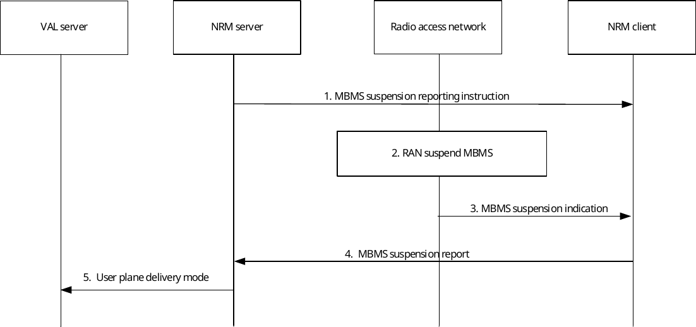

# 14.3.4.7 MBMS suspension notification

## 14.3.4.7.1 General

In this procedure the NRM client is requested by the NRM server to send a MBMS suspension report. This request for MBMS suspension report can be included in the MBMS bearer announcement and the NRM server may choose to only send this request for MBMS suspension report to a subset of all NRM clients.

## 14.3.4.7.2 Procedure

Figure 14.3.4.7.2.-1 illustrates a procedure in which the NRM client notifies the NRM server about an MBMS suspension decision in RAN.

The NRM server can decide on a subset of all VAL UEs in the MBMS broadcast area that shall report on MBMS bearer suspension. When the NRM server makes the decision of the VAL UE subset, consideration shall be taken to the location of the VAL UEs, since VAL UEs' location is dynamically changed. This means that the MBMS suspension reporting instruction may need to be updated regularly based on the VAL UEs mobility.

Pre-condition:

\- It is assumed that there is at least one active MBMS bearer

Figure 14.3.4.7.2-1: MBMS suspension notification

1\. The NRM server sends an MBMS suspension reporting instruction to the NRM client.

NOTE: This message may be included in the MBMS bearer announcement message and may be sent both on a unicast bearer and a multicast bearer.

2\. RAN decides to suspend the MBMS bearer, according to existing procedures in 3GPP TS 36.300 \[23\].

3\. An MBMS suspension indication is sent in the MSI (MCH Scheduling Information), according to existing procedures in 3GPP TS 36.300 \[23\].

4\. The NRM client detect the MBMS suspension and sends an MBMS suspension report.

5\. Based on the MBMS suspsension report received, the NRM server determines whether to switch to a new bearer (unicast or MBMS). If NRM server determines to switch to unicast bearer, then the NRM server sends the user plane delivery mode message to VAL server , and the VAL server sends the downlink data over the new bearer.

The NRM client that is not instructed to send an MBMS suspension report shall still detect the MBMS suspension indication from RAN (step 3). A NRM client shall in this case not send other types of report (e.g. MBMS listening reports).

The same procedure can be applied at MBMS resumption or other MBMS events that may be detected by the NRM client.
