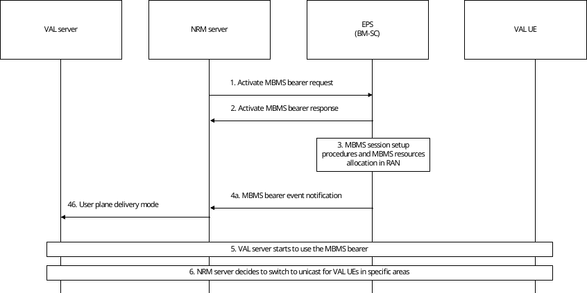

# 14.3.4.8 MBMS bearer event notification

## 14.3.4.8.1 General

The NRM server is an instantiation of a GCS AS. For the NRM server to know the status of the MBMS bearer, and thus know the network's ability to deliver the VAL service, it is required that the network provides MBMS bearer event notifications to the NRM server. The different events notified to the NRM server include the MBMS bearer start result (e.g. when the first cell successfully allocated MBMS resources), including information if any cells fail to allocate MBMS resources to a specific MBMS bearer.

## 14.3.4.8.2 Procedure

The procedure in figure 14.3.4.8.2-1 shows notification information flows from NRM server to BM-SC.

Figure 14.3.4.8.2-1: MBMS bearer event notification

1\. The NRM server activates an MBMS bearer. The activation of the MBMS bearer is done on the MB2-C reference point and according to 3GPP TS 23.468 \[16\].

2\. The BMSC will respond to the activation with an Activate MBMS bearer response message, according to 3GPP TS 23.468 \[16\].

3\. The EPC and RAN will initiate the MBMS session start procedure according to 3GPP TS 23.246 \[17\]. This procedure is outside the scope of this specification.

4a. At the first indication of a successful MBMS session start procedure, the BM-SC sends a MBMS bearer event notification, indicating that the MBMS bearer is ready to use.

4b. The NRM server notifies user plane delivery mode to the VAL server.

5\. The VAL server starts to use the MBMS bearer according to the MBMS procedures in this specification.

6\. The NRM server may decide, based on the received events (e.g., any cells fail to allocate MBMS resources to a specific MBMS bearer), to switch to unicast transmission for relevant VAL UEs.
