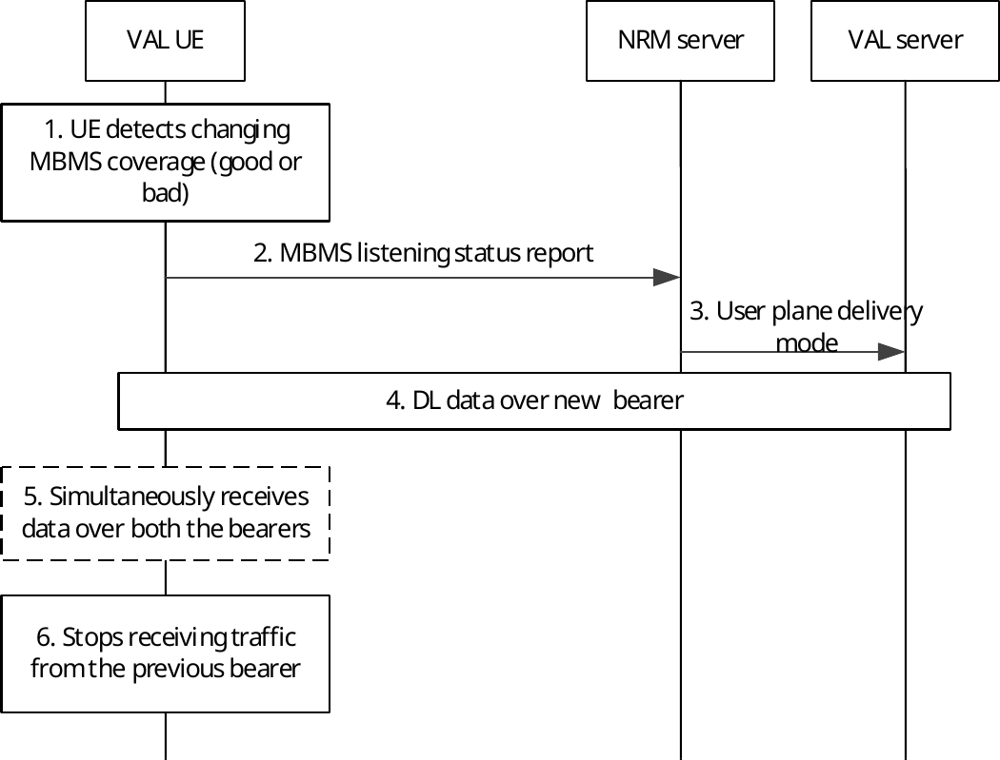

# 14.3.4.9 Switching between MBMS bearer and unicast bearer

## 14.3.4.9.1 General

The NRM server monitors the bearers used for VAL service communications and decides to switch between MBMS and unicast bearers.

## 14.3.4.9.2 Procedure

Figure 14.3.4.9.2-1 shows the procedure for service continuity when a UE is about to move out of MBMS coverage or getting into good MBMS coverage by switching between MBMS bearer and unicast bearer.

Pre-condition:

\- It is assumed that a bearer (unicast or MBMS) has been activated by the VAL server for downlink delivery.

Figure 14.3.4.9.2-1: Switching between MBMS delivery and unicast delivery

1\. The VAL UE detects changing MBMS bearer condition (good or bad MBMS coverage) for the corresponding MBMS service. The method to detect is implementation specific.

2\. The NRM client notifies the NRM server about the MBMS bearer condition for the corresponding MBMS service by sending the MBMS listening status report.

NOTE 1: To efficiently notify the NRM server, e.g., when the NRM client detects that the reception quality of the MBMS bearer is decreasing or reaching an insufficient quality level for the reception of VAL services, the NRM client proactively may send to the NRM server a MBMS listening status report including the MBMS reception quality level.

3\. The NRM server makes the decision to switch between MBMS delivery and unicast delivery based on available information at the NRM server including the MBMS listening status report as described in clause 14.3.4.5. The NRM server notifies a user plane delivery mode to the VAL server.

4\. The VAL server sends the downlink data over the new bearer (unicast or MBMS) to the VAL client as per step 3.

NOTE 2: The new bearer (unicast or MBMS) may be set up on demand after step 3 or before.

5\. During the switching, the VAL client simultaneously receives downlink data through both bearers (unicast bearer and MBMS bearer). If there is no downlink data to the VAL client, this step can be skipped.

6\. The VAL client ceases to receive the downlink data through previous bearer but continues receiving data through new bearer.
