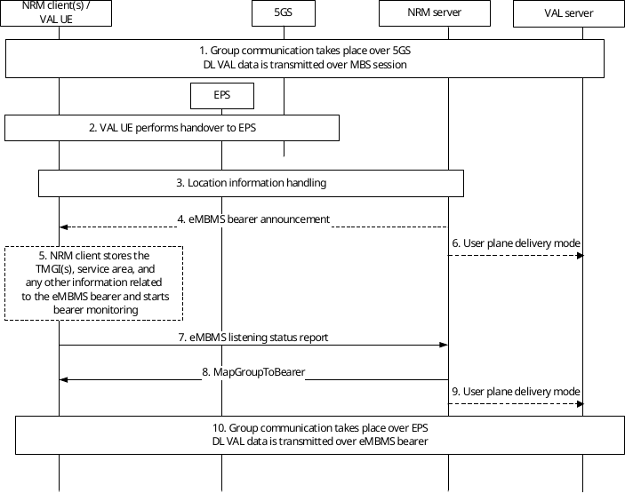
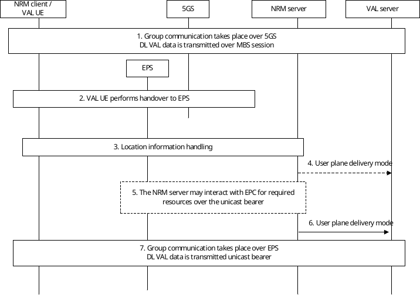
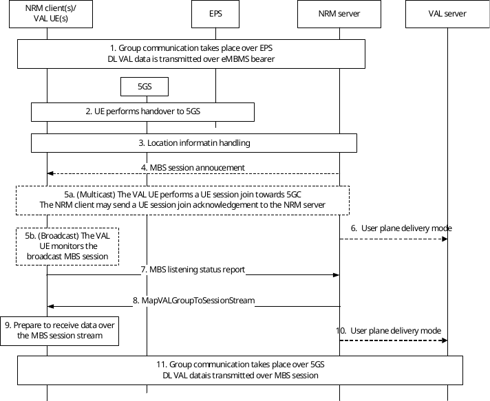
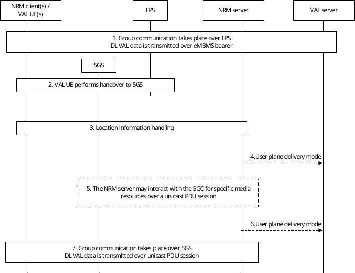

# 14.3.4A.10 VAL service inter-system switching between 5G and LTE

## 14.3.4A.10.1 General

The VAL server delivers the VAL data to the VAL UE(s) without being aware of the mobility of the VAL UE with the assistance and guidance of the NRM server. When working in transport only mode, the NRM server guides the NRM clients throughout the VAL data transmission for switching between the LTE and 5G systems. For this purpose, the location management client may send location related information to the location management server, similar to the one defined in clause 9, which is triggered due to its location change – in this case due to Radio Access Technology (RAT) change, to inform the NRM server hence the latter provides guidance related to how to receive the VAL data after the location update.

The procedures cover both the deployment scenarios with/without MBSF/MBSTF. The procedures specify four inter-system switching related scenarios as follows:

1\. Inter-system switching from 5G MBS session to LTE eMBMS bearer, as in 14.3.4A.10.2

2\. Inter-system switching from 5G MBS session to LTE unicast bearer, as in 14.3.4A.10.3

3\. Inter-system switching from LTE eMBMS to 5G MBS session, as in 14.3.4A.10.4

4\. Inter-system switching from LTE eMBMS to 5G unicast PDU session, as in 14.3.4A.10.5

In all the inter-system switching related scenario described in 14.3.4A.10.2, 14.3.4A.10.3, 14.3.4A.10.4 and 14.3.4A.10.5, the functional entity that resides in 5GS may be NEF, or MBSF, or MB-SMF for session creation and together with PCF or PCC related interaction.

NOTE: There will be a service interruption when the VAL server performs path switch between 5G and LTE bearers or sessions.

## 14.3.4A.10.2 Inter-system switching from 5G MBS session to LTE eMBMS bearer

The procedure provided in figure 14.3.4A.10.2-1 describes how the NRM server handles inter-system switching when the VAL UE switches from 5G to LTE network, where the NRM server is able to provide the VAL data to the clients over eMBMS bearer(s).

Pre-conditions:

\- NRM clients are attached to the 5GS, registered.

\- The VAL service can be provided via both 5GS and EPS.

\- The NRM client(s) is within the eMBMS service area.

\- It is assumed that the NRM client(s) has not received the eMBMS bearer announcement while camping in 5GS.

Figure 14.3.4A.10.2-1: Inter-system switching from 5G MBS session to LTE eMBMS bearer.

1\. An VAL group communication takes place, and the VAL data is delivered over 5G MBS session (either broadcast or multicast session mode), which is associated to the VAL group X.

2\. The VAL UE performs handover to EPS.

3\. Location information indicating the RAT change from the VAL UE is provided to the NRM server. VAL UE\`s location information is provided via the location management client, triggered by RAT change, to the location management server, where the latter provides the location information to the NRM server. Also, location information handling can be based on notifications provided from the network to the NRM server related to 5GS supporting EPS interworking, as specified in 3GPP TS 23.501 \[10\], 3GPP TS 23.502 \[11\], and 3GPP TS 23.503 \[12\]. For that, the NRM server can subscribe to receive notifications of specific events from the network. For instance, the NRM server can subscribe to PCF related notifications (via N5 or Rx) for specific events, e.g., access network information notification and change of access type. Also, when SCEF+NEF is deployed, the NRM server can subscribe to SCEF+NEF related notifications for specific events, e.g., core network (CN) type change.

4\. The NRM server analyses the RAT change and decides how to deliver the DL VAL data. If the NRM server decides to serve the client via eMBMS bearer, it may send an eMBMS bearer announcement. This step is optional as the bearer announcement related information could be sent in advance (implementation specific).

5\. If not already available, the NRM client stores the announced TMGI(s), service area, and any relevant information to the eMBMS, which is delivered via the bearer announcement. As a result, the NRM client starts monitoring the bearer.

6\. The NRM server may inform the VAL server to stop sending DL VAL data via the MBS by sending the user plane delivery mode message, e.g., when the last UE leaves the MBS session or move out of the MBS service area.

7\. The NRM client sends an eMBMS listening status report to inform the server of its ability of receiving DL VAK data over the specified bearer.

8\. The NRM server sends the necessary information related to receiving the DL VAL data in the form of the MapGroupToBearer.

9\. The NRM server may inform the VAL server to start sending DL VAL data via the eMBMS by sending the user plane delivery mode message, e.g., the first UE(s) enters the eMBMS service area.

10\. The VAL group communication takes place over EPS, and the VAL data is transmitted over an eMBMS bearer.

## 14.3.4A.10.3 Inter-system switching from 5G MBS session to LTE unicast bearer

The procedure provided in figure 14.3.4A.10.3-1 describes how the NRM server handles inter-system switching when the VAL UE switches from 5G to LTE network, where the VAL server is unable to provide the VAL services to the VAL UE over eMBMS bearer.

Pre-conditions:

\- NRM clients are attached to the 5GS, registered and affiliated to the same VAL group X.

\- The VAL services can be provided via both 5GS and EPS.

Figure 14.3.4A.10.3-1: Inter-system switching from 5G MBS session to LTE unicast bearer.

1\. An VAL group communication takes place, and the VAL data is delivered over 5G MBS session (either broadcast or multicast session mode), which is associated to the VAL group X.

2\. The VAL UE performs handover to EPS.

3\. Location information indicating the RAT change from the VAL UE is provided to the NRM server. VAL UE\`s location information is provided via the location management client, triggered by RAT change, to the location management server, where the latter provides the location information to the NRM server.

Also, location information handling can be based on notifications provided from the network to the NRM server related to 5GS supporting EPS interworking, as specified in 3GPP TS 23.501 \[10\], 3GPP TS 23.502 \[11\], and 3GPP TS 23.503 \[12\]. For that, the NRM server can subscribe to receive notifications of specific events from the network. For instance, the NRM server can subscribe to PCF related notifications (via N5 or Rx) for specific events, e.g. access network information notification and change of access type. Also, when SCEF+NEF is deployed, the NRM server can subscribe to SCEF+NEF related notifications for specific events, e.g. core network (CN) type change.

4\. The NRM server may inform the VAL server to stop sending DL VAL data via the MBS by sending the user plane delivery mode message, e.g., when the last UE leaves the MBS session or move out of the MBS service area.

5\. The NRM server may interact with the EPC for providing the required media resources over the unicast bearer, if not already allocated.

6\. The NRM server informs the VAL server to send DL VAL data to the VAL UE via the LTE unicast bearer by sending the user plane delivery mode message.

7\. The VAL group communication takes place over EPS, and the DL VAL data is transmitted over a LTE unicast bearer.

## 14.3.4A.10.4 Inter-system switching from LTE eMBMS to 5G MBS session

The procedure provided in figure 14.3.4A.10.4-1 describes how the NRM server handles inter-system switching when the VAL UE switches from LTE network to 5G, where the NRM server is able to provide the VAL services to the client over 5G MBS sessions (either broadcast or multicast).

Pre-conditions:

\- NRM clients are attached to the EPC.

\- The VAL services can be provided via both 5GS and EPS.

\- The NRM client(s) is within the service area (if the session is limited to an area), where the MBS session is configured.

\- It is assumed that the NRM client(s) has not received the 5G MBS session announcement while camping in EPS.

Figure 14.3.4A.10.4-1: Inter-system switching from LTE eMBMS bearer to 5G MBS sessions (either broadcast or multicast).

1\. An VAL group communication takes place, and the DL VAL data is delivered over eMBMS bearer, which is associated to the VAL group X.

2\. The VAL UE performs handover to 5GS.

3\. Location information indicating the RAT change from the VAL UE is provided to the NRM server. VAL UE\`s location information is provided via the location management client, triggered by RAT change, to the location management server, where the latter provides the location information to the NRM server.

Also, location information handling can be based on notifications provided from the network to the NRM server related to 5GS supporting EPS interworking, as specified in 3GPP TS 23.501 \[10\], 3GPP TS 23.502 \[11\], and 3GPP TS 23.503 \[12\]. For that, the NRM server can subscribe to receive notifications of specific events from the network. For instance, the NRM server can subscribe to PCF related notifications (via N5 or Rx) for specific events, e.g., access network information notification and change of access type. Also, when SCEF+NEF is deployed, the NRM server can subscribe to SCEF+NEF related notifications for specific events, e.g., core network (CN) type change.

4\. The NRM server analyses the RAT change and decides how to deliver the DL VAL data. If the NRM server decides to serve the client via 5G MBS session, it may send an MBS session announcement indicating information among others the session mode to serve the NRM client and the corresponding MBS session ID. This step is optional as the session announcement related information could be sent in advance (implementation specific).

5\. The VAL UE acts according to the MBS session mode provided to receive the DL media.

5a. In case of multicast MBS sessions, the VAL UE performs a UE session join towards the 5GC indicating the MBS session ID to join. It may as well send a UE session join acknowledgement to the NRM server.

5b. In case of broadcast MBS sessions, the VAL UE starts monitoring the broadcast MBS session. 6. The NRM server may inform the VAL server to stop sending DL VAL data via the eMBMS bearer by sending the user plane delivery mode message, e.g., when the last UE moves out of the MBMS service area.

7\. The NRM client sends an MBS listening status report to the server indicating its ability to receive media over the indicated MBS session.

8\. The NRM server sends a MapVALGroupToSessionStream over the MBS session providing the required stream information to receive the media related to the group communication.

9\. The NRM client processes the received information related to the DL VAL data over the MBS session.

10\. The NRM server may inform the VAL server to start sending DL VAL data via the 5G MBS session by sending the user plane delivery mode message, e.g., the first UE(s) enters the MBS service area or joins the multicast MBS session.

11\. The VAL group communication takes place over 5GS, and the DL VAL data is delivered over the broadcast or multicast MBS session.

## 14.3.4A.10.5 Inter-system switching from LTE eMBMS to 5G unicast PDU session

The procedure provided in figure 14.3.4A.10.5-1 describes how the NRM server handles inter-system switching when the VAL UE switches from LTE network to 5G, where the NRM server is able to provide the VAL services to the client over 5G MBS sessions (either broadcast or multicast).

Pre-conditions:

\- NRM clients are attached to the EPC and affiliated to the same VAL group X.

\- The VAL services can be provided via both 5GS and EPS.

Figure 14.3.4A.10.5-1: Inter-system switching from LTE eMBMS bearer to 5G unicast PDU session.

1\. An VAL group communication takes place, and the VAL data is delivered over eMBMS bearer, which is associated to the VAL group X.

2\. The VAL UE performs handover to 5GS.

3\. Location information indicating the RAT change from the VAL UE is provided to the NRM server. VAL UE\`s location information is provided via the location management client, triggered by RAT change, to the location management server, where the latter provides the location information to the NRM server.

Also, location information handling can be based on notifications provided from the network to the NRM server related to 5GS supporting EPS interworking, as specified in 3GPP TS 23.501 \[10\], 3GPP TS 23.502 \[11\], and 3GPP TS 23.503 \[12\]. For that, the NRM server can subscribe to receive notifications of specific events from the network. For instance, the NRM server can subscribe to PCF related notifications (via N5 or Rx) for specific events, e.g. access network information notification and change of access type. Also, when SCEF+NEF is deployed, the NRM server can subscribe to SCEF+NEF related notifications for specific events, e.g. core network (CN) type change.

4\. The NRM server may inform the VAL server to stop sending DL VAL data via the eMBMS bearer by sending the user plane delivery mode message, e.g., when the last UE moves out of the LTE MBMS service area.

5\. The NRM server may interact with the 5GC to request media resources (if not already allocated) with specific requirements over unicast PDU session, as it is able to serve the NRM client via unicast PDU session.

6\. The NRM server informs the VAL server to send DL VAL data to the VAL UE via the PDU session by sending the user plane delivery mode message.

7\. The VAL group communication takes place over 5GS, and the VAL data is delivered over unicast PDU session.
