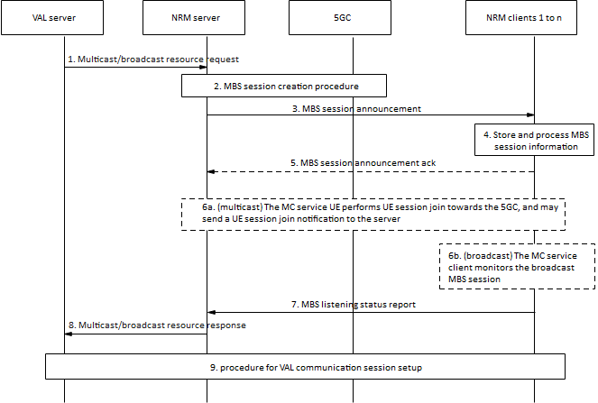
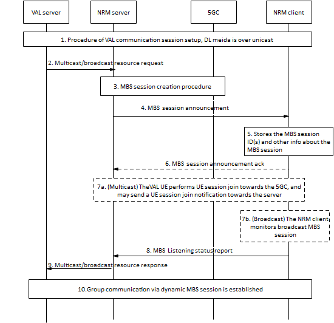

# 14.3.4A.2 MBS session creation and MBS session announcement

## 14.3.4A.2.1 General

The procedures in this clause describe how MBS session creation and MBS session announcement can be used for the transmission of VAL service group communication data over either broadcast or multicast MBS sessions. The MBS session can either be created with or without dynamic PCC rule, where the latter requires less interaction done by the NRM server towards the 5GC (either directly or via NEF).

## 14.3.4A.2.2 Procedure for pre-created MBS session and MBS session announcement

Pre-conditions:

\- The NRM server has decided to use an MBS session for VAL service group communications associated to a certain VAL servive group based on transport only mode.

\- The NRM server has performed MB-SMF discovery and selection either directly or indirectly via NEF/MBSF, unless the corresponding information is locally configured.

\- NRM clients 1 to n are attached to the 5GS, registered and belong to the same VAL service group X.

\- The NRM server is aware whether to request the creation of the MBS service server with or without dynamic PCC rule.

Figure 14.3.4A.1.2-1: Use of pre-created MBS session.

1\. The VAL server sends a multicast/broadcast resource request towards the NRM server including the VAL server identity, service description(s), multicast resource type (e.g,. multicast type or broadcast type), service announcement mode (i.e., service announcement is sent by NRM or the VAL itself), Endpoint of the VAL server.

2\. The NRM server initiates an MBS session creation procedure towards the 5GC as described in 3GPP TS 23.247 \[39\]. The procedure starts once the NRM server initiates a TMGI allocation request (either directly to MB-SMF or indirectly via NEF). Upon the reception of the TMGI allocation response, the NRM server sends an MBS session creation request, including further information related to the MBS session, e.g., MBS session ID, MBS session mode and the QoS requirements if dynamic PCC rule is not considered. However, if dynamic PCC rule is considered, the NRM server defines these requirements at a later step, namely it sends an MBS authorization/policy create request towards PCF (either directly or to the NEF) indicating the QoS requirements.

> In the case of an untrusted NRM server, when the requested MBS service area crosses several MB-SMF service areas, the NEF/MBSF rejects the TMGI allocation request, and it guides the NRM server by dividing the requested MBS service area into groups and returns the groups as described in 3GPP TS 23.247 \[39\]. Hence, the NRM server initiates a new TMGI allocation request for each grouped MBS service area. If during MBS session creation request the 5GS discovers that the MBS service area crosses several MB-SMF service areas, the request is rejected and the NEF/MBSF guides the NRM server by dividing the requested MBS service area into groups and returns the groups as described in 3GPP TS 23.247 \[39\]. The NRM initiates a new MBS session creation procedure for each grouped MBS service area.
>
> The NRM server may utilize a unicast session if any MBS service area is not supported by any MB-SMF.

NOTE 1: In case of LTE eMBMS and 5G MBS co-existence, the NRM server may trigger the establishment of eMBMS bearers as described in clause 14.3.4 (or it may establish a unicast bearer) based on the RAT capabilities supported by the VAL service group members in the VAL service group X. If MBSF and BM-SC are co-located, TMGI used by 4G eMBMS can be the same as the MBS session ID.

NOTE 2: For the case of multi carrier support for broadcast MBS sessions, the NRM server may indicate the frequencies within a broadcast MBS service area by providing the MBS frequency selection area ID(s) (MBS FSA ID(s)) to the MB-SMF or indirectly via NEF.

3\. The NRM server provides the NRM clients of the VAL service group X with the information related to the created MBS session via the MBS session announcement. The MBS session announcement includes information such as the MBS session ID, MBS session mode (broadcast or multicast service type) and SDP information related to the MBS session under consideration.

NOTE 3: The NRM server may send an MBS session announcement at an earlier step during the MBS session creation procedure towards the NRM clients once the VAL service group associated to the MBS session is known.

> Optionally, the NRM server includes the information elements related to the established eMBMS bearer, as indicated in table 7.3.2.2-1. The NRM clients which camp on LTE will subsequently react to the information elements related to the eMBMS bearer as described in 3GPP TS 23.280 \[3\].

4\. NRM clients store and process the received MBS session information.

5\. NRM clients may provide an MBS session announcement acknowledgment to the NRM server to indicate the reception of the corresponding MBS session announcement.

6\. Based on the MBS session mode (either multicast or broadcast), the following actions take place;

6a. For multicast MBS sessions, NRM clients initiate a UE session join request towards the 5GC using the information provided via the MBS session announcement. Hence, upon the first successful UE session join request, the multicast is then established, and the radio resources are reserved, if the session is in an active state. The established session can either be in active or inactive state as indicated in 3GPP TS 23.247 \[39\]. The NRM clients sends a UE session join notification towards the server as indicated in the MBS session announcement. If indicated in the MBS session announcement information, NRM clients report the monitoring state (i.e. the reception quality of the MBS session) back to the NRM server; or

6b. For broadcast MBS sessions, if the NRM client is accessing over 5G, the session is established as part of the session creation procedures as described in 3GPP TS 23.247 \[39\], and the network resources are reserved both in 5GC and NG-RAN. The NRM clients start monitoring the reception quality of the broadcast MBS session. If indicated in the MBS session announcement information, NRM clients report the monitoring state (i.e. the reception quality of the MBS session) back to the NRM server.

NOTE 4: It is implementation specific whether the MBS session reception quality level is determined per MBS session, per media stream or per MBS QoS flow level via e.g., measurements of radio level signals, such as the reference signals from the NG-RAN node(s), or packet loss.

7\. The NRM clients provide a listening status notification related to the announced session (multicast or broadcast session) in the form of an MBS listening status report.

8\. The NRM server provides a multicast/broadcast resource response to the VAL server.

9\. An VAL service group communication setup takes place and uses the pre-created MBS session for this group communication packet DL delivery.

## 14.3.4A.2.3 Procedure for dynamic MBS sessions

In this scenario, the VAL service group communication is already taken place and a unicast PDU session is utilized for DL transmission. When the NRM server decides to use an MBS session for the transmission under consideration, the NRM server interacts with 5GC to reserve the necessary network resources.

NOTE 1: The NRM server logic for determining when to create a dynamic MBS session is implementation specific.

The procedure in figure 14.3.4A.2.3-1 shows one NRM client receiving the DL media. There might also be NRM clients in the same VAL service group communication session that receive the communication on a PDU session.

Pre-conditions:

\- NRM client is attached to the 5GS, registered and affiliated to a certain VAL service group X.

\- The NRM server is aware whether to request the creation of the MBS session with or without dynamic PCC rule.

\- The NRM server has performed MB-SMF discovery and selection either directly or indirectly via NEF/MBSF, unless the corresponding information is locally configured.

\- No MBS session exists, or the existing multicast MBS session fails to satisfy the QoS requirements.

Figure 14.3.4A.2.3-1: Use of dynamic MBS session.

1\. An VAL service group communication session is established and the DL media packet is delivered to the VAL client via unicast.

2\. The VAL server sends a multicast/broadcast resource request towards the NRM server including the VAL server identity, service description(s), multicast resource type (e.g,. multicast type or broadcast type), service announcement mode (i.e., service announcement is sent by NRM or the VAL itself), Endpoint of the VAL server.

3\. The NRM server decides to create an MBS session. The MBS session creation procedure takes place as described in clause 14.3.4A.2.2.

NOTE 2: In case of LTE eMBMS and 5G MBS co-existence, the NRM server may trigger the establishment of eMBMS bearers as described in 3GPP TS 23.280 \[3\] (or it may establish a unicast bearer) based on the RAT capabilities supported by the affiliated members in the VAL service group X. If MBSF and BM-SC are co-located, TMGI used by 4G eMBMS can be the same as the MBS session ID.

NOTE 3: For the case of multi carrier support for broadcast MBS sessions, the NRM server may indicate the frequencies within a broadcast MBS service area by providing the MBS frequency selection area ID(s) (MBS FSA ID(s)) to the MB-SMF or indirectly via NEF.

4\. The NRM server provides the NRM client with the information related to the created MBS session via an MBS session announcement. As described in table 7.3.2.2-1, the session announcement includes information such as the MBS session ID, MBS session mode (broadcast or multicast service type), and SDP information related to the MBS session.

> Optionally, the NRM server includes the information elements related to the established eMBMS bearer once the NRM server has determined the need, as indicated in table 7.3.2.2-1. The NRM clients which camp on LTE will subsequently react to the information elements related to the eMBMS bearer as described in 3GPP TS 23.280 \[3\].

5\. The NRM client stores the MBS session ID and other associated information.

6\. The NRM client may send an MBS session announcement ack back to the NRM server.

7\. Based on the MBS session mode (either multicast or broadcast), the following actions take place:

> 7a. For multicast MBS sessions, NRM client initiates a UE session join request towards the 5GC using the information provided via the MBS session announcement. Hence, upon the first successful UE session join request, the multicast is then established, and the radio resources are reserved, if the session is in active state. The established session can either be in active or inactive state as indicated in 3GPP TS 23.247 \[39\]. The NRM client sends a UE session join notification towards the server as indicated in the MBS session announcement. If indicated in the MBS session announcement information, NRM clients report the monitoring state (i.e. the reception quality of the MBS session) back to the NRM server; or
>
> 7b. For broadcast MBS sessions, if the NRM client is accessing over 5G, the session is established as part of the session creation procedures as described in 3GPP TS 23.247 \[39\], and the network resources are reserved both in 5GC and NG-RAN. The NRM clients start monitoring the reception quality of the broadcast MBS session. If indicated in the MBS session announcement information, NRM clients report the monitoring state (i.e. the reception quality of the MBS session) back to the NRM server.

NOTE 4: It is implementation specific whether the MBS session reception quality level is determined per MBS session, per media stream or per MBS QoS flow level via e.g., measurements of radio level signaling such as the reference signals from the NG-RAN node(s), packet loss.

8\. The NRM clients provide a listening status notification related to the announced session (multicast or broadcast session) in the form of an MBS listening status report.

9\. The NRM server provides a multicast/broadcast resource response to the VAL server.

10\. An VAL service group communication via dynamic MBS session is established. The VAL server sends the downlink packet for the VAL service group communication session over the MBS session.
