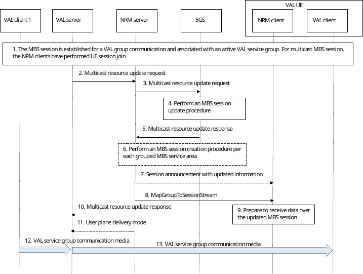
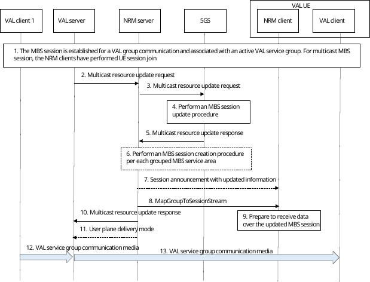

# 14.3.4A.3 MBS resources update

## 14.3.4A.3.1 General

The VAL server can create one or several MBS sessions via the NRM server, based on certain service requirements, a certain service area, or the activity status of multicast MBS sessions. However, during the life cycle of the MBS sessions, the VAL server may need to trigger the update of the sessions via the NRM server to meet emerging needs, including the service requirements, service area related parameters.

## 14.3.4A.3.2 Procedure for updating MBS resources without dynamic PCC rule

The procedure shown in figure 14.3.4A.3.2-1 presents an MBS session update procedure triggered by the VAL server via the NRM server (either directly interacting with the MB-SMF, or indirectly with NEF/MBSF). Within the update request, either the service requirements, MBS service area, activity status of multicast MBS session, or all three are done, as indicated in 3GPP TS 23.247 \[39\].

Pre-conditions:

\- The NRM clients 1 to n are attached to the 5GS, registered and belong to the same active VAL service group.

\- The NRM server has obtained the required information related to the MB-SMF, either locally configured or during initial session configuration.

\- The MBS session is created with certain service requirements and optionally with a certain broadcast/multicast service area. The MBS session is announced to be associated with the VAL service group for group communication purposes.

Figure 14.3.4A.3.2-1: MBS session update without dynamic PCC

1\. An MBS session is established as described in in 3GPP TS 23.247 \[39\] (either a multicast or a broadcast session), and associated with a certain active VAL service group for group communication purposes. In the case of a multicast MBS session, the NRM clients have already joined the session.

2\. The VAL server invokes the multicast resource update request to the NRM server once the need has emerged to modify some aspects for the given MBS session under consideration. The updated parameters are included, e.g., service requirements, MBS service area or both. In case of multicast MBS sessions, the VAL server may as well include the status (active or inactive) of the multicast MBS session to be set.

3\. The NRM server sends an MBS session update request towards the 5GC, either directly or via NEF, as described in 3GPP TS 23.247 \[39\], either directly or indirectly via NEF.

4\. Based on the needed requirements, the corresponding MBS session is accordingly modified at the 5GS as described in 3GPP TS 23.247 \[39\]. The update may lead to QoS Flow(s) addition, modification, or removal.

5\. The NRM server receives an MBS session update response from the 5GS either directly or via NEF once the requested modifications are performed, and the indicated MBS session is updated accordingly.

6\. In case of untrusted NRM server, if the requested MBS service area crosses several MB-SMF service areas, the requested MBS service area to be updated is partially accepted by the 5GC as described in 3GPP TS 23.247 \[39\]. The reduced MBS service area is grouped and provided by the NEF/MBSF in the response. Hence, the NRM server sends a new MBS session creation request as described in clause 14.3.4A.1.2. for each grouped MBS service area.

7\. The NRM server may initiate a session announcement towards the NRM clients associated with the ongoing session in order to announce the updated information, if required, e.g., the updated service area or SDP information.

8\. The NRM server sends an MapGroupToSessionStream over the configured MBS session providing the required information to receive the media related to the established VAL service group communication.

9\. The NRM clients process the received information over the MapGroupToSessionStream in order to receive the associated VAL media over the specific MBS session stream.

10\. The NRM server returns the multicast resource update response to the VAL server.

11\. If the MBS session creation is failed towards the grouped MBS service areas in step 6, then the NRM server indicates to the VAL server to use unicast delivery for that grouped MBS service areas via by sending the user plane delivery mode message.

12\. VAL client 1 sends media to the VAL server over unicast to be distributed for the established group communication.

13\. The VAL server distributes the VAL media to the VAL clients 2 to n over the indicated streams.

## 14.3.4A.3.3 Procedure for updating MBS resources with dynamic PCC rule

The procedure shown in figure 14.3.4A.3.3-1 presents an MBS session update procedure triggered by the NRM server to the 5GC, either directly or via NEF/MBSF. Based on the required updates to be done, the NRM server needs to interact with the MB-SMF to update the MBS service area and multicast activity status, with the PCF to update the required QoS requirements, or sequentially both to update all the above, as indicated in 3GPP TS 23.247 \[39\].

Pre-conditions:

\- The NRM clients 1 to n are attached to the 5GS, registered and belong to the same active VAL service group.

\- The NRM server has obtained the required information related to the MB-SMF, either locally configured or during initial session configuration.

\- The MBS session is created with certain service requirements and optionally with a certain broadcast/multicast service area. The MBS session is announced to be associated with the VAL service group for group communication purposes.

Figure 14.3.4A.3.3-1: MBS session update with dynamic PCC

1\. An MBS session is established as described in 3GPP TS 23.247 \[39\] (either a multicast or a broadcast session), and associated with a certain active VAL service group for group communication purposes. In the case of a multicast MBS session, the NRM clients have already joined the session.

2\. The VAL server invoke the multicast resource update request to the NRM server once the need has emerged to modify some aspects for the given MBS session under consideration. The updated parameters are included, e.g., service requirements, service area or both.

3\. The NRM server sends an MBS session update request towards the 5GC as described in 3GPP TS 23.247 \[39\], either directly or indirectly via NEF.

NOTE 1: The updated service area information is required for local MBS and for broadcast MBS services.

4\. Based on the update requirements perform the MBS session is updated with PCC procedure as described in 3GPP TS 23.247 \[39\].

5\. The NRM server receives an MBS session update response from the 5GC either directly or via NEF once the requested modifications are performed, and the indicated MBS session is updated accordingly.

6\. In case of untrusted NRM server, if the requested MBS service area crosses several MB-SMF service areas, the requested MBS service area to be updated is partially accepted by the 5GC, as described in 3GPP TS 23.247 \[39\]. The reduced MBS service area is grouped and provided by the NEF/MBSF in the response. Hence, the NRM server sends a new MBS session creation request as described in clause 14.3.4A.1.2. for each grouped MBS service area.

7\. The NRM server may initiate a session announcement towards the NRM clients associated with the ongoing session in order to announce the updated information if required, e.g., the updated service area or SDP information.

NOTE 2: The updated service area information is required for local MBS and for broadcast MBS services.

8\. The NRM server sends an MapGroupToSessionStream over the MBS session providing the required information to receive the media related to the established VAL service group communication.

9\. The NRM server returns the multicast resource update response to the VAL server.

10\. The NRM clients process the received information over the MapGroupToSessionStream in order to receive the associated VAL media over the specific MBS session stream.

11\. If the MBS session creation is failed towards the grouped MBS service areas in step 6, then the NRM server indicates to the VAL server to use unicast delivery for that grouped MBS service areas via by sending the user plane delivery mode message.

12\. VAL client 1 sends media to the VAL server over unicast to be distributed for the established group communication.

13\. The VAL server distributes the VAL media to the VAL clients 2 to n over the indicated streams.
