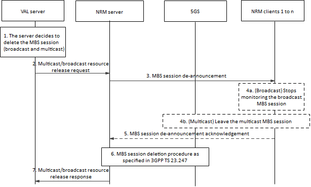

# 14.3.4A.4 MBS resource deletion

## 14.3.4A.4.1 General

The VAL server can decide to release a certain MBS session once it is no longer further utilized for the associated VAL service group communication, e.g., the VAL service group is no longer active, the VAL media transmission is over and no further VAL media to be delivered, group communication is terminated. The MBS session deletion procedure leads to releasing the network resources associated to that MBS session.

NOTE: It is up to implementation of VALserver to decide whether to release the MBS session or re-use it for subsequent group operations.

To delete the MBS session, the VAL server invokes the multicast/broadcast resource release service of NRM server which further triggers the NRM server to send an MBS session deletion request to the 5GS providing the corresponding MBS session ID. The MBS session deletion request is sent to the MB-SMF (directly or via NEF/MBSF) when PCC is not used. However, if dynamic PCC rule is utilized, a policy authorization deletion request is initially sent to the PCF. Further details of the MBS session deletion are provided in 3GPP TS 23.247 \[39\].

NRM server further informs the NRM client with the MBS session de-announcement, so that the VAL UE stops monitoring the broadcast MBS session or leaves the multicast MBS session. This procedure is applied for both broadcast MBS session and multicast MBS session.

## 14.3.4A.4.2 Procedure

The procedure in figure 14.3.4A.4.2-1 describes the MBS session deletion aspects for group communication.

Pre-conditions:

\- NRM clients 1 to n are attached to the 5GS, registered and affiliated to the same active VAL service group.

\- An MBS session is configured to address the corresponding VAL service group with certain service requirements and optionally with a certain broadcast/multicast service area. The session is announced and established for group communication purposes for the VAL service group.

Figure 14.3.4A.4.2-1: MBS session deletion procedure.

1\. The VAL server decides to delete the MBS session for the associated VAL group communication, either multicast or broadcast session.

2\. The VAL server invokes the multicast/broadcast resource release service of the NRM server by sending the multicast/broadcast resource release request.

3\. Upon receiving the multicast/broadcast resource release request, the NRM server sends an MBS session de-announcement message with the MBS session ID towards the NRM client(s). Upon receiving the MBS session de-announcement message, either 4a or 4b is performed.

4a. If the MBS session identified by MBS session ID is a broadcast MBS session, the UE(s) stops monitoring the broadcast MBS session and removes the broadcast MBS session related information.

4b. If the MBS session identified by MBS session ID is a multicast MBS session, the joined UE(s) initiate an MBS session leave procedure to leave the indicated MBS session in order to release the respective network resources, as defined in 3GPP TS 23.247 \[39\].

5\. Subsequently, the NRM clients may send an MBS session de-announcement acknowledgement message to the NRM server indicating the status of MBS session.

6\. The NRM server initiates the MBS session deletion procedure with the 5GC (either directly or through NEF/MBSF) in order to stop using the configured MBS session and release the corresponding network resources. The NRM server indicates within the MBS session release request the corresponding MBS session ID. The MBS session deletion procedure can either be with or without a dynamic PCC rule, as indicated in 3GPP TS 23.247 \[39\].

7\. The NRM server returns the multicast/broadcast resource release response to the VAL server indicating the result.
