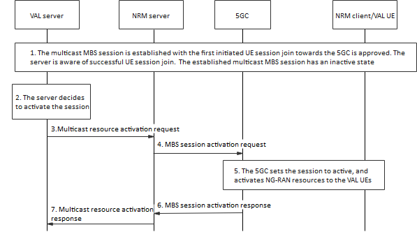
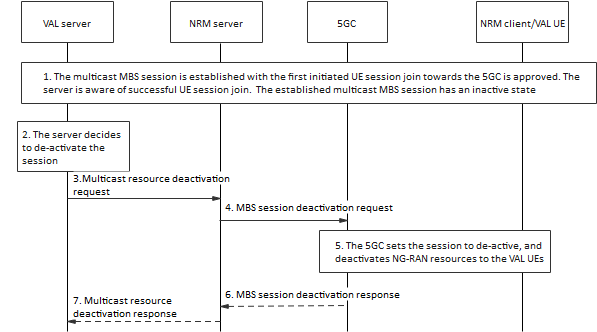

# 14.3.4A.5 Request to activate / de-activate multicast MBS sessions

## 14.3.4A.5.1 General

In case of multicast MBS sessions, the members affiliated to a certain VAL service group need to initiate a UE session join request towards the 5GC in order to receive the VAL media sent via the associated MBS session. The UE session join request enables the reservation of NG-RAN resources for the members of the VAL group. However, it is not necessary that the VAL media is delivered over the whole time the multicast MBS session is associated to the group under consideration. Therefore, the VAL server is able to efficiently utilize and control the reservation of radio resources based on the availability of VAL data to be delivered via the activation and de-activation procedure with NRM server. This presents more flexibility and efficient use of resources different from LTE.

The most suitable scenario to activate/de-activate a certain multicast MBS session is based on whether there is a VAL group communication, taking place over that associated session to the VAL service group. In this manner, the VAL server can activate the associated multicast session once a VAL group communication takes place, then deactivate it once the VAL group communication is over. Whether the multicast session is activated (i.e., in an active state), or de-activated (in an inactive state), the VAL group is associated to the multicast session and its members are within a UE session join.

The activation or de-activation request is initiated by the VAL server towards the NRM server which further interacts either directly with the MB-SMF or indirectly with NEF/MBSF.

NOTE: The activation of de-activation procedure may also be triggered by MB-SMF based on receiving notification from MB-UPF based on the availability of VAL data to be transmitted.

## 14.3.4A.5.2 Multicast MBS session activation procedure

The procedure shown in figure 14.3.4A.5.2-1 presents the multicast MBS session activation procedure initiated by the VAL server.

Pre-conditions:

\- NRM clients are attached to the 5GS, registered and affiliated to the same VAL service group X.

\- The NRM server has directly performed (or via NEF/MBSF) an MB-SMF discovery and selection, unless the corresponding information is locally configured.

\- The multicast MBS session for NRM group communications associated to VAL service group X.

\- The MBS session is created and announced to address VAL group communication related to the associated VAL service group X with certain service requirements and optionally with a certain service area.

Figure 14.3.4A.5.2-1: Multicast MBS session activation procedure.

1\. The multicast MBS session is established as the first UE session join request, which is initiated by the first VAL UE towards 5GC, is granted. At this stage, the multicast MBS session is established with an inactive state.

2\. The VAL server decides to activate the multicast MBS session as VAL data is needed to be transmitted over the session to the VAL service group X, as a VAL group communication is to take place over the associated MBS session.

3\. The VAL server invokes the multicast resource activation request provided by NRM server, the MBS session ID is included.

4\. Upon receiving the request in step 3, the NRM server sends an MBS session activation request towards the 5GC, either directly to the MB-SMF or via NEF/MBSF, indicating the TMGI to be activated.

5\. The 5GC changes the session status to "active" and finds the list of joined VAL UEs associated with the session and activates the NG- RAN resources for VAL data delivery.

6\. The 5GC may send an MBS session activation response to the NRM server indicating that the requested multicast MBS session has been activated.

7\. The NRM server returns the multicast resource activation response to the VAL server.

## 14.3.4A.5.3 Multicast MBS session de-activation procedure

The procedure shown in figure 14.3.4A.5.3-1 presents the multicast MBS session activation procedure initiated by the VAL server.

Pre-conditions:

\- NRM clients are attached to the 5GS, registered and affiliated to the same VAL service group X.

\- The NRM server has directly performed (or via NEF/MBSF) an MB-SMF discovery and selection, unless the corresponding information is locally configured.

\- A multicast MBS session is created and announced to address the corresponding VAL service group with certain service requirements and optionally with a certain multicast service area.

\- The VAL UE have already joined the multicast MBS session and are able to receive the VAL data over the associated MBS session.

Figure 14.3.4A.5.3-1: Multicast MBS session deactivation procedure.

1\. The group communication associated with VAL service group X takes place, and the corresponding VAL data is delivered over the associated multicast MBS session, hence the MBS session has an active state.

2\. The VAL server decides to deactivate the multicast MBS session, as no further VAL data to be delivered to the associated group, or the VAL group communication is over, and no further VAL media is to be delivered.

3\. The VAL server invokes the multicast resource deactivation request provided by NRM server, the MBS session ID is included.

4\. Upon receiving the request in step 3, the NRM server sends an MBS session deactivation request towards the 5GC, either directly to the MB-SMF or via NEF/MBSF, indicating the TMGI to be deactivated.

4\. The 5GC changes the session state to "inactive" and deactivates the radio resources associated with the joined VAL UEs.

5\. The 5GC may send an MBS deactivation response to the server indicating that the requested multicast MBS session has been inactivated.

7\. The NRM server may return the multicast resource deactivation response to the VAL server.
