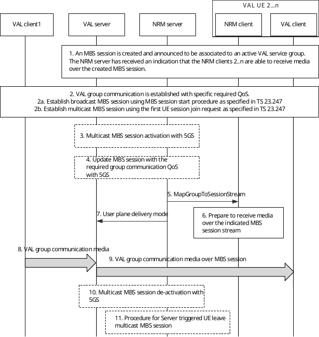

# 14.3.4A.6 VAL service group media transmissions over 5G MBS sessions

## 14.3.4A.6.1 General

The VAL server can decide to configure an MBS session per VAL service group to transmit the media related to the corresponding VAL group communications. Such group communications can comprise different service requirements. For that, multicast and broadcast MBS sessions need to be configured with multiple MBS QoS flows to address different service requirements, e.g., different required QoS, provided by the NRM server. For instance, application-level control messages or media associated to a group communication can comprise different QoS requirements. Also, different type of group communications can comprise different QoS requirements, e.g., emergency group communication should be handled with a higher priority than normal group communication.

The configuration of multiple MBS QoS flows to address different service requirements is associated to the assignment of different streams (e.g., different ports) within an MBS session.

The established multicast MBS session can either be in active or inactive state, where the former indicates the activation of radio resources hence transmitting the VAL media to the associated VAL service group, and the latter indicates their deactivation as no VAL media is being transmitted. The VAL server may initiate the activation of multicast MBS sessions once the VAL service group is established and active, as well as once the VAL media is available for transmission. For this purpose, the VAL server sends a multicast MBS session activation request towards the NRM indicating the MBS session ID to be activated, and the NRM server further interacts with the 5GS to complete the MBS session activation.

Similar to the use of eMBMS, the NRM server shall provide the associated information between a specific group communication and the stream to be used within an MBS session to the UE. This information could be sent in advance in an MBS session announcement or could be provided on demand in an additional signalling message for the MBS session, e.g., MapGroupToSessionStream (similar to the MapGroupToBearer in eMBMS).

## 14.3.4A.6.2 Procedure

The procedure in figure 14.3.4A.6.2-1 describes how media related to a specific group communication can be distributed over a configured MBS session which consist of multiple QoS flows, i.e. addressing different service requirements. The procedure is applicable for both the pre-created MBS session case as described in 14.3.4A.2.2 and the dynamic MBS session case as described in 14.3.4A.2.3. For simplicity, the figure 14.3.4A.6.2-1 shows that the MBS session is pre-created prior to the group communication establishment.

Pre-conditions:

\- VAL UE 1 to n are attached to the 5GS, registered and belong to the same VAL service group X.

\- The VAL server has decided to use an MBS session for VAL service group communications associated to VAL service group X.

Figure 14.3.4A.6.2-1: VAL service group media transmission over MBS sessions

1\. The VAL server creates a multicast or a broadcast MBS session targeting group communications associated to VAL service group X via the NRM server, as being specified in clause 14.3.4A.2. Therefore, the VAL server can provide default service requirements to be addressed by the MBS session.

The MBS session is announced by NRM server and received by NRM client 2 to n. The NRM server has identified that VAL UE 2 to n can receive media over the MBS sessions, e.g. based on a notification from NRM clients indicating the successful join of the multicast MBS session or a monitoring report of the broadcast MBS session (similar to the listening status report used for MBMS).

2\. A new VAL group communication is established for the VAL service group X consisting of a specific required service requirements, e.g. a VAL service emergency group communication. The group communication setup can be done over unicast.

2a. For broadcast MBS sessions, the session is established as described in 3GPP TS 23.247 \[39\].

2b. For multicast MBS session, the session is established upon the acceptance of the first UE session join request initiated from the VAL UE towards the 5GS, as described in 3GPP TS 23.247 \[39\]. The multicast session can then have either an active or an inactive state.

3\. The VAL server may initiate the multicast MBS activation towards the NRM as described in clause 14.3.4A.5 in order to activate the multicast MBS session in case the session has an inactive state.

4\. Considering that the established group communication requires a specific QoS, e.g. an VALemergency group communication which requires higher priority (i.e. better ARP), the VAL server initiates an MBS session update to the NRM to provide the new required service requirements, if not done during the MBS session creation in step 1, as described in clause 14.3.4A.2. The MBS session should then be updated and an additional QoS flow may be configured.

5\. The NRM server sends a MapGroupToSessionStream to NRM clients 2 to n over the configured MBS session providing the required stream information to receive the media related to the specific established VAL group communication within the MBS session.

6\. NRM clients process the MapGroupToSessionStream information to receive the related media over the specific MBS session stream.

7\. The NRM server sends the user plane delivery mode message to the VAL server to instruct the VAL server to switch to MBS delivery.

8\. VAL client 1 sends media to the VAL server over unicast to be distributed for the established group communication.

9\. The VAL server distributes the media to VAL clients 2 to n over the indicated stream within the established MBS session.

NOTE: The VAL server can stop the unicast delivery (if ongoing) towards the VAL clients considering the UE session join notification or the MBS listening status report.

10\. The VAL server may initiate the multicast MBS session deactivation towards the NRM as described in clause 14.3.4A.5, in order to deactivate the multicast MBS session.

11\. The NRM server may further trigger the UE to leave multicast MBS session.
