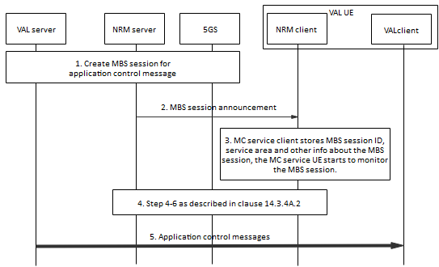

# 14.3.4A.7 Aplication level control signalling over 5G MBS sessions

## 14.3.4A.7.1 Description

The VAL server may use an 5G MBS session for application level control signalling. An 5G MBS session for application level control signalling is typically used for the purposes beyond the benefit for using 5G for resource efficiency, e.g. for improved MC service performance (KPIs), handling of high load scenarios.

Similar to the usage of eMBMS, both broadcast and multicast 5MBS session for application level control signalling may be used to transmit the following messages, for example:

\- MBS session announcement for media sessions

\- Group application paging

\- Group dynamic data (e.g. status of the group)

5G MBS session for application level control signalling is created in a service area that is larger than the estimated service for media MBS session. The service area for the media sessions is mainly based on counting of group members in each defined service area. The MBS session for application level control signalling is also created with a QoS that is better than MBS media session since the packet loss requirements are much stricter.

The NRM client shall not send responses to group-addressed application level control signalling unless instructed or configured to respond.

## 14.3.4A.7.2 Procedure

The procedure in figure 14.3.4A.7.2-1 shows only one of the receiving VAL UE using a 5G MBS session.

Figure 14.3.4A.7.2-1: Use of 5G MBS for application-level control signalling

1\. The VAL server determines to create MBS session for application-level control signalling, the VAL server initiated the 5G MBS session establishment via the NRM is done according to clause 14.3.4A.2.

2\. The NRM server passes the 5G MBS session info for the service description associated with the 5G MBS session to the NRM client. The NRM client obtains the MBS session ID, from the service description.

NOTE: For 5G MBS and 4G MBMS co-existence, the MBMS bearers activation and MBS session announcement are performed as specified in the procedure for pre-created MBS session and session announcement.

3\. The NRM client stores the information associated with the MBS session ID. The NRM client uses the MBS session ID and other 5G MBS session related information to enable monitoring of the 5G MBS session by the VAL UE.

4\. Steps 4 to 6 defined in clause 14.3.4A.2 are performed.

5\. The VAL server transmits MC application control messages over the MBS session.
