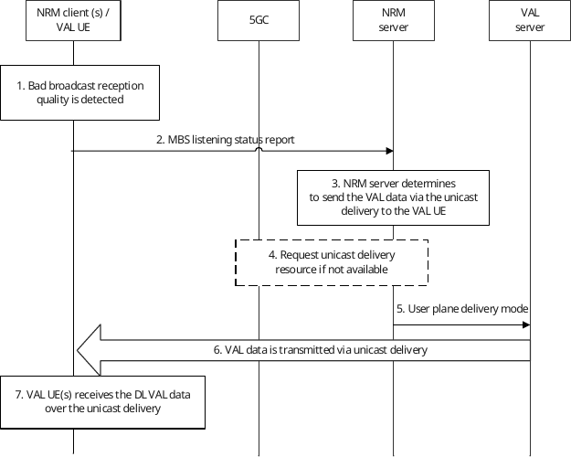
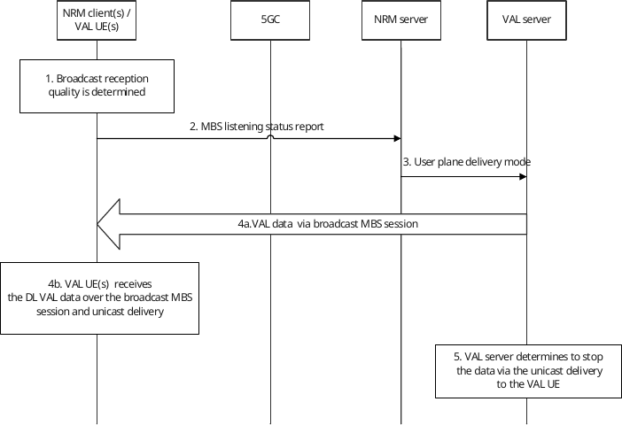

# 14.3.4A.8 Service continuity between 5G MBS delivery and unicast delivery

## 14.3.4A.8.1 General

This clause addresses the issue of VAL data delivery over MBS session, specifically, to maintain the service continuity when switching between 5G MBS delivery and unicast delivery.

## 14.3.4A.8.2 Service continuity for broadcast MBS session

### 14.3.4A.8.2.1 General

This solution provides the procedure which allows the NRM client to report the broadcast reception quality to the NRM server which is used to make the decision whether to use the unicast delivery to the VAL UE(s) which are suffering bad broadcast reception quality due to e.g., move out of the broadcast service area.

An NRM client monitors the broadcast MBS session to receive VAL data. Based on the received quality (e.g., radio level quality, RTP packet loss), the NRM client needs to inform the NRM server that the NRM client is able to receive the VAL data on the broadcast MBS session with sufficient quality or not.

This estimation of the broadcast reception quality may be dependent on, for example, the modulation and coding scheme (MCS) and measurements from the reference signals from the NG-RAN node(s), RTP packet loss, BLER of the received VAL data.

### 14.3.4A.8.2.2 Procedures

#### 14.3.4A.8.2.2.1 Service continuity from broadcast to unicast

The procedure in figure 14.3.4A.8.2.2.1-1 illustrates the VAL UE which is receiving VAL data via broadcast MBS session is switched to unicast delivery because the VAL UE suffers from bad broadcast reception quality due to e.g., moving out of the broadcast service area. It shows only one of the receiving VAL UEs receiving the broadcast MBS session.

Pre-conditions:

1\. The VAL group communication is ongoing and the VAL data (e.g., DL media, application layer control signalling) is transmitted via broadcast MBS session.

2\. The NRM client is receiving the VAL data (e.g., DL media, application layer control signalling) via the broadcast MBS session.

3\. The NRM client(s) already have the associated information (e.g., SDP) to receive the unicast delivery during the group communication establishment phase.

4\. An VAL group communication session is ongoing and the DL VAL data is transmitted over broadcast MBS session.

Figure 14.3.4A.8.2.2.1-1: Service continuity from broadcast to unicast

1\. The NRM client detects that it suffers bad broadcast reception due to e.g., moving out of the broadcast service area of the announced MBS session ID. The NRM client may determine the broadcast reception quality by using the BLER of the received media. When no media is received, the quality estimation can consider the reference signals and the modulation and coding scheme (MCS).

2\. The NRM client sends MBS listening status report which indicates the broadcast reception quality associated with the MBS session ID is not sufficient to receive media. The NRM client may also map the determined broadcast reception quality to a broadcast reception quality level. The broadcast reception quality level indicates at which specific broadcast reception quality level the VAL data has been received.

NOTE 1: It is implementation that the broadcast reception quality level can be determined per MBS session, per media stream or per MBS QoS flow level via e.g., measurements of radio level signalling such as the reference signals from the NG-RAN node(s), packet loss.

NOTE 2: The set of MBS reception quality levels and the mapping of the determined broadcast reception quality to those levels are implementation.

NOTE 3: The frequency of VAL UE sending listening reports can be limited to prevent signalling congestion. E.g., the VAL UE can stop monitoring the broadcast reception quality and send the MBS listening status report only once when it moves outside of the broadcast service area.

3\. The NRM server based on the report from the participant, determines that the UE is not able to receive the media or the QoS requirements is not satisfied. The NRM server determines the VAL media (e.g., DL media, application layer control signalling) needs to be delivered via the unicast delivery to the reported NRM client.

4\. If the unicast QoS flow is not satisfied, the NRM server interacts with the 5GC to update the QoS requirements.

5\. The NRM server informs the VAL server to send the VAL data via the unicast delivery towards the reported NRM client by sending a user plane delivery mode message.

6\. The NRM server sends the VAL media via the unicast delivery towards the NRM client which suffers bad broadcast reception quality.

7\. The NRM client then receives the DL VAL data via both broadcast MBS session and unicast delivery.

#### 14.3.4A.8.2.2.2 Service continuity from unicast to broadcast

The procedure in figure 14.3.4A.8.2.2.2-1 illustrates the VAL UE receiving VAL data via unicast delivery being switched to broadcast MBS session as the UE enters the broadcast service area where the NG-RAN is broadcasting the VAL media of the ongoing group communication. The VAL UE now is able to receive the VAL data via the broadcast MBS session. Only one of the receiving VAL UEs receiving the broadcast MBS session is shown.

Pre-conditions:

1\. The VAL group communication is ongoing and the VAL data (e.g., DL media, application layer control signalling) is transmitted via broadcast MBS session in the broadcast service areas.

2\. The VAL UE is receiving the VAL data (e.g., DL media, application layer control signalling) via the unicast delivery.

3\. The NRM client has already received the broadcast MBS session announcement, MapVALGroupToSessionStream information and enters the broadcast service area.

4\. A VAL group communication session is ongoing and the broadcast MBS session is used by the VAL server to deliver the VAL data of the group communication. The VAL UE is receiving the VAL data via the unicast delivery.

Figure 14.3.4A.8.2.2.2-1: Service continuity from unicast to broadcast

1\. The NRM client detects that it is able to receive the broadcast media due to e.g., moving into the broadcast service area of the announced MBS session ID. The NRM client may determine the broadcast reception quality by using the BLER of the received media. When no media is received, the quality estimation can consider the reference signals and the modulation and coding scheme (MCS).

2\. The NRM client sends MBS listening status report which indicates the broadcast reception quality associated with the MBS session ID is sufficient to receive VAL data. The NRM client may also map the determined broadcast reception quality to a broadcast reception quality level. The broadcast reception quality level indicates at which specific broadcast reception quality level the VAL data has been received.

NOTE 1: The set of MBS reception quality levels and the mapping of the determined broadcast reception quality to those levels are up to implementation.

NOTE 2: It is up to implementation that the broadcast reception quality level can be determined per MBS session, per media stream or per MBS QoS flow level via e.g., measurements of radio level signals, such as the reference signals from the NG-RAN node(s), or packet loss.

3\. The NRM server determines the VAL UE is able to receive the VAL data via the the broadcast MBS session, and the NRM server sends a user plane delivery mode to the VAL server indicating to stop the unicast delivery.

4\. Based on the MapVALGroupToSessionStream received before, the NRM client receives the DL VAL data via both the broadcast MBS session and the unicast delivery.

NOTE 3: If any information about the broadcast MBS session stream has changed, the NRM server provides the MapVALGroupToSessionStream again.

5\. The VAL server, based on the user plane delivery mode message, determines to stop sending the VAL data (e.g., DL media, application layer control signalling) via the unicast delivery to the reporting NRM client. After then, the NRM client receives the VAL data only via the broadcast MBS session.

## 14.3.4A.8.3 Service continuity for multicast MBS session

### 14.3.4A.8.3.1 General

The NRM server may also switch between multicast and unicast by utilizing application layer mechanisms similar to switching between broadcast and unicast as specified in clause 14.3.4A.8.2. If indicated in the MBS session announcement information, the NRM client reports the monitoring state (i.e., the reception quality of the MBS session) back to the NRM server.

NOTE: Once the VAL UE has successfully joined the multicast MBS session and started to receive the VAL data via the multicast MBS session, then the network mechanism specified in 3GPP TS 23.247 \[39\] will deliver the media from the NRM server via the 5GC Individual MBS traffic delivery method or the 5GC Shared MBS traffic delivery method towards the VAL UE(s). The usage of 5GC Individual MBS traffic delivery method or the 5GC Shared MBS traffic delivery method is transparent to the NRM server and VAL server.
