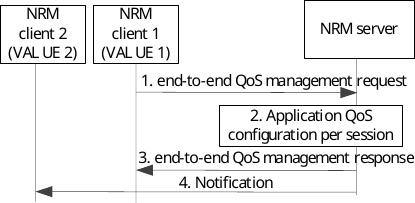
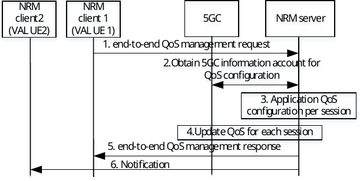
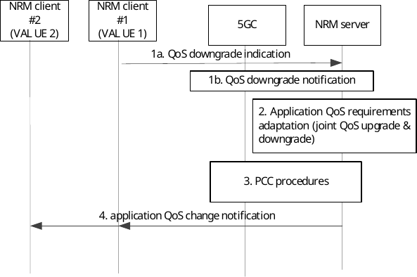
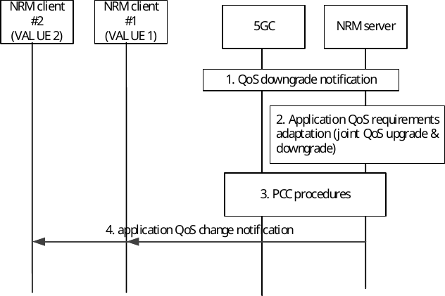
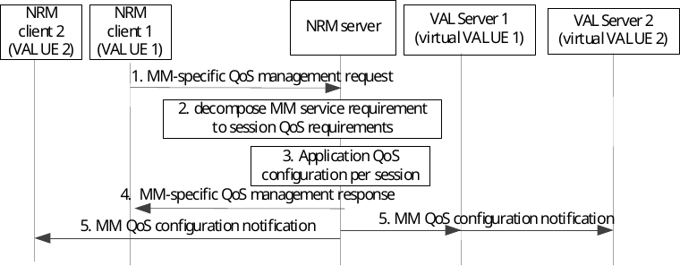

# 14.3.5 QoS/resource management for network-assisted UE-to-UE/VN group communications

## 14.3.5.1 General

This feature provides the SEAL NRM support for coordinated QoS/resource management for network assisted UE-to-UE communications. Such capability may be required for guaranteeing end-to-end QoS fulfilment (primarily for meeting end-to-end latency requirements) in network assisted UE to UE communications and may accommodate various vertical-specific application services, e.g.:

\- Network-assisted Command and Control (C2) communications in UASAPP, 3GPP TS 23.255 \[62\], where the UAV controller navigates its UAV over the 5GS;

\- Teleoperated Driving (ToD) in eV2XAPP, 3GPP TS 23.286 \[7\], where the a V2X UE acting as server may remotely control a further V2X UE over the 5GS;

\- Network-assisted Device-to-Device communications in Factory of the Future (FF) use cases, such as control-to-control communications.

\- 5G LAN-Type communication within a 5G VN group as specified in 3GPP TS 23.501 \[10\].

\- Application QoS coordination for Mobile Metaverse Services in distributed VAL servers.

## 14.3.5.2 QoS/resource management capability initiation in network assisted UE-to-UE communications

This procedure provides a mechanism for initiating the capability at the NRM server for managing the end-to-end application QoS requirement fulfilment for a network-assisted VAL UE to VAL UE session (comprising a PDU session for each of the constituent links, e.g. VAL UE 1 to PLMN, and PLMN to VAL UE 2). The request may come from NRM client of either of the VAL UEs within the service and will trigger the end-to-end QoS/resource management by the NRM server. The triggering the end-to-end QoS management request can be initiated by the VAL application at the VAL UE, and the conditions may depend on the requirements of the VAL service, e.g. for UAS such triggering may be needed when a UAV is in-flight, or for V2X such trigger may be initiated when a controlled VAL UE enters an urban area, or for 5G LAN-type service such trigger may be initiated by the AF (e.g. on VAL UE1) that manages the corresponding 5G VN group.

The clause 14.3.5.2.1 describes the end-to-end QoS/resource management capability for network-assisted UE-to-UE communications for a single pair of UEs.

The clause 14.3.5.2.2 describes the end-to-end QoS/resource management capability for network-assisted UE-to-UE communications for a group of UEs.

### 14.3.5.2.1 Procedure for a single pair of UEs

Figure 14.3.5.2.1-1 illustrates the procedure where the NRM server is initiating the end-to-end QoS/resource management capability for network-assisted UE-to-UE communications for a single pair of UEs.

Pre-conditions:

1\. The NRM client is connected to the NRM server.

2\. The VAL UEs involved in the end-to-end session (VAL UE 1 and VAL UE 2) are connected to one or more PLMNs and have ongoing PDU sessions.

3\. NRM server has used the "Setting up an AF session with required QoS procedure" (clause 4.15.6.6 of 3GPP TS 23.502 \[11\]).

Figure 14.3.5.2.1-1 end-to-end QoS management request / response

1\. The NRM client 1 (of VAL UE 1) sends to the NRM server an end-to-end QoS management request for managing the QoS for the end-to-end application session.

2\. The NRM server configures the application QoS parameters by decomposing the end-to-end QoS requirements (VAL UE 1 to VAL UE 2) to application QoS parameters for each individual session (e.g. network session for VAL UE 1 -and network session for VAL UE 2) which are part of the end-to-end application session.

3\. The NRM server sends to the NRM client 1 an end-to-end QoS management response with a positive or negative acknowledgement of the request.

4\. The NRM server may also send a notification to NRM client 2 (of VAL UE 2) to inform about the end-to-end QoS management initiation by the NRM server.

### 14.3.5.2.2 Procedure for a group of UEs

Figure 14.3.5.2.2 illustrates the procedure where the NRM server is initiating the end-to-end QoS/resource management capability for network-assisted UE-to-UE communications for a group of UEs.

Pre-conditions:

1\. The NRM client is connected to the NRM server.

2\. The VAL UEs involved in the end-to-end session (VAL UE 1 and a group of VAL UEs) are connected to one or more PLMNs and have ongoing PDU sessions.

Note : The NRM client2 (of VAL UE 2) can be any VAL UEs in the group of VAL UEs.

Figure 14.3.5.2.2 end-to-end QoS management request / response for a group of UEs

1\. The NRM server receives from the AF on NRM client 1 (of VAL UE 1) the end-to-end QoS management request for managing the QoS on UE-to-UE traffic for a group of UEs.

2\. The NRM server retrieves from 5GC or subscribe to 5GC to obtain additional VAL-UE associated information for each member in the group identified by the VAL group ID, which is account for decomposition. The VAL-UE associated information could be from the 5GC (NEF Monitoring Events as in 3GPP TS 23.502 \[11\], QoS sustainability analytics as in 3GPP TS 23.288 \[34\]) or SEAL LMS (on demand location reporting).

3\. The NRM server configures the application QoS parameters by decomposing the end-to-end QoS requirements (UE-to-UE traffic for any two UEs in a group) to application QoS parameters for each individual session (uplink network session for ingress group member and downlink network session for egress group member). The NRM server needs to take the additional VAL-UE associated information into account for evaluation during such decomposition.

4\. The NRM/SEAL server, acting as AF, sends to the 5GC a "Procedures for AF requested QoS for a UE or group of UEs not identified by a UE address" to set the application QoS parameters respectively for uplink network session for each ingress group member in the group and for downlink network session for egress group member.

Additionally, the NRM/SEAL server may activate monitoring of the performance to receive QoS monitoring event notifications from 5GC by setting the (optionally with Alternative QoS Profiles) in the request, in this case the AF may receive the QoS downgrade notification for e.g. latency thus to initiate the NRM-assisted coordinated QoS provisioning for 5G LAN-Type communication in clause 14.3.5.3.x

5\. The NRM server sends to the NRM client 1an end-to-end QoS management response with a positive or negative acknowledgement of the request.

6\. If the NRF server receives the end-to-end QoS management request including VAL UE2 as any of the List of VAL UEs, then the NRM server may also send a notification to NRM client 2 (of VAL UE 2) to inform about the end-to-end QoS management initiation by the NRM server.

## 14.3.5.3 Procedure for coordinated QoS provisioning operation in network assisted UE-to-UE communications

This procedure provides a mechanism for ensuring the end-to-end application QoS requirement fulfilment for the application service (which is between two or more VAL UEs), considering that the QoS of one of the links may downgrade. It is assumed that the application session is ongoing, and both the source and target VAL UEs are connected to 3GPP network (the same or different). The communication between the VAL UEs is assumed to be in-direct / network-assisted; hence two PDU sessions are established respectively (one per VAL UE).

The clause 14.3.5.2.1 describes the end-to-end QoS/resource management capability for network-assisted UE-to-UE communications for a single pair of UEs.

The clause 14.3.5.2.2 describes the end-to-end QoS/resource management capability for network-assisted UE-to-UE communications for a group of UEs.

### 14.3.5.3.1 Procedure for a single pair of UEs

Figure 14.3.5.3.1-1 illustrates the procedure where the NRM server supports the coordinated QoS provisioning for network-assisted UE-to-UE communications for a single pair of UEs.

Pre-conditions:

1\. NRM server has activated the end-to-end QoS/resource management capability, as described in 14.3.5.2.1

2\. NRM server, acting as AF, has registered to receive QoS monitoring event notifications from 5GC and notifications from VAL UEs (from both UEs), as specified in 3GPP TS 23.501 \[10\].

Figure 14.3.5.3.1-1: NRM-assisted coordinated QoS provisioning for C2 communication

1a. A QoS downgrade trigger event is sent from the NRM client of the VAL UE 1 to the NRM server, denoting an application QoS degradation (experienced or expected) e.g. based on the experienced packet delay or packet loss for the Uu link (e.g. packet loss great than threshold value). The conditions for triggering the QoS downgrade indication from the NRM client is based on the threshold that may be provided in advance by the NRM server (at the end-to-end QoS management response by the NRM server in 14.3.5.2.1).

1b. Alternatively, the NRM server receives a trigger event from the 5GC (SMF/NEF), denoting a QoS downgrade notification for the VAL UE 1 session. (described in clause 5.7.2.4.1b of 3GPP TS 23.501 \[10\]).

2\. The NRM server evaluates the fulfilment/non-fulfilment of the end-to-end QoS based on the trigger event. NRM server may retrieve additional information based on subscription to support its evaluation. This could be from the 5GC (NEF Monitoring Events as in 3GPP TS 23.502 \[11\], QoS sustainability analytics as in 3GPP TS 23.288 \[34\]) or SEAL LMS (on demand location reporting for one or both VAL UEs 1 and 2).

Then, the NRM server, determines an action, which is the QoS parameter adaptation of one or both links (QoS profile downgrade for the link receive QoS notification control, and QoS upgrade for the link which can be upgraded).

3\. The NRM/SEAL server, acting as AF, sends to the 5GC (to SMF via NEF or to PCF via N5) a request for a change of the QoS profile mapped to the one or both network sessions (for VAL UE 1 and UE 2) or the update of the PCC rules to apply the new traffic policy (as specified in 3GPP TS 23.502 \[11\] in clause 4.15.6.6a: AF session with required QoS update procedure).

4\. The NRM server sends an application QoS change notification to the affected NRM clients, to inform on the adaptation of the QoS requirements for the individual session.

### 14.3.5.3.2 Procedure for a group of UEs

Figure 14.3.5.3.2 illustrates the procedure where the NRM server supports the coordinated QoS provisioning for network-assisted UE-to-UE communications.

Pre-conditions:

1\. NRM server has activated the end-to-end QoS/resource management capability, as described in 14.3.5.2.1

2\. NRM server, acting as AF, has registered to receive QoS monitoring event notifications from 5GC and notifications from VAL UEs (from any UEs in a group), as specified in 3GPP TS 23.501 \[10\].

Figure 14.3.5.3.2-1: NRM-assisted coordinated QoS provisioning for 5G LAN-Type communication

1\. The NRM server receives a trigger event from the 5GC (SMF/NEF), denoting a QoS downgrade notification for the network session of any group member in a group. (described in clause 5.7.2.4.1b of 3GPP TS 23.501 \[10\]).

2\. The NRM server evaluates the fulfilment/non-fulfilment of the end-to-end QoS based on the trigger event. NRM server may retrieve additional information based on subscription to support its evaluation. This could be from the 5GC (NEF Monitoring Events as in 3GPP TS 23.502 \[11\], QoS sustainability analytics as in 3GPP TS 23.288 \[34\]) or SEAL LMS (on demand location reporting for one or both VAL UEs 1 and 2).

Then, the NRM server, determines an action, which is the QoS parameter adaptation of only uplink/downlink network session or both uplink and downlink network sessions for each ingress group member in the group.

3\. The NRM/SEAL server, acting as AF, sends to the 5GC (to SMF via NEF or to PCF via N5) a request for a change of the QoS profile mapped to the impacted network sessions or the update of the PCC rules to apply the new traffic policy (as specified in 3GPP TS 23.502 \[11\] in clause 4.15.6.14: AF requested QoS for a UE or group of UEs not identified by a UE address procedure).

4\. The NRM server sends an application QoS change notification to the affected NRM clients, to inform on the adaptation of the QoS requirements for the individual session.

## 14.3.5.4 Application QoS coordination for Mobile Metaverse Services in distributed VAL servers

### 14.3.5.4.1 General

This clause provides a mechanism for application session QoS coordination for mobile metaverse (MM) services where these services are offered by more than one VAL server.

It is assumed that the MM service consists of the following VAL sessions which can be present for multi-user interactions. The sessions may include VAL UE1 and VAL UE2 and digital counterparts of UE1 and UE2 instantiated in one or more DNs (called as virtual or avatar VAL UEs).

\- VAL session \#1: VAL client 1 sends to VAL server 1 (including virtual VAL UE 1 at DN side) sensor data / measurements on the physical environment related to VAL UE1 over VAL-UU interface. VAL server (virtual VAL UE1) sends back haptic feedback to VAL UE1 (for UE1 and/or UE2 and the environment).

\- VAL session \#2: VAL client 2 sends to VAL server 2 (including virtual VAL UE 2 at DN side) sensor data / measurements on the physical environment related to VAL UE2 over VAL-UU interface. VAL server (virtual VAL UE2) sends back haptic feedback to UE2 (for UE1 and/or UE2 and the environment).

\- VAL session \#3: Exchange of service related / feedback data between VAL server 1 and 2 for interactions between virtual UE 1 and 2 (for example micro-transactions such as avatar updates/modifications or environment changes).

\- VAL session \#4: Sensor data / measurements are exchanged between VAL UEs over VAL-PC5 (communication can be over side link) for traffic related to the MM service.

There is a coupling in the performance requirements for all the above VAL sessions which is corresponding to the end-to-end MM service. The end-to-end MM service may be related e.g., to 5G-enabled Traffic Flow Simulation and Situational Awareness, where the physical objects including UEs (e.g. V2X UEs) in cars and trucks in each lanes, will have a corresponding digital twin in the virtual world in distributed VAL servers, and the virtual and physical UEs form the mobile metaverse.

One possible coupling of such requirements is about the expected sequence of certain messages to be transferred via the 5GS. For example, the delay of the collection of sensor information from the physical environment may have impact on the expected delay of haptic feedback from the server to the VAL UE which will result in degrading the QoE for the MM service.

In the procedure as defined in 14.3.5.4.2, the NRM server takes the performance of VAL Session \# 1, VAL Session \# 2, VAL Session \# 3, VAL Session \# 4 into consideration to ensure the E2E performance (UE#1 - VAL server#1 - VAL server#2 - UE#2). For example, if the delay of VAL session \# 1 is long, the delay of other sessions needs to be reduced.

NOTE: This capability is only applicable to multiple VAL server deployments (e.g., virtual UEs in different edge or cloud deployed VAL servers). In case of single VAL server offering the MM service, the application QoS coordination is performed based on procedure in clause 14.3.5.3.1 for single pair and 14.3.5.3.2 for group of UEs..

### 14.3.5.4.2 Procedure on application QoS coordination for Mobile Metaverse Services

Figure 14.3.5.4.1-1 illustrates the procedure where the NRM server is supporting application QoS coordination for the VAL sessions within a MM Service.

Pre-conditions:

1\. The NRM clients are connected to the NRM server.

2\. The VAL servers are connected to the NRM server.

3\. The VAL sessions which are coupled to support the Mobile Metaverse (MM) Service (e.g., VAL client 1 to VAL server 1, VAL client 2 to VAL server 2) are established.

4\. The NRM client 1 has acquired information on the dependencies among different sessions (e.g. sequence of data to be exchanged among VAL servers and clients) from the VAL client.

Figure 14.3.5.4.1-1 application QoS coordination for VAL MM services

1\. The NRM client 1 (acting on behalf of VAL client 1) sends to the NRM server an MM-specific QoS management request to trigger the application QoS coordination between the physical and virtual VAL UEs within MM service. This request may also include the end-to-end QoS/service provisioning requirement for the MM service, and the expected dependencies among different sessions (e.g. sequence of data to be exchanged among VAL servers and clients).

2\. The NRM server decomposes the MM service performance requirement (end to end application QoS target) to per VAL session requirement taking into account the dependencies among sessions, where in this step the NRM server identifies the VAL sessions for which the application QoS parameters need to be configured or updated.

3\. The NRM server configures the application QoS parameters per VAL session, for the identified VAL sessions to ensure meeting the end-to-end QoS requirements for the MM service.

4\. he NRM server sends the MM-specific QoS management response to the NRM client 1 to provide the configuration information for the QoS attributes for the VAL sessions related to VAL UE 1.

5\. The NRM server sends a QoS configuration notification to the VAL servers 1 and 2 as well as to the NRM client 2 to provide the configuration information for the QoS attributes for the corresponding VAL sessions. The QoS configuration notification may include per session QoS requirements for each metaverse session received/sent at/by the UE, where each metaverse session may be composed of multi-modal type of communication conveying audio, video or haptic/sensor information from/between the UE.
