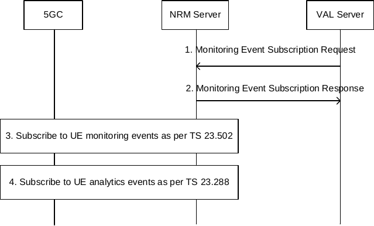
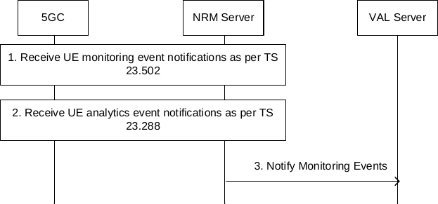

# 14.3.6 Event Monitoring

## 14.3.6.1 General

The VAL server utilizes the NRM server for monitoring the events related to its VAL UEs and receive the event reports. The NRM server shall subscribe to multiple core network services to fetch all the required events related to the multiple VAL UEs served by the VAL server and report the same to the VAL server with the event details.

To monitor and report the events related to the VAL UE from the 3GPP core network, the NRM server shall use the Monitoring Events procedures as specified in 3GPP TS 23.502 \[11\].

To monitor and report the analytics events related to the VAL UE, the NRM server shall use the procedures specified in 3GPP TS 23.288 \[34\].

## 14.3.6.2 Monitoring Events Subscription Procedure

### 14.3.6.2.1 General

The VAL server subscribes to the NRM server to monitor the events related to VAL UE(s). Based on the VAL server request, the NRM server consumes the relevant core network services to receive the events related to the VAL UE(s). The related procedure is illustrated in the next clause.

### 14.3.6.2.2 Procedure

The procedure for VAL server subscribing to the NRM server, to monitor the VAL UE(s) related events is described in figure 14.3.6.2.2-1.

Pre-conditions:

\- The NRM server is authorized to consume the core network services (Monitoring events as specified in 3GPP TS 23.502 \[11\] and Analytics services as specified in 3GPP TS 23.288 \[34\]);

Figure 14.3.6.2.2-1: Monitoring Events Subscription Procedure

1\. The VAL server sends Monitoring Events Subscription request to the NRM server, requesting the NRM server to monitor the events related to the VAL UE(s) as per the subscription request, and shall include the information related to the events that the VAL server is interested in.

2\. The NRM server shall check if the VAL server is authorized to initiate the Monitoring Events Subscription request and if authorized, shall respond with Monitoring Events Subscription Response message, indicating the successful subscription status along with subscription information to the VAL server. The VAL service ID may be used by the NRM server to derive event specific information in 3GPP core network services (e.g. QoS requirement in analytics event subscription), based on e.g. local configuration. The NRM server maps the VAL group ID (if received) to the External Group ID known to the 3GPP core network.

NOTE: The mapping between Monitoring profile ID and event details in the NRM server can be pre-configured and/or dynamically built based on VAL server request with explicitly sent event details, which is implementation specific.

3\. Based on the events of interest information in the subscription request message, if applicable, the NRM server shall subscribe to the UE monitoring events (LOSS_OF_CONNECTIVITY, COMMUNICATION_FAILURE, etc.) for the set of UEs (VAL UEs) in the subscription request, as specified in 3GPP TS 23.502 \[11\].

4\. Based on the events of interest information in the subscription request message, if applicable, the NRM server shall subscribe to the UE analytics events (like ABNORMAL_BEHAVIOUR etc.) for the set of UEs (VAL UEs) in the subscription request, as specified in 3GPP TS 23.288 \[34\].

## 14.3.6.3 Monitoring Events Notification Procedure

### 14.3.6.3.1 General

The NRM server receives the events related to VAL UE(s) from the 3GPP core network. The NRM server reports the monitoring events information to the VAL server.

### 14.3.6.3.2 Procedure

The procedure for NRM server notifying the VAL server with VAL UE(s) related events is described in figure 14.3.6.3.2-1.

Pre-conditions:

\- The VAL server has subscribed with NRM server using Monitoring Events Subscription Procedure as specified in clause 14.3.6.2;

Figure 14.3.6.3.2-1: Monitoring Events Notification Procedure

1\. If applicable, the NRM server receives the VAL UE related monitoring event notifications from the 3GPP core network as specified in 3GPP TS 23.502 \[11\].

2\. If applicable, the NRM server receives the VAL UE related Analytics event notifications from the 3GPP core network as specified in 3GPP TS 23.288 \[34\].

3\. The NRM server notifies the VAL server about the events related to the VAL UE in Notify Monitorng Events message. If multiple events are to be notified, then the NRM server may aggregate the notifications and send to the VAL server.
