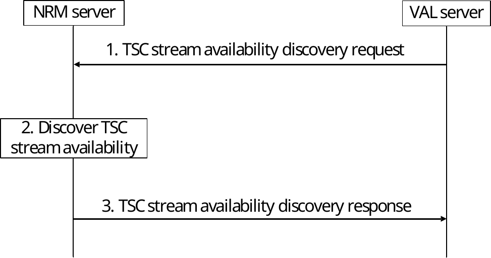
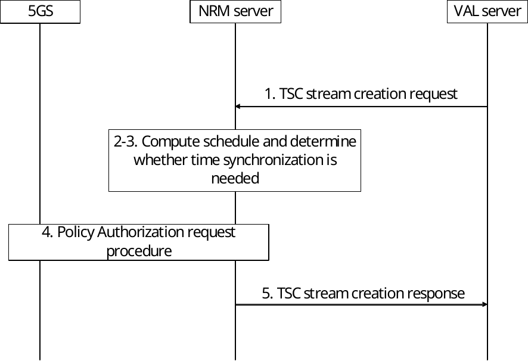
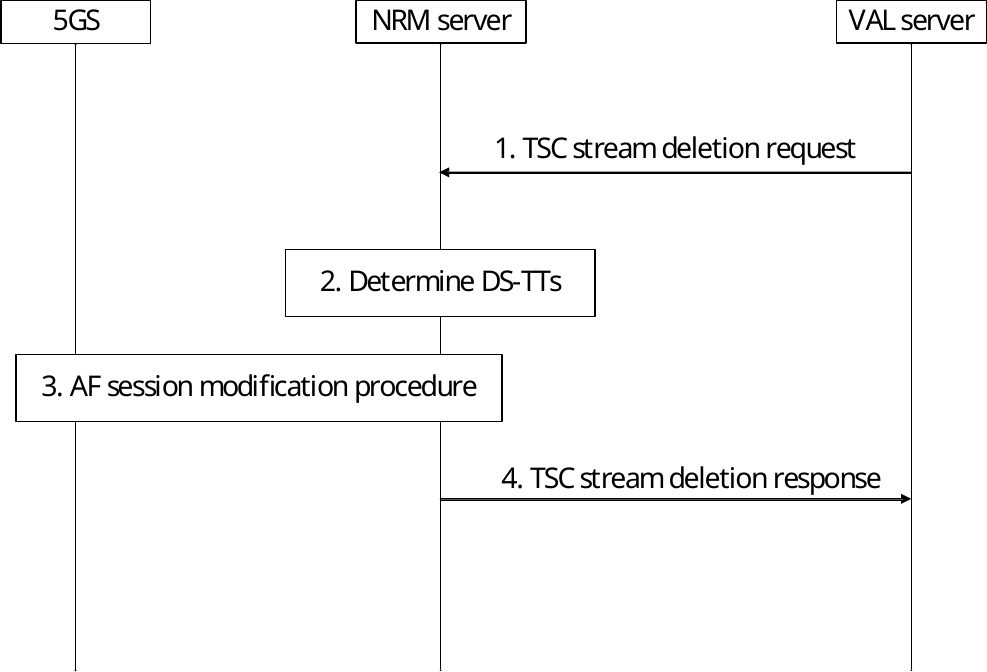

# 14.3.7 5G TSC resource management procedures

## 14.3.7.1 General

The procedures related to the 5G TSC network resource management are described in the following subclauses.

## 14.3.7.2 TSC stream availability discovery procedure

The TSC stream availability discovery procedure is used by the VAL server to discover the availability of resources for TSC communication for the given stream specification (i.e., between the target UEs) prior to creating the stream.

Pre-conditions:

1\. Each UE has an established Ethernet PDU session and DS-TTs are connected to the 5GS TSC bridge. The traffic classes are configured on each DS-TT.

2\. The NRM server has collected the 5GS TSC bridge management and port management information. The latter is related to the Ethernet ports located in the DS-TTs including bridge delay per DS-TT Ethernet port pair per traffic class.

3\. NRM server has calculated the bridge delay for each port pair, i.e. composed of (ingress DS-TT Ethernet port, egress DS-TT Ethernet port) including the UE-DS-TT residence time, packet delay budget (PDB) and propagation delay for both UL from sender UE and DL to receiver UE.

Figure 14.3.7.2-1: TSC stream availability discovery procedure

1\. The NRM server receives a request from a VAL server on NRM-S reference point to discover the connectivity and available QoS characteristics between DS-TTs identified by the stream specification.

2\. The NRM server validates the connectivity between the DS-TTs connected in the same 5GS TSC bridge based on the collected 5GS TSC bridge management and port management information, identifies the traffic classes supported by the DS-TTs and determines the end-to-end latency (including the UE-DS-TT residence times, PDBs and propagation delay).

3\. NRM server responds to the VAL server with the stream specification and a list of traffic specifications with the available end-to-end latency and the traffic classes supported by the DS-TTs.

## 14.3.7.3 TSC stream creation procedure

This procedure allows the VAL server to create a TSC stream. The TSC stream creation procedure enables the VAL server to establish TSC connectivity with the required QoS between the UEs connected to the 5GS after the stream discovery procedure.

Pre-conditions:

1\. Each UE has an established Ethernet PDU session for its DS-TT port MAC address.

2\. Connectivity between the DS-TTs has been validated by the TSC stream availability discovery procedure specified in clause 14.3.7.2.

3\. The NRM server maintains mapping from the traffic class to TSC QoS.

Figure 14.3.7.3-1: TSC stream creation procedure

1\. The NRM server receives a TSC stream creation request from a VAL server to create a TSC stream identified by a VAL Stream ID, between DS-TT ports in the stream specification and for the traffic class in the traffic specification.

2\. The NRM server calculates the schedule for the VAL Stream ID based on the information collected earlier from the 5GS via N5. It provides per-stream filtering and policing parameters (e.g. as defined in IEEE 802.1Q \[36\]) used to derive the TSC QoS information and related flow information. NRM server also provides the forwarding rule (e.g. as defined in IEEE 802.1Q \[36\]) used to identify the DS-TT MAC address of the corresponding PDU session. Based on the 5GS bridge delay information it determines the TSC QoS information and TSC Assistance information for the stream.

3\. Based on the Traffic specification (from the TSC stream creation request in step 1), the SEAL NRM server determines whether time synchronization needs to be activated for the TSC stream on the DS-TTs. If the DS-TTs are time synchronized, then the NRM does not activate the time synchronization for the corresponding DS-TT.

4\. As a TSCTSF, the NRM server triggers via N84 the Npcf_PolicyAuthorization_Create service operation as described in 3GPP TS 23.502 \[11\] for the TSC stream for both UL QoS flow (sender UE to UPF/bridge) and DL QoS flow (UPF/bridge to receiver UE). The Policy Authorization request includes the DS-TT port MAC address, TSC QoS information, TSC Assistance Information (3GPP TS 23.501 \[1\], cl.5.27.2.3), flow bit rate, priority, Service Data Flow Filter containing flow description including Ethernet Packet Filters. The QoS flow will be assigned for the PDU session for the source MAC address for the UL direction and for the PDU session for the destination MAC address for the DL direction. This information is delivered to the DS-TT by the 5GS.

> If time synchronization is determined to be needed for the TSC stream on the DS-TTs in step 3, the NRM server uses the procedures in clause K.2.2 of 3GPP TS 23.501 \[10\] to activate the time synchronization via the Npcf_PolicyAuthorization_Update service operation. The procedure includes the configuration and initialization of the PTP instance in the DS-TTs, the construction of PMICs to each DS-TT/UE to activate the time synchronization service in the DS-TT and to subscribe for the port management information changes in the DS-TTs.

NOTE: Using gate control parameters for hold and forward buffering is out of scope of the present document.

5\. The NRM server sends TSC stream creation response to the VAL server with the result of TSC stream creation for the VAL Stream ID.

## 14.3.7.4 TSC stream deletion procedure

This procedure allows the VAL server to delete a TSC stream.

Pre-conditions:

1\. The TSC stream is configured in the 5GS and the DS-TTs.

Figure 14.3.7.4-1: TSC stream deletion procedure

1\. The NRM server receives a request from VAL server to delete a TSC stream for with a VAL Stream ID.

2\. The NRM server identifies the MAC addresses of the DS-TTs involved in the stream based on the stored information for the VAL Stream ID. If none of the streams require to keep the time synchronization activated, the NRM server deactivates the time synchronization for the corresponding DS-TTs, otherwise keeps the time synchronization activated if the time synchronization for the DS-TTs was activated by the NRM server.

3\. As a TSCTSF, the NRM server triggers via N84 the Npcf_PolicyAuthorization_Delete service operation defined in 3GPP TS 23.502 \[11\] for MAC addresses referred to by the VAL Stream ID. The NRM server uses the procedure to delete both UL QoS flow (sender UE to UPF/bridge) and DL QoS flows (UPF/bridge to receiver UE) from the PDU sessions of the UEs referred to by the VAL Stream ID. Before invoking the Npcf_PolicyAuthorization_Delete procedure, if the time synchronization service for the DS-TTs needs deactivation, the NRM server deactivates the time synchronization for the DS-TTs as described in clause K.2.2 3GPP TS 23.501 \[10\] via the Npcf_PolicyAuthorization_Update service operation.

4\. The NRM server sends TSC stream deletion response to the VAL server with the result of TSC stream deletion for the VAL Stream ID.
