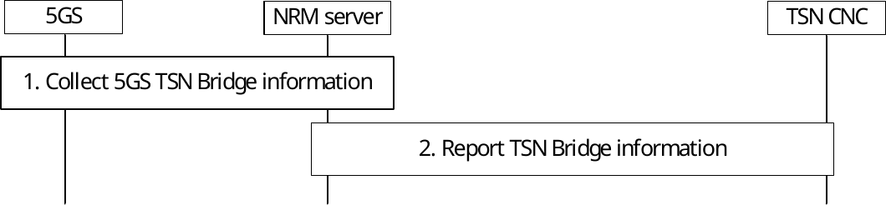
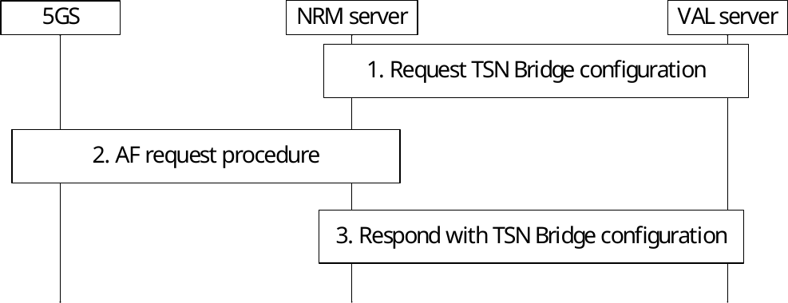

# 14.3.8 TSN resource management procedures

## 14.3.8.1 General

The procedures related to the TSN network resource management are described in the following subclauses.

## 14.3.8.2 5GS TSN Bridge information reporting

Pre-conditions:

1\. There is already an established session between the TSN CNC and the NRM server acting as TSN-AF.

Figure 14.3.8.2-1: TSN Bridge information reporting procedure

1\. Acting as the TSN AF the NRM server collects 5GS TSN Bridge information by interaction with the 5GS via the N5 reference point, as described in in TS 23.502 \[11\] Annex F.1. The NRM server stores the binding relationship between 5GS Bridge ID, MAC address of the DS-TT Ethernet port and also updates 5GS bridge delay as defined in clause 5.27.5 of TS 23.501 \[10\]. The NRM server retrieves txPropagationDelay and Traffic Class table from DS-TT and it also retrieves txPropagationDelay and Traffic Class table from NW-TT.

2\. Whenever there is a new or updated bridge information the NRM server interacts with the TSN CNC and reports the TSN Bridge information to register a new TSN Bridge or update an existing TSN Bridge. The TSN CNC stores the TSN Bridge information and confirms to the NRM server.

## 14.3.8.3 5GS TSN Bridge configuration procedure

Pre-conditions:

1\. The TSN CNC has stored the 5GS TSN Bridge information received from the NRM server acting as TSN AF.

2\. The NRM server acting as TSN AF has stored the 5GS TSN Bridge information collected from the 5GS, as described in clause 14.3.8.2.

Figure 14.3.8.3-1: TSN Bridge configuration procedure

1\. The NRM server receives from the TSN CNC per-stream filtering, policing parameters and related flow information according to IEEE 802.1Q \[36\] and it uses them to derive TSN QoS information and related flow information. The TSN AF uses this information to identify the DS-TT MAC address of the corresponding PDU session.

2\. NRM server triggers via N5 the AF request procedure as described in 3GPP TS 23.502 \[11\] Annex F.2. The AF request includes the DS-TT port MAC address, TSC QoS information, TSC Assistance Information, flow bit rate, priority, Service Data Flow Filter containing flow description including Ethernet Packet Filters.

> 3\. NRM server responds with a TSN Bridge configuration.
