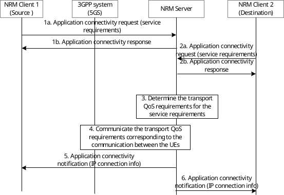
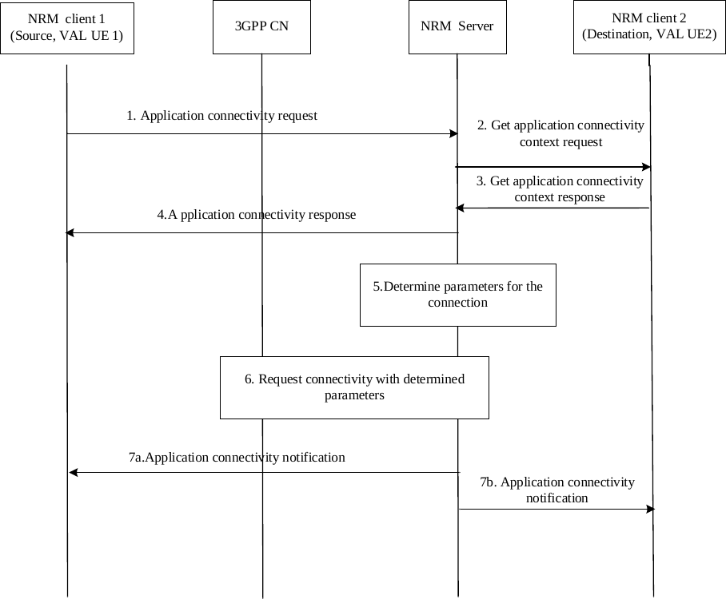
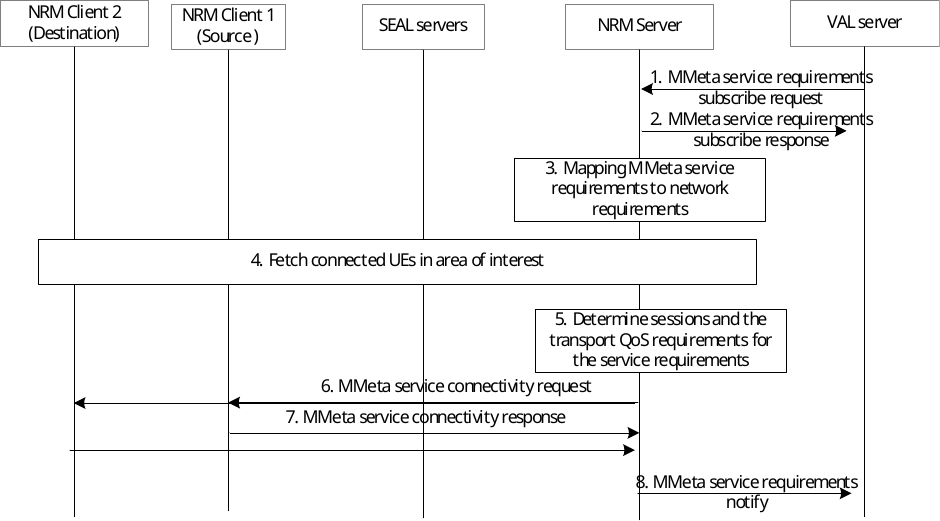

# 14.3.9 Establishing communication with application service requirements

## 14.3.9.1 General

The NRM client and the NRM server (acting as an AS) are involved in the exchange and analysis of the desired service requirements (e.g. packet size, packet transmission interval, reliability, packet error rate) for the E2E communication amongst the Vertical UEs. The NRM server triggers the establishment of application-level direct service connectivity between two UEs via Uu, based on the information provided by the UEs and static configuration information available to the NRM server prior to the UE interaction. Note that service connectivity among VAL clients is established over the Uu, without device-to-device direct radio connectivity (e.g. PC5) requirement.

## 14.3.9.2 Procedures

### 14.3.9.2.1 Procedure triggered by correlated source and destination requests

The procedure for establishing Uu-based application-level direct communications between two UEs, with application service requirements is as illustrated in figure 14.3.9.2.1‑1. In this procedure the source and destination VAL clients correlate their triggering of the procedure establishment before the NRM Server provides the service.

Pre-conditions:

\- NRM client 1 and NRM client 2 are provided configuration information for the VAL clients served e.g. connectivity requirements, which destination UEs to connect to over Uu, etc.

\- The NRM client 1 and NRM client 2 are configured with the information of the NRM server and have connectivity enabled to communicate with the NRM server. The information is provided via pre-configuration.

\- The NRM server is configured with policies and information of the UEs to determine authorization of the UEs requesting connectivity via Uu.

\- The VAL clients associated with NRM client 1 and NRM client 2 have triggered the establishment of connectivity.

Figure 14.3.9.2.1-1: Establishing communication with application service requirements

1a. The NRM client 1 sends the application connectivity request (source identity and IP address, destination identities, service requirements) to the NRM Server. The service requirement from the source includes packet size, packet transmission interval, packet E2E latency, allowed packet loss rate/packet loss amount/packet error rate, etc. The destination may be multiple UEs (devices). The identity of source and destination may be the application user identity or the MAC address.

1b. The NRM server determines whether the UE of NRM client 1 is authorized to connect to the destination UEs for direct service communications via Uu. If UE of NRM client 1 is authorized to connect to the destination UEs, then a response is provided to the NRM client 1 indicating acceptance of the request.

2a. The NRM client 2 sends the application connectivity request (destination identity and IP address, source identity, service requirements) to the NRM server. The service requirements from the destination includes the service requirements as described in step 1a.

2b. The NRM server determines whether the UE of NRM client 2 is authorized to connect to the destination UEs for direct service communications via Uu. If UE of NRM client 2 is authorized to connect to the destination UEs, then a response is provided to the NRM client 2 indicating acceptance of the request.

3\. Based on the service requirements received in step 1 and step 2, the NRM server determines the parameters and patterns for direct service connectivity between the source UE and the destination UE via Uu and also the transport requirements (i.e., QoS requirements for the 3GPP system (e.g. 5GS)). Further, the NRM server derives the individual QoS requirements for the source UE and the destination UE from the transport requirement accordingly, i.e., the QoS requirements required between the source UE of NRM client 1 and the 3GPP network and the QoS requirements required between the destination UE of NRM client 2 and the 3GPP network. This step may also include retrieving the direct link status of the UEs (e.g. PDU Session Status, UE reachability). If the NRM server determines that direct service connectivity via Uu is not authorized or not possible with the given connectivity requirements, it skips step 4 and proceeds to steps 5 and 6, informing each NRM client accordingly.

NRM server will process E2E connectivity establishment between NRM client 1 and NRM client 2 only after it receives the request from NRM client 2. There can be several NRM clients (destinations) which will perform step 2 and NRM server will process their E2E connectivity with NRM client 1 (source) as and when the requests are received by the NRM server.

4\. The NRM server triggers 3GPP system to establish QoS flow between the UE of NRM client 1 and the 3GPP network and the QoS flow between the UE of NRM client 2 and the network with individual QoS requirements derived from step 3 followed the procedure as specified in 3GPP TS 23.502 \[12\], 3GPP TS 23.501 \[10\].

5\. The NRM server sends the application connectivity notification (connectivity/session information) to NRM client 1 indicating successful establishment of the connectivity. The connectivity/session information may contain the accepted destination identities.

6\. The NRM server sends the application connectivity notification (connectivity/session information) to NRM client 2 indicating successful establishment of the connectivity.

### 14.3.9.2.2 Procedure triggered by source request and coordinated with destination

This procedure is used for establishing Uu-based application-level direct communications between two UEs, based on a single client initiating and providing application requirements. The procedure is as illustrated in figure 14.3.9.2.2‑1. The NRM Server provides the service by coordinating with the destination client.

Pre-conditions:

\- NRM client 1 and NRM client 2 are provided configuration information for the VAL clients served e.g. connectivity requirements, etc.

\- Pre-processing determines that network assisted UE-to-UE communications is required. VAL application policies and destination information for NRM clients are available at the NRM server.

\- The VAL client associated with NRM client 1 triggers the establishment of connectivity and provides information about (one or more) destination VAL client(s).

Figure 14.3.9.2.2-1: Coordination UE-to-UE communications with VAL application requirements

1\. The NRM client 1 sends the application connectivity request (source identity and IP address, destination identities, application requirements) to the NRM server to establish connectivity for VAL client 1 on UE 1. The destination VAL client(s) may be hosted on one or multiple UEs (devices).

> 2\. The NRM server determines whether VAL client 1 is authorized to connect to VAL client 2 for application-level direct UE-to-UE communications. If VAL client 1 is authorized to connect to VAL client 2, the NRM server performs the get application connectivity context request to retrieve VAL UE-to-UE connection coordination context procedure as described in clause 14.3.2.56. This step can be skipped if the NRM server is already aware of VAL client 2's context information.
>
> NOTE: The signaling and functionality for handling the cases when NRM client 2 will be temporarily unavailable for establishing the direct service connection are implementation dependent.

3\. The NRM client 2 sends the get application connectivity context response to the NRM server, 2. Using the request information and local policies, the NRM client 2 determines whether context information is to be provided for establishing application-level direct connectivity to the counterpart UE for the VAL application indicated. If the NRM client determines that context information is to be provided, it responds to the NRM server and provides the VAL connection coordination context data for the VAL client served.

> 4\. The NRM server sends the application connectivity response to NRM client 1.
>
> 5\. The NRM server uses VAL client 1's and VAL client 2's context information, their application-level direct UE-to-UE connectivity requirements, location information, and network context as input, checks connectivity service policies, and determines the parameters and patterns for application-level direct UE-to-UE connectivity between the VAL clients. The NRM server may also determine transport requirements (e.g. QoS requirements, for the 3GPP system (e.g. 5GS)). Further, the NRM server derives the individual QoS requirements for the source UE and the destination UE from the transport requirement accordingly, i.e., the QoS requirements required between the source UE of NRM client 1 and the 3GPP network and the QoS requirements required between the destination UE of NRM client 2 and the 3GPP network.
>
> If network provided location information is used, location information may be obtained from the SEAL location management server. Alternatively, Location Reporting monitoring as described in 23.502\[12\] may be used. This step may also include a request for direct link status (e.g. PDU Session Status, UE reachability, etc. as described in 23.502 \[12\]). This action may be skipped if the clients provide location information or if there are no location requirements for establishing the application-level direct UE-to-UE connectivity.
>
> If the NRM server determines that UE-to-UE application-level direct connectivity is not authorized or not possible with the given connectivity requirements, it skips step 5 and proceeds to steps 6 and 7, informing each NRM client accordingly.
>
> 6\. The NRM server may request the 3GPP system to establish or modify the QoS flow between the source UE and the network, and the QoS flow between the destination UE and the network that enables the application-level direct UE-to-UE connection for VAL client 1 and VAL client 2 services, e.g. via modification of existing radio bearers. NRM server provides the necessary information (e.g. identifiers of VAL client 1 and VAL client 2, transport requirements) in this request message as per the procedure as specified in 3GPP TS 23.502 \[12\], 3GPP TS 23.501 \[10\].

7\. a. The NRM server notifies NRM client 1 of the established UE-to-UE connection b. The NRM server notifies the NRM client 2 of the established UE-to-UE connection.

Each NRM client notifies the corresponding VAL client of the established application-level direct UE-to-UE connection.

### 14.3.9.2.3 Procedure for establishing communication in Situational Awareness use case

As described in Annex F, in Mobile Metaverse (MMeta) for 5G-enabled Traffic Flow Simulation and Situational Awareness use case and requirements as specified in 3GPP TS 22.156 \[61\], real-time information and data about the real objects can be delivered to the virtual objects of the road infrastructure and traffic participants including vulnerable road users can form a smart transport metaverse. To support such use case, it is essential to discover the identities of the virtual UEs (as counterparts of the physical UEs at the VAL server side) and identify the sessions required as well as the per session requirement in both physical and virtual world.

This clause describes the procedure for the translation of MMeta service requirements to network and connectivity requirements and the MMeta service connectivity support of all VAL UEs within the MMeta service area of interest.

Pre-conditions:

\- VAL server has deployed the MMeta service for the target VAL service area.

Figure 14.3.9.2.3-1: Establishing communication with MMeta service requirements

1\. The VAL server (MMeta service provider who deploys the virtual UEs) sends an MMeta service requirement subscription request message to the NRM server for configuring the connectivity and network requirements for the MM service.

2\. The NRM server authorizes the request and sends an MMeta service requirements subscription response to the VAL server.

3\. The NRM server translates the MMeta service requirement to a network communication requirement (which is equivalent network resources/QoS requirements) for the mobile metaverse service.

4\. The NRM server based on the translated network requirements, obtains location info for all the connected VAL UEs within the network coverage area where the MMeta service is deployed. For location information, such retrieval is based on SEAL LMS service for receiving the list of UEs and their locations in each area/zone (see clause 9.3.12), or by querying this information from the UEs (via NRM clients) for the area of interest (see clause 9.3.4 and clause 9.3.5).

5\. The NRM server identifies the application sessions among the VAL UEs (VAL UE -to network -to- VAL UE) and between the VAL UEs and the VAL servers (where the virtual UEs are deployed) required for the end-to-end MMeta service. Then, NRM server translates the network requirements to different per session performance requirements for expected communications among the discovered virtual - physical UEs.

NOTE: It is assumed that all VAL UEs with the MMeta capability (based on the VAL UE capability requirement) which are discovered in the area of interest, are selected to establish VAL sessions among them as well as towards their virtual UEs at the VAL server side.

The NRM server triggers 3GPP system to establish QoS flow between the UE of NRM client 1 and the 3GPP network and the QoS flow between the UE of NRM client 2 and the network with individual QoS requirements derived from step 3 followed the procedure as specified in 3GPP TS 23.502 \[12\], 3GPP TS 23.501 \[10\].

6\. The NRM server sends an MM service connectivity request to NRM client 1 and NRM client 2.

7\. The NRM client 1 and 2 send an MM service connectivity response to NRM server.

8\. The NRM server sends the MM service connectivity notification (connectivity/session information) to VAL server indicating successful establishment of the connectivity.
