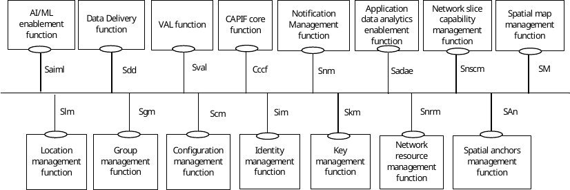

# 15 Service-based interface representation of the functional model for SEAL services

## 15.1 General

The functional models for SEAL services is represented using functional entities and reference points between the functional entities as specified in subclause 6. The vertical applications consume the SEAL services in the form of APIs. Each SEAL service offers these APIs on a service-based interface to all its consumer entities.

## 15.2 Functional model representation

Figure 15.2-1 illustrates the service-based interface representation of the functional model for SEAL services.

Figure 15.2-1: SEAL generic functional model representation using service-based interfaces

The SEAL function(s) exhibit the service-based interfaces which are used for providing and consuming SEAL services. The service APIs are specified for each SEAL function enabled over the service-based interface. The service-based interfaces of specific SEAL services are specified in this document. All the interactions with SEAL are governed based on the reference point interactions of the functional models specified in subclause 6. VAL function represents the functionalities of the VAL server.

NOTE: The service-based interface Sval for the VAL function is out of scope of the present document.

The service APIs offered by the SEAL function(s) are published and discovered on the CAPIF core function as specified in 3GPP TS 23.222 \[8\].

## 15.3 Service-based interfaces

Table 15.3-1 specifies the service-based interfaces supported by SEAL.

Table 15.3-1: Service-based interfaces supported by SEAL

|                         |                                                |                                              |                                                   |
|-------------------------|------------------------------------------------|----------------------------------------------|---------------------------------------------------|
| Service-based interface | Application functionEntity                     | Mapping server entity                        | APIs offered                                      |
| Slm                     | Location management function                   | Location management server                   | Specified in subclause 9.4                        |
| Sgm                     | Group management function                      | Group management server                      | Specified in subclause 10.4                       |
| Scm                     | Configuration management function              | Configuration management server              | Specified in subclause 11.4                       |
| Sim                     | Identity management function                   | Identity management server                   | Specified in subclause 12.4                       |
| Skm                     | Key management function                        | Key management server                        | Specified in subclause 13.4                       |
| Snrm                    | Network resource management function           | Network resource management server           | Specified in subclause 14.4                       |
| Snsce                   | Network slice capability enablement function   | Network slice capability enablement server   | Specified in 3GPP TS 23.435 \[40\]                |
| Sdd                     | Data delivery function                         | Data delivery server                         | Specified in 3GPP TS 23.433 \[48\]                |
| Cccf                    | CAPIF core function                            | Not applicable                               | Specified in subclause 10 of 3GPP TS 23.222 \[8\] |
| Snm                     | Notification management function               | Notification management server               | Specified in subclause 17.4                       |
| Sadae                   | Application data analytics enablement function | Application data analytics enablement server | Specified in 3GPP TS 23.436 \[49\]                |
| Saiml                   | AI/ML enablement function                      | AI/ML enablement server                      | Specified in 3GPP TS 23.482 \[56\]                |
| SAn                     | Spatial anchors management function            | Spatial anchors management server            | Specified in 3GPP TS 23.437 \[58\]                |
| SM                      | Spatial map management function                | Spatial map management server                | Specified in 3GPP TS 23.437 \[58\]                |
