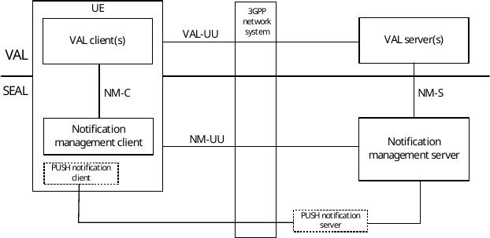
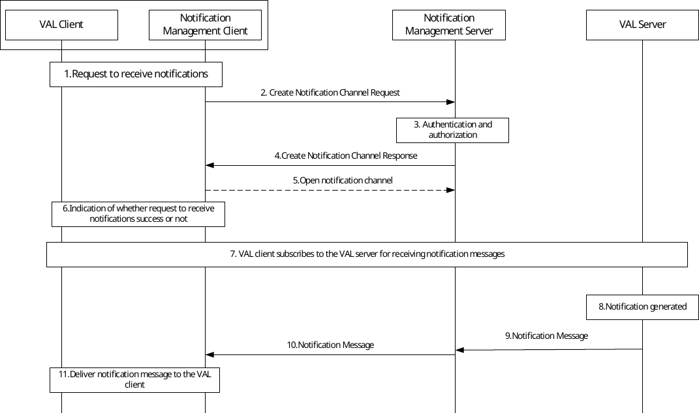
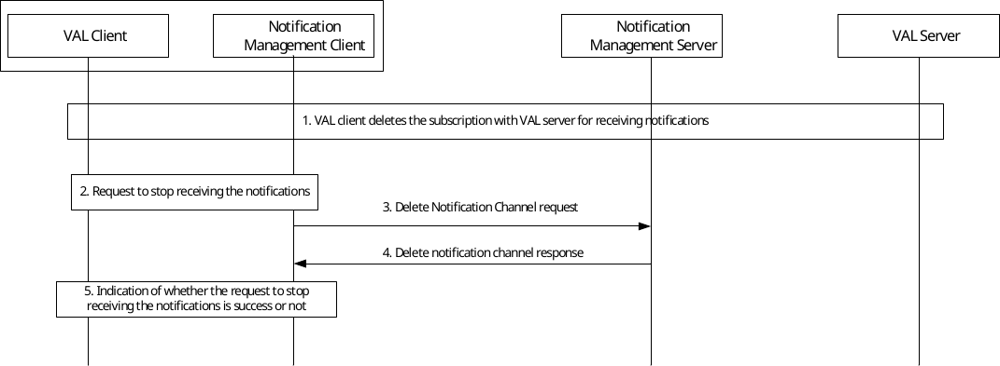
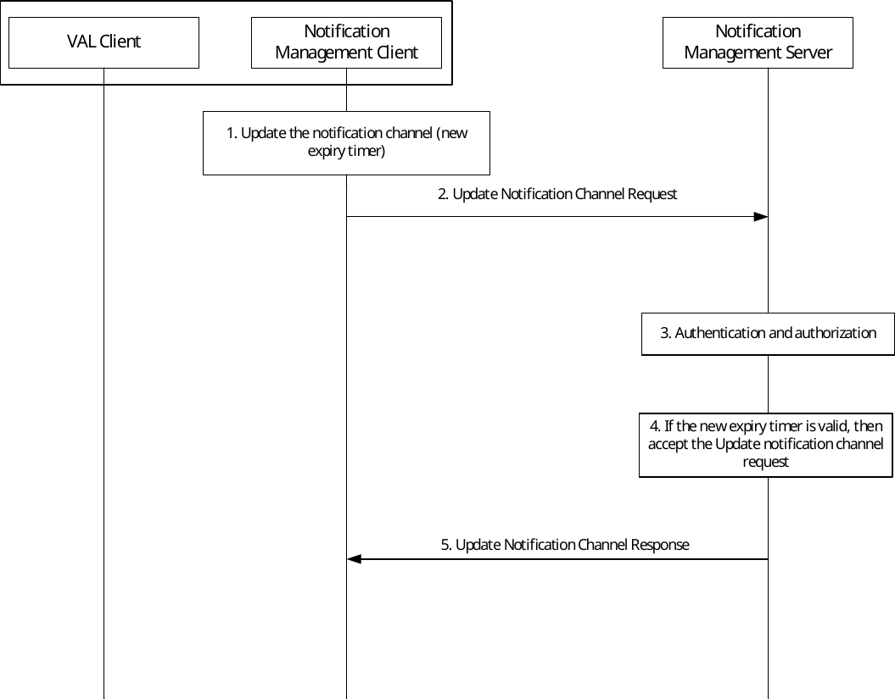

# 17 Notification Management

## 17.1 General

The notification management is a SEAL service that offers the notification functionality to one or more verticals. This service enables VAL clients to subscribe and receive notifications from the VAL servers and thereby offloading the complexity of delivery and reception of notifications to the enabler layer. It provides common notification delivery service to vertical applications.

## 17.2 Functional model

### 17.2.1 General

The functional model for the notification management is based on the generic functional model specified in clause 6.2. It is organized into functional entities to describe a functional architecture which addresses the notification management aspects required for vertical applications. Since the notification management is a feature which considers the Uu interfaces, only the on-network functional model is specified in this clause.

### 17.2.2 Functional model description

Figure 17.2.2-1 illustrates the generic functional model for notification management.

Figure 17.2.2-1: Functional model for notification management

The notification management client communicates with the notification management server over the NM-UU reference point. The notification management client provides the support for notification management functions to the VAL client(s) over NM‑C reference point. The VAL server(s) communicates with the notification management server over the NM-S reference point for delivering the notification messages which is targeted for the VAL client(s). Notification management server sends these notification messages to the notification management client either through NM-UU interface for direct delivery (e.g. Long-polling, WebSocket) or through the OEM PUSH server for indirect delivery (e.g. FCM, APNS, OMA PUSH) which is implementation specific and outside the scope of this specification.

NOTE: Notification messages from PUSH notification server to the PUSH notification client are delivered either through 3GPP network system or through any non-3GPP system, which is implementation specific.

### 17.2.3 Functional entities description

#### 17.2.3.1 General

The functional entities for notification management service are described in the following subclauses.

#### 17.2.3.2 Notification Management client

The notification management client functional entity acts as the application client for notification management aspects. It interacts with the notification management server. It handles the notification messages received from the notification management server and deliver it to the corresponding VAL clients residing on the VAL UE.

The notification management client functional entity is supported by the HTTP client functional entities of the signalling control plane.

#### 17.2.3.3 Notification Management server

The notification management server is a functional entity that handles the notification management aspects by interacting with the notification management client and the VAL servers. The notification management server receives the notification messages from the vertical application layer and delivers it to the notification management client. The notification management server acts as CAPIF's API exposing function as specified in 3GPP TS 23.222 \[8\].

### 17.2.4 Reference points description

#### 17.2.4.1 General

The reference points for the functional model for notification management are described in the following subclauses.

#### 17.2.4.2 NM-UU

The interactions related to notification management functions between the notification management client and the notification management server are supported by NM-UU reference point. This reference point utilizes Uu reference point as described in 3GPP TS 23.401 \[9\] and 3GPP TS 23.501 \[10\].

#### 17.2.4.3 NM-C

The interactions related to notification management functions between the VAL client(s) and the notification management client within a VAL UE are supported by NM-C reference point.

#### 17.2.4.4 NM-S

The interactions related to notification management functions between the VAL server(s) and the notification management server are supported by NM-S reference point. This reference point is an instance of CAPIF 2 reference point as specified in 3GPP TS 23.222 \[8\].

## 17.3 Procedures and information flows for notification management

### 17.3.1 General

This sub-clause describes the procedure and information flows for notification management service. The notification management procedures apply to on-network VAL service only.

### 17.3.2 Information flows for notification management

#### 17.3.2.1 Create notification channel request

Table 17.3.2.1-1 describes the information flow create notification channel request from the notification management client to the notification management server.

Table 17.3.2.1-1: Create notification channel request

|                                                             |        |                                                                                                                         |
|-------------------------------------------------------------|--------|-------------------------------------------------------------------------------------------------------------------------|
| Information element                                         | Status | Description                                                                                                             |
| Requestor identity                                          | M      | Identity of the requesting notification management client                                                               |
| Channel type                                                | M      | Indicates PULL or PUSH method to be used for delivering the notification messages                                       |
| PUSH channel details (see NOTE)                             | O      | Carries the details of the type of PUSH delivery and its associated data                                                |
| Validity Duration                                           | M      | How long the notification channel will last (i.e. channel lifetime) as requested by the notification management client. |
| NOTE : This IE shall be present of the channel type is PUSH |        |                                                                                                                         |

NOTE: Whether and how the notification management server can indicate the notification management client to initiate sending keep alive to keep the notification channel alive when the IP address is allocated is NATted is up to Stage 3 to decide.

#### 17.3.2.2 Create notification channel response

Table 17.3.2.2-1 describes the information flow create notification channel response from the notification management server to the notification management client.

Table 17.3.2.2-1: Create notification channel response

|                     |        |                                                                                                                                                                                                                                     |
|---------------------|--------|-------------------------------------------------------------------------------------------------------------------------------------------------------------------------------------------------------------------------------------|
| Information element | Status | Description                                                                                                                                                                                                                         |
| Notification URL    | O      | The URL to receive the notification message if a PULL method is requested. For some PUSH method implementation (such as WebSockets) this URL is used to start the PUSH notification service from the notification management server |
| Callback URL        | M      | The URL to be shared to the VAL server by the VAL client for sending the notifications to the notification management server. The callback URL is unique to the notification management client.                                     |
| Validity duration   | O      | How long the notification channel will last (i.e. channel lifetime) as granted by the notification management server.                                                                                                               |
| Channel ID          | M      | Unique identifier for the created notification channel                                                                                                                                                                              |

#### 17.3.2.3 Open notification channel

Table 17.3.2.3-1 describes the information flow open notification channel from the notification management client to the notification management server.

Table 17.3.2.3-1: Open notification channel

|                     |        |                                                                                                                     |
|---------------------|--------|---------------------------------------------------------------------------------------------------------------------|
| Information element | Status | Description                                                                                                         |
| Identity            | M      | Identity of the requesting notification management client                                                           |
| Notification URL    | M      | The URL to receive the notification message and it is same as received in the Create notification channel response  |
| Channel ID          | M      | Identifies the notification channel and the value shall be same as returned in Create notification channel response |

#### 17.3.2.4 Notification message

Table 17.3.2.4-1 describes the information flow notification message from VAL server to the notification management server and from notification management server to the notification management client.

Table 17.3.2.4-1: Notification Message

|                     |        |                                                                                                                                         |
|---------------------|--------|-----------------------------------------------------------------------------------------------------------------------------------------|
| Information element | Status | Description                                                                                                                             |
| VAL Application ID  | M      | Identity of the VAL application residing in the VAL UE this notification message is targeted                                            |
| VAL Service ID      | M      | Identity of the VAL service for which this notification is generated                                                                    |
| Notification data   | M      | This information element carries the details of the notification data such as type of the event and the data corresponding to the event |

#### 17.3.2.5 Delete notification channel request

Table 17.3.2.5-1 describes the information flow delete notification channel request from notification management client to the notification management server.

Table 17.3.2.5-1: Delete notification channel request

|                     |        |                                                           |
|---------------------|--------|-----------------------------------------------------------|
| Information element | Status | Description                                               |
| Identity            | M      | Identity of the requesting notification management client |
| Channel ID          | M      | Identifies the notification channel to be deleted         |
| Request type        | M      | De-register or delete channel                             |

#### 17.3.2.6 Delete notification channel response

Table 17.3.2.6-1 describes the information flow delete notification channel response from notification management server to the notification management client.

Table 17.3.2.6-1: Delete notification channel response

|                     |        |                                                                                                                             |
|---------------------|--------|-----------------------------------------------------------------------------------------------------------------------------|
| Information element | Status | Description                                                                                                                 |
| Identity            | M      | Identity of the requesting notification management client                                                                   |
| Result              | M      | Indicates if the deletion of the channel is success or failure or if the VAL server de-registered from channel successfully |

#### 17.3.2.7 Update notification channel request

Table 17.3.2.7-1 describes the information flow Update notification channel request from notification management client to the notification management server.

Table 17.3.2.7-1: Update notification channel request

|                     |        |                                                                                                                         |
|---------------------|--------|-------------------------------------------------------------------------------------------------------------------------|
| Information element | Status | Description                                                                                                             |
| Requestor identity  | M      | Identity of the requesting notification management client                                                               |
| Channel ID          | M      | Identifies the notification channel to be updated                                                                       |
| Validity Duration   | O      | How long the notification channel will last (i.e. channel lifetime) as requested by the notification management client. |

#### 17.3.2.8 Update notification channel response

Table 17.3.2.8-1 describes the information flow Update notification channel request from notification management server to the notification management client.

Table 17.3.2.8-1: Update notification channel response

|                     |        |                                                                                                                       |
|---------------------|--------|-----------------------------------------------------------------------------------------------------------------------|
| Information element | Status | Description                                                                                                           |
| Validity duration   | O      | How long the notification channel will last (i.e. channel lifetime) as granted by the notification management server. |
| Result              | M      | Indicates if updating of the channel is success or failure                                                            |

### 17.3.3 Procedure for creating notification channel to receive notifications

Figure 17.3.3-1 below illustrates the procedure for receiving notifications from the notification management server by the notification management client.

Pre-conditions:

1\. The notification management client does not have any notification channel open with the notification management server.

Figure 17.3.3-1: Receiving notifications from notification management server

1\. The VAL client requests the notification management client to subscribe to and receive notifications from the VAL server.

2\. The notification management client creates notification channels (i.e. endpoint URLs), if not created already, to be used by the VAL server to send notification messages. To create notification channel, the notification management client sends a create notification channel request to the notification management server. The desired validity duration for the channels to be used and the notification channel type (PUSH or PULL) are included in the request. The notification management client decides which type of the notification channel to be used based on the UE capability.

3\. The notification management server authenticates the notification management client and authorizes its request.

4\. The notification management server sends the notification management client the Create notification channel response with the endpoint URLs that will be used by the VAL server to send the notification messages and the notification management client to receive the notification messages. The notification management server also includes what is the valid duration for these endpoint URLs to be used and the channel ID to uniquely identify the channel created in the response.

5\. If the notification type is PULL method, the notification management client sends the Open notification channel to the notification management server to start receiving the notification message. For certain PUSH method notification type (such as WebSockets) the notification management client requests the notification management server to start the PUSH notification service with its specific protocol that is outside the scope of this specification.

NOTE 1: This step is not required if the notification client wants to receive the notification messages via PUSH notification server.

6\. The notification management client responds to the VAL client the status of its request as in step 1 to receive notifications from the VAL server. It also includes the callback URL which needs to be used by the VAL client while subscribing to the VAL server for receiving notifications. The callback URL is unique to SEAL NMC.

7\. The VAL client subscribes to the VAL server for receiving notifications. This request includes the subscription data and the callback URL returned from the notification management server in step 4.

NOTE 2: This step is outside the scope of this specification.

8\. The VAL server generates the notification message for the subscription request from the VAL client.

9\. The VAL server sends the notification message to the notification management server containing the VAL UE or VAL user ID, VAL service ID, VAL application ID and the notification data utilizing the callback URL provided in step 7.

10\. If the delivery method is PULL, the notification management server sends the notification message to the notification management client over the opened notification channel.

NOTE 3: If the delivery method is PUSH via PUSH notification server, the notification management server sends the notification message to the OEM Push server (not shown in the figure and is outside the scope of this specification) to deliver to the notification management client.

11\. The notification management client delivers the received notification message to the appropriate VAL client based on the details as received in the notification message from the notification management server.

### 17.3.4 Procedure for deleting notification channel

Figure 17.3.4-1 below illustrates the procedure for deleting notification channel by the notification management client.

Pre-conditions:

1\. The notification management client has notification channel open with the notification management server.

Figure 17.3.4-1: Deletion of notification channel by the notification management client

1\. The VAL client decides to stop receiving notifications from the VAL server and deletes the subscription with the VAL server.

NOTE: Step 1 is outside the scope of 3GPP but triggers step 2.

2\. The VAL client requests the notification management client to stop receiving the notifications.

3\. If the same notification channel is being used for other VAL clients in the UE, the notification management client sends the delete notification channel request with request type as de-register otherwise the notification management client sends the delete notification channel request with request type as delete to the notification management server. The delete notification channel request carries the channel ID of the notification channel.

4\. The notification management server acknowledges the request and sends the delete notification channel response to the notification management client.

5\. The notification management client indicates to the VAL client about the status (de-registered or channel deleted or failure) of its request to stop receiving the notification.

### 17.3.5 Procedure for updating notification channel

Figure 17.3.5-1 below illustrates the procedure for updating the notification channel by the notification management client.

Pre-conditions:

1\. The notification management client has notification channel open with the notification management server.

Figure 17.3.5-1: Updating notification channel by the notification management client

1\. The notification management client detects the expiry timer of the active notification channel being approached and a need for updating the new expiry time on notification management server.

2\. To update notification channel, the notification management client sends an update notification channel request to the notification management server with the proposed new validity duration for the active channel.

3\. The notification management server authenticates the notification management client and authorizes its request.

4\. The notification management server checks whether the new proposed expiry timer is valid or not. The NMS may accept the proposed validity duration from the request or assign a different validity duration based on the local policy.

5\. The notification management server sends the notification management client the Update notification channel response with the valid duration for this active notification channel. The notification management client shall store the new valid duration of the notification management channel.
