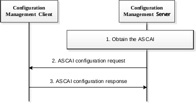
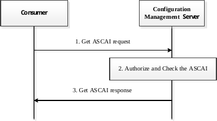

# 21.2 Application satellite coverage availability information (ASCAI) configuration

## 21.2.1 General

The following clauses describe the ASCAI provisioning procedure.

## 21.2.2 Procedures

### 21.2.2.1 Procedures of the ASCAI provisioning

The procedure for VAL UE obtaining the ASCAI configuration for a particular location of UE is illustrated in figure 21.2.2.1-1.

Pre-conditions:

\- The VAL UE has registered to the 3GPP network via satellite access as defined in clause 5.3.2.1 of 3GPP TS 23.401 \[9\] or clause 4.2.2.2.2 of 3GPP TS 23.502 \[11\].

Figure 21.2.2.1-1: The ASCAI provisioning

1\. The configuration management server obtains the ASCAI locally or from the satellite service provider, and may interact with NWDAF to obtain the target VAL UE's mobility analytics as defined in clause 6.7.2 of 3GPP TS 23.288 \[34\] and may interact with the SEAL location management server to obtain the VAL UE's information (e.g., location) in order to provide accurate information to the UE. If the configuration management server receives the different kinds of satellite information from different satellite information providers for the same satellite, it may consolidate them in a unified format. The information elements of ASCAI can refer to the table 21.2.3.1-1.

2\. The configuration management server sends the ASCAI configuration request to the configuration management client to indicate whether the satellite coverage is available for a particular location and time when the VAL UE uses the satellite access.

3\. The configuration management client acknowledges the configuration management server if it supports the satellite access.

### 21.2.2.2 Procedures for obtaining the application satellite coverage availability information (ASCAI)

The procedure for VAL UE/VAL server requesting and obtaining the ASCAI from the application enabler is illustrated in figure 21.2.2.2-1.

Pre-conditions:

\- The VAL UE is a consumer and has registered to the 3GPP network via satellite access as defined in clause 5.3.2.1 of 3GPP TS 23.401 \[9\] or clause 4.2.2.2.2 of 3GPP TS 23.502 \[11\] and has not received the satellite coverage availability information from the network yet.

> \- The configuration management server has obtained the ASCAI as described in clause 21.2.2.1.

Figure 21.2.2.2.1-1: Obtaining the ASCAI

1\. The consumer (i.e. Configuration management client, VAL server) sends Get application satellite coverage availability information (ASCAI) request to the configuration management server to require ASCAI when it is using the satellite access. The request may contain the dedicated satellite ID for the requested UE, the current UE location data, etc.

2\. The configuration management server authorizes the request. If the request is granted, it checks the requested ASCAI is available or not. If it’s not available, the configuration management server obtains the ASCAI as described in step 1 of clause 21.2.2.1.

NOTE: If the dedicated satellite ID for the requested UE is included in the request, the configuration management server will only consider the satellite coverage availability information for the dedicated satellite. Otherwise, the configuration management server will consider all of satellites which can serve the requested UE.

3\. The configuration management server replies the ASCAI to the consumer (i.e. VAL UE/configuration management client, VAL server) to guide them how to minimize the service impact (e.g. indicate when to trigger the UL/DL service flow if the VAL UE is accessing the satellite). And the VAL UE may retrieve the UE unavailability period (e.g., unavailability period duration or the start time for the unavailability period) as defined in clause 5.4.1.4 of 3GPP TS 23.501 \[10\] based on the received ASCAI.

## 21.2.3 Information flows

### 21.2.3.1 Application satellite coverage availability information (ASCAI) configuration request

Table 21.2.3.1-1 describes the information flow from the configuration management server to the configuration management client to configure the ASCAI.

Table 21.2.3.1-1: ASCAI configuration request

| Information element                 | Status | Description                                                                                                                                                  |
|-------------------------------------|--------|--------------------------------------------------------------------------------------------------------------------------------------------------------------|
| Identity                            | M      | Identity of the requesting VAL user or VAL UE.                                                                                                               |
| VAL service ID                      | O      | Identity of the VAL service that is requested.                                                                                                               |
| ASCAI                               | M      | Defines the application satellite coverage information including a list of geographical areas, corresponding available time periods and satellite RAT types. |
| \> Geographical area                | M      | It includes a list of geographical area information (e.g. coordinates, as defined in 3GPP TS 29.572 \[51\]) where the satellite coverage is available.       |
| \> Availability time period         | M      | It provides the time periods when the satellite coverage is available over the indicated geographical area.                                                  |
| \> Availability satellite RAT types | O      | It provides the satellite RAT types information corresponding to the satellite availability in the indicated geographical area.                              |

### 21.2.3.2 Application Satellite coverage availability information (ASCAI) configuration response

Table 21.2.3.2-1 describes the information flow from the configuration management client to the configuration management server for the response of the ASCAI configuration request.

Table 21.2.3.2-1: ASCAI configuration response

| Information element | Status | Description                                    |
|---------------------|--------|------------------------------------------------|
| Identity            | M      | Identity of the requesting VAL user or VAL UE. |
| Result              | M      | Indicates the request result.                  |
| Cause               | O      | The cause for the request failure.             |

### 21.2.3.3 Get application satellite coverage availability information (ASCAI) request

Table 21.2.3.3-1 describes the information flow from the configuration management client or VAL server to the configuration management server to obtain the ASCAI.

Table 21.2.3.3-1: Get ASCAI request

| Information element | Status | Description                                                    |
|---------------------|--------|----------------------------------------------------------------|
| Identity            | M      | Identities of the requesting VAL user or VAL UE or VAL server. |
| VAL service ID      | O      | Identity of the VAL service that is requested.                 |
| Satellite ID        | O      | Indicates the dedicated satellite ID for the requested VAL UE. |
| Location            | O      | Indicates the current location data for the VAL UE.            |

### 21.2.3.4 Get application satellite coverage availability information (ASCAI) response

Table 21.2.3.4-1 describes the information flow from the configuration management server to the configuration management client or VAL server to notify the ASCAI.

Table 21.2.3.4-1: Get ASCAI response

| Information element                 | Status | Description                                                                                                                                                  |
|-------------------------------------|--------|--------------------------------------------------------------------------------------------------------------------------------------------------------------|
| Identity                            | M      | Identity of the requesting VAL user or VAL UE.                                                                                                               |
| VAL service ID                      | O      | Identity of the VAL service that is requested.                                                                                                               |
| ASCAI                               | M      | Defines the application satellite coverage information including a list of geographical areas, corresponding available time periods and satellite RAT types. |
| \> Geographical area                | M      | It includes a list of geographical area information (e.g. coordinates, as defined in 3GPP TS 29.572 \[51\]) where the satellite coverage is available.       |
| \> Availability time period         | M      | It provides the time periods when the satellite coverage is available over the indicated geographical area.                                                  |
| \> Availability satellite RAT types | O      | It provides the satellite RAT types information corresponding to the satellite availability in the indicated geographical area.                              |

## 21.2.4 APIs for application satellite coverage availability information (ASCAI)

### 21.2.4.1 General

Table 21.2.4.1.1-1 illustrates the APIs for ASCAI.

Table 21.2.4.1-1: List of APIs for ASCAI

| API Name               | API Operations    | Known Consumer(s) | Communication Type |
|------------------------|-------------------|-------------------|--------------------|
| SS\_ASCAIInfoRetrieval | Obtain_ASCAI_Info | VAL server        | Request/Response   |

### 21.2.4.2 SS_ASCAIInfoRetrieval API

#### 21.2.4.2.1 General

**API description:** This API enables the VAL server to obtain the application satellite coverage availability information (ASCAI) from the configuration management server.

#### 21.2.4.2.2 Obtain_ASCAI_Info operation

**API operation name:** Obtain_ASCAI_Info

**Description:** Request the application satellite coverage availability information.

**Known Consumers:** VAL server.

**Inputs:** Refer subclause 21.2.3.3

**Outputs:** Refer subclause 21.2.3.4

See subclause 21.22.2.2 for the details of usage of this API operation.
