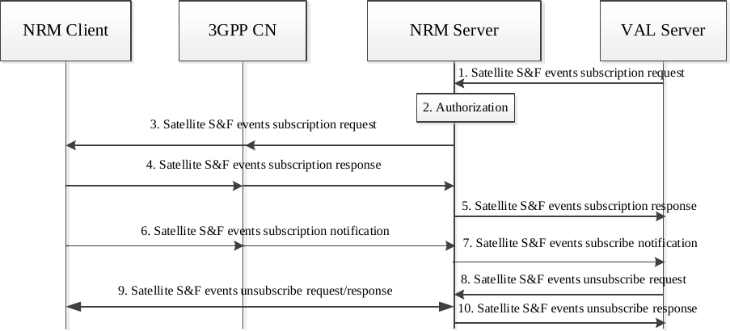
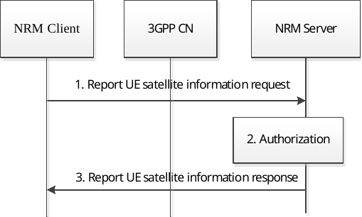
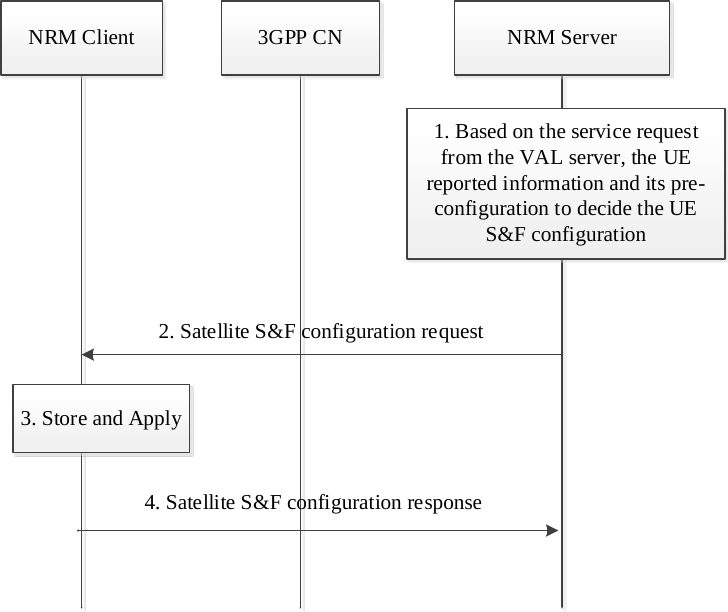

# 21.3 Satellite S&F events information

## 21.3.1 General

This following sub-clauses shows how the application enablers provisioning the satellite S&F configuration to the VAL UE and expose the satellite S&F events information to the VAL server to help minimize the service interruption (e.g., adjust the DL frequency, etc.) when the VAL UE starts to perform the satellite S&F operation.

NOTE 1: In S&F Satellite operation, the end-to-end exchange of traffic is handled in a sequence of steps reflecting the intermittent availability of the service link (when the satellite can exchange data with the NRM client) and the intermittent availability of the feeder (ground) link (when the satellite can exchange data with the ground network (NRM server)). To support S&F satellite operation, network functionality needs to be deployed on the satellite, as specified in 3GPP TS 23.401 \[9\].

NOTE 2: The network functionality deployed on the satellite enables that the NRM server can also send/receive request/responses when the feeder link is available and that the NRM client can also send/receive request/responses when the service link is available.

## 21.3.2 Procedures

### 21.3.2.1 NRM Server exposing the S&F events to the VAL server procedure

Pre-condition:

\- The NRM client, the NRM server and the VAL server all are deployed on the ground.

\- The PGW-U in 3GPP CN is deployed on the satellite.

\- The VAL UE has registered to the 3GPP network via satellite access as defined in clause 5.3.2.1 of 3GPP TS 23.401 \[9\] and supports the S&F mode.

Figure 21.3.2.1-1: NRM Server exposing the satellite S&F events to the VAL server procedure

1\. The VAL server sends the satellite S&F events subscription request to the NRM server in which the subscribed events may include the UE status in S&F mode, the DL estimated delivery time, the trigger conditions, etc.

NOTE: Step 1 is also applicable to the update procedure when the VAL server requires to update the satellite S&F events subscription request.

2\. The NRM server authorizes the subscription request from the VAL server.

3\. If the subscription request is authorized, the NRM server sends the satellite S&F events subscription request to the NRM client and/or the 3GPP CN respectively.

4\. The NRM client and/or 3GPP CN acknowledge the NRM server with the satellite S&F events subscription response respectively.

5\. The NRM server responds to the VAL server with the satellite S&F events subscription response.

6\. If the trigger condition in the subscription request is met, the NRM client and/or 3GPP CN may report the requested satellite S&F events as specified in table 21.3.3.3 to the NRM server via the satellite S&F events subscription notification.

7\. The NRM server notifies the VAL server for the received satellite S&F events in step 6. The VAL server may take them into consideration and adjust the application behaviour (e.g., pending the DL data transition when the UE is registered in S&F Mode, re-transmit the pending DL data when the feeder link is available, adjust the DL traffic volume according to the Estimated S&F DL Delivery Time, etc.) to minimize the service interruption.

8\. The VAL server sends the satellite S&F events unsubscribe request to the NRM server to unsubscribe the subscription to monitor the satellite S&F events.

9\. The NRM server relays the satellite S&F events unsubscribe request to the NRM client and/or 3GPP CN. And receives the response from the NRM client and/or 3GPP CN respectively.

10\. The NRM server replies to the VAL server with the satellite S&F events unsubscribe response.

### 21.3.2.2 VAL UE reports the UE satellite information procedure

The Figure 21.3.2.2-1 illustrates the procedure of the VAL UE/NRM client reports the UE satellite information to the NRM server.

This procedure also applies when the VAL UE/NRM client updating its UE satellite information to the NRM server.

Pre-condition:

\- The VAL UE has registered to the 3GPP network via satellite access as defined in clause 5.3.2.1 of 3GPP TS 23.401 \[9\] and supports the S&F mode.

Figure 21.3.2.2-1: VAL UE reports the UE satellite information procedure

1\. The NRM client reports the UE satellite information to the NRM server which may contain the UE identity, the UE type (e.g. IoT) and the UE satellite related information, such as the serving satellite ID, the accessing satellite types (LEO, MEO and GEO), the S&F mode indicator, the maximum data storage quota which indicates the maximum data storage quota per application layer on the UE for all of services, etc.

2\. The NRM server checks the authorization for the request from the NRM client.

3\. After successful authorization, the NRM server sends a Report UE satellite capability response to the NRM client and stores the UE identity and the satellite information.

### 21.3.2.3 NRM server provisioning the S&F configuration procedure

Figure 21.3.2.3-1 shows how the NRM Server provides the S&F configuration to the NRM Client based on the service request from VAL server and the VAL UE reported satellite information.

This procedure also applies when the NRM server provides the updated S&F configuration to the NRM client.

Pre-condition:

\- The NRM client and the NRM server are deployed on the ground.

\- The PGW-U in 3GPP CN is deployed on the satellite.

\- The NRM Client has reported the UE satellite information to the NRM server as described in clause 21.3.2.2.

Figure 21.3.2.3-1: NRM Server providing the S&F configuration to the NRM Client procedure

> 1\. The NRM server takes advantage of the service request initiated by the VAL server, the reported UE satellite information (e.g. serving satellite ID, the maximum data storage quota per UE) as described in clause 21.3.2.2 and its pre-configuration, etc. to determine the on-board S&F parameters for the application layer (e.g., maximum S&F data storage quota per UE/service, maximum S&F data retention per UE/service, etc.).
>
> 2\. After determined the satellite S&F parameters, the NRM server provides such information to the NRM client via sending a satellite S&F configuration request.
>
> 3\. The NRM client/VAL UE stores the received satellite S&F parameters and may take them into account when the VAL UE starts to operate the S&F operations based on its satellite S&F configuration per service.

NOTE: The VAL UE may consider the pre-configuration, the received parameters from the application enabled layer to determine/update its satellite S&F configuration per service.

> 4\. The NRM client sends the satellite S&F configuration response to the NRM server.

## 21.3.3 Information flows

### 21.3.3.1 Satellite S&F events subscription request

Table 21.3.3.1-1 describes the information flow from VAL server to NRM server or from the NRM server to NRM client for satellite S&F events subscription request.

Table 21.3.3.1-1: Satellite S&F status events subscription request

|                       |        |                                                                                                                                                                                     |
|-----------------------|--------|-------------------------------------------------------------------------------------------------------------------------------------------------------------------------------------|
| Information element   | Status | Description                                                                                                                                                                         |
| Identity              | M      | Identity of the requesting VAL server/VAL users or VAL UEs or NRM server.                                                                                                           |
| Satellite S&F events  | O      | Lists of the satellite S&F events that to be monitored for one or more UEs (e.g. UE status in S&F mode, the Estimated S&F DL Delivery Time, Feeder link availability period, etc.). |
| Triggering conditions | M      | Identifies the conditions that triggered NRM client sending the notification report.                                                                                                |

### 21.3.3.2 Satellite S&F events subscription response

Table 21.3.3.2-1 describes the information flow from NRM server to the VAL server or from NRM client to NRM server for response of satellite S&F events subscription request.

Table 21.3.3.2-1: Satellite S&F events subscription response

| Information element | Status | Description                                                               |
|---------------------|--------|---------------------------------------------------------------------------|
| Identity            | M      | Identity of the requesting VAL server/VAL users or VAL UEs or NRM server. |
| Subscription status | M      | It indicates the subscription result                                      |
| Cause               | O      | The cause for the request failure.                                        |

### 21.3.3.3 Satellite S&F events notification

Table 21.3.3.3-1 describes the information flow from NRM server to VAL server or from the NRM client to NRM server to notify the subscribed satellite S&F events.

Table 21.3.3.3-1: Satellite S&F status events notification

<table>
<colgroup>
<col style="width: 33%" />
<col style="width: 16%" />
<col style="width: 50%" />
</colgroup>
<tbody>
<tr class="odd">
<td>Information element</td>
<td>Status</td>
<td>Description</td>
</tr>
<tr class="even">
<td>Identity</td>
<td>M</td>
<td>Identity of the requesting VAL server/VAL users or VAL UEs or NRM server.</td>
</tr>
<tr class="odd">
<td>Satellite S&amp;F events</td>
<td>O</td>
<td>List the notification for satellite S&amp;F events that to be monitored for one or more UE(s).</td>
</tr>
<tr class="even">
<td>&gt; UE status in S&amp;F mode</td>
<td>
O

(NOTE)
</td>
<td>Indicates the UE is registered in S&amp;F mode or moving from S&amp;F mode to not registered in S&amp;F mode.</td>
</tr>
<tr class="odd">
<td>&gt; Estimated S&amp;F DL Delivery Time</td>
<td>
O

(NOTE)
</td>
<td>Indicates the estimated/expected time required to deliver the data to the UE from the time data has been received in the network.</td>
</tr>
<tr class="even">
<td>&gt; Feeder link availability period</td>
<td>
O

(NOTE)
</td>
<td>Indicates the availability period when the feeder link is available.</td>
</tr>
<tr class="odd">
<td>Triggering events</td>
<td>M</td>
<td>Identifies the events that triggered NRM client sending the report.</td>
</tr>
<tr class="even">
<td>Timestamp</td>
<td>O</td>
<td>Timestamp of the notification report.</td>
</tr>
<tr class="odd">
<td colspan="3">NOTE: The definition refers to the clause 5.6.3.10 of 3GPP TS 23.682 [13].</td>
</tr>
</tbody>
</table>

### 21.3.3.4 Satellite S&F events unsubscribe request

Table 21.3.3.4-1 describes the information flow from VAL server to NRM server or from the NRM server to NRM client for satellite S&F events unsubscribe request.

Table 21.3.3.4-1: Satellite S&F status events unsubscribe request

|                     |        |                                                             |
|---------------------|--------|-------------------------------------------------------------|
| Information element | Status | Description                                                 |
| Requestor ID        | M      | Identity of the requesting ID for VAL server or NRM server. |

### 21.3.3.5 Satellite S&F events unsubscribe response

Table 21.3.3.5-1 describes the information flow from NRM server to the VAL server or from NRM client to NRM server for response of satellite S&F events unsubscribe request.

Table 21.3.3.5-1: Satellite S&F events unsubscribe response

| Information element | Status | Description                                  |
|---------------------|--------|----------------------------------------------|
| Request status      | M      | It indicates the unsubscribe request result. |
| Cause               | O      | The cause for the request failure.           |

### 21.3.3.6 Report UE satellite information request

Table 21.3.3.6-1 describes the information flow from the NRM client to the NRM server for reporting the UE satellite related capabilities.

Table 21.3.3.6-1: Report UE satellite information request

| Information element             | Status | Description                                                                                           |
|---------------------------------|--------|-------------------------------------------------------------------------------------------------------|
| Identity                        | M      | Identity of the VAL user or identity of the VAL UE.                                                   |
| UE type                         | O      | Indicate the type of VAL UEs (e.g. IoT).                                                              |
| Satellite information           | O      | The satellite information of VAL UE when the VAL UE supports the satellite access.                    |
| \> Satellite ID                 | O      | Indicates the serving satellite ID for the VAL UE.                                                    |
| \> Satellite type               | O      | Indicates the accessing satellite RAT types (LEO, MEO and GEO) for the VAL UE.                        |
| \> S&F mode indicator           | O      | Indicates the UE support the S&F mode or not.                                                         |
| \> Maximum data storage quota   | O      | Indicates the maximum data storage quota for the VAL UE for all of services on the application layer. |
| \> Maximum data retention timer | O      | Indicates the maximum data retention timer value for the VAL UE per service on the application layer. |

### 21.3.3.7 Report UE satellite information response

Table 21.3.3.7-1 describes the information flow the NRM server to the NRM client for the response of reporting the UE satellite related information request.

Table 21.3.3.7-1: Report UE satellite information response

| Information element | Status | Description                        |
|---------------------|--------|------------------------------------|
| Result              | M      | It indicated the request result.   |
| Cause               | O      | The cause for the request failure. |

### 21.3.3.8 Satellite S&F configuration request

Table 21.3.8-1 describes the information flow from the NRM server to the NRM client for satellite S&F configuration request.

Table 21.3.3.8-1: Satellite S&F configuration request

| Information element                     | Status | Description                                                                                                                                    |
|-----------------------------------------|--------|------------------------------------------------------------------------------------------------------------------------------------------------|
| Identity                                | M      | Identity of the requesting VAL user or VAL UE.                                                                                                 |
| VAL service ID                          | O      | Identity of the VAL service that is requested.                                                                                                 |
| Satellite S&F configuration information | O      | Indicates the S&F configuration per UE per service when it is using the satellite S&F operation.                                               |
| \> Maximum S&F data storage quota       | O      | Indicates the maximum data storage quota per UE per service on the application layer when the UE is using the satellite S&F operation.         |
| \> Maximum S&F data retention timer     | O      | Indicates the maximum data retention timer value per UE per service on the application layer when the UE is using the satellite S&F operation. |

### 21.3.3.9 Satellite S&F configuration response

Table 21.3.3.9-1 describes the information flow from the NRM client to the NRM server for the response of satellite S&F configuration request.

Table 21.3.3.9-1: Satellite S&F events subscription response

| Information element | Status | Description                                                    |
|---------------------|--------|----------------------------------------------------------------|
| Identity            | M      | Identity of the requesting VAL users or VAL UEs or NRM server. |
| Result              | M      | It indicates the request result                                |
| Cause               | O      | The cause for the request failure.                             |

## 21.3.4 APIs for Satellite S&F events information

### 21.3.4.1 General

Table 21.3.4.1-1 illustrates the APIs for Satellite S&F events information.

Table 21.3.4.1-1: List of APIs for Satellite S&F events

| API Name                 | API Operations                   | Known Consumer(s) | Communication Type |
|--------------------------|----------------------------------|-------------------|--------------------|
| SS_SatelliteS&FInfoEvent | Subscribe\_S&F_Info              | VAL server        | Subscribe/Notify   |
|                          | Unsubscribe\_ S&F \_Info         | VAL server        |                    |
|                          | Update\_ S&F \_Info_Subscription | VAL server        |                    |
|                          | Notify\_ S&F \_Info              | VAL server        |                    |

### 21.3.4.2 SS_SatelliteS&FInfoEvent API

#### 21.3.4.2.1 General

**API description:** This API enables the VAL server to trigger reporting of satellite S&F information from the NRM server over LM-S.

#### 21.3.4.2.2 Subscribe_S&F_Info operation

**API operation name:** Subscribe_S&F_Info

**Description:** Subscription to the satellite S&F events.

**Known Consumers:** VAL server.

**Inputs:** Refer subclause 21.3.3.1

**Outputs:** Refer subclause 21.3.3.2

See subclause 21.3.2.2 for the details of usage of this API operation.

#### 21.3.4.2.3 Unsubscribe_S&F_Info operation

**API operation name:** Unsubscribe_S&F_Info

**Description:** Unsubscribe to the satellite S&F events.

**Known Consumers:** VAL server.

**Inputs:** Refer subclause 21.3.3.4

**Outputs:** Refer subclause 21.3.3.5

See subclause 21.3.2.2 for the details of usage of this API operation.

#### 21.3.4.2.4 Update\_ S&F \_Info_Subscription operation

**API operation name:** Update\_ S&F \_Info_Subscription

**Description:** Update the subscription to the satellite S&F events.

**Known Consumers:** VAL server.

**Inputs:** Refer subclause 21.3.3.1

**Outputs:** Refer subclause 21.3.3.2

See subclause 21.3.2.2 for the details of usage of this API operation.

#### 21.3.4.2.5 Notify\_ S&F \_Info operation

**API operation name:** Notify\_ S&F \_Info

**Description:** Notification to the existing subscription.

**Known Consumers:** VAL server.

**Inputs:** Refer subclause 21.3.3.3

**Outputs:** Refer subclause 21.3.3.3

See subclause 21.3.2.2 for the details of usage of this API operation.
