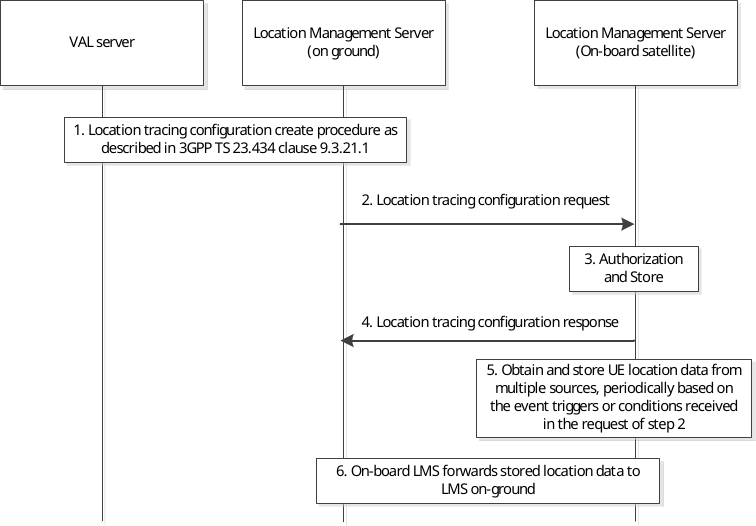

# 21.4 Location management service via satellite access

## 21.4.1 General

The following sub-clauses show how the SEAL location management server provides the Location management service via satellite access. The SEAL location management server is deployed both on the ground and onboard the satellite (GEO, MEO, or LEO), to complement and ensure continuity of the location management service, especially when the feeder link is not available and S&F is supported. SEAL location enabler on-board satellite is deployed as described in Annex A.1.2.

## 21.4.2 Procedure

Figure 21.4.2-1 illustrates the Procedure for on-board satellite LMS assisted SEAL location history service.

Pre-condition:

1\. The location management server on-board satellite is deployed to assist the value-added location information.

> **21.4.2-1: Procedure for on-board satellite LMS assisted SEAL location history service**

1\. Location tracing configuration from the VAL server to the location management server (on-ground) as described in clause 9.3.21.1.

2\. The location management server (on-ground) sends a location tracing configuration request to the location management server (on-board satellite) to configure the location tracing service while the feeder link is available. The location tracing configuration request may contain the geographical area for historical location tracing, events/conditions for triggering the location history report, location QoS, the identities for the UE and service, the time till when the SEAL LM needs to store the location history data and the required positioning method(s), etc.

Editor's note: How the target satellite to configure the location tracing service is determined is FFS.

3\. The location management server (on-board satellite) checks whether the location tracing configuration request is authorized and available to serve. If the request is available, the location management server (on-board satellite) stores the configuration received in step 2. If the request includes multiple UEs, the location management server creates and stores the contexts for each UE.

4\. The location management server (on-board satellite) sends the location tracing configuration response to the location management server (on-ground).

5\. When the feeder link is not available, the location management server (on-board satellite) has obtained and stored the UE location data from multiple sources (e.g. UE, gNB/GMLC onboard, 3rd party), periodically based on the event triggers or conditions received in the request of step 2.

6\. Once the feeder link is available, the location management server (on-board satellite) forwards the stored UE location data towards the location management server (on-ground).

NOTE: The interactions between the location management server (on-board satellite) and the location management server (on-ground) are supported by the LM-E reference point as described in clause 9.2.5.6.
