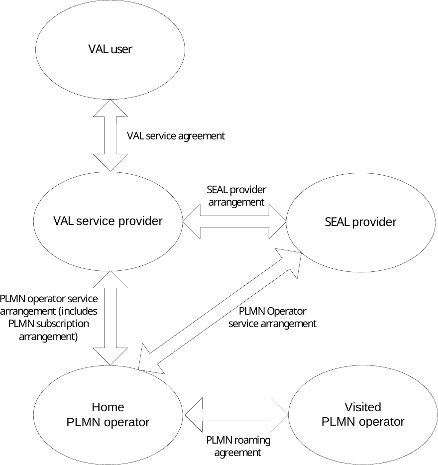
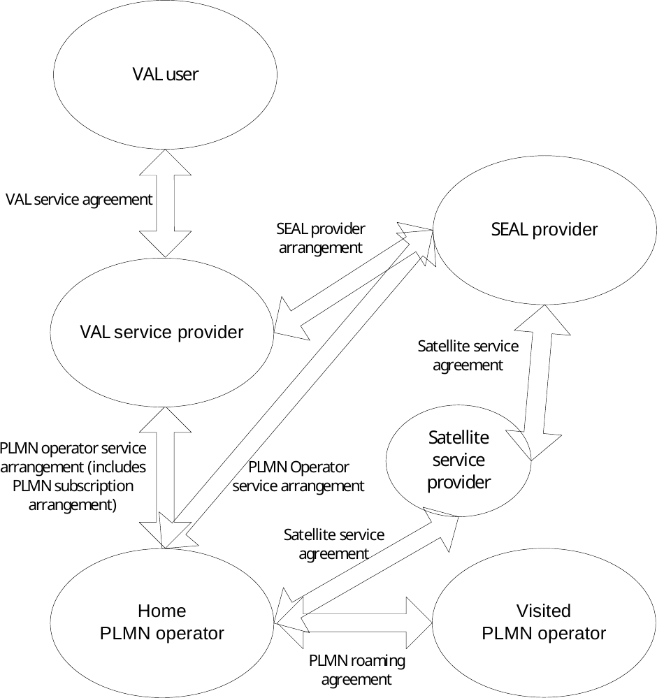
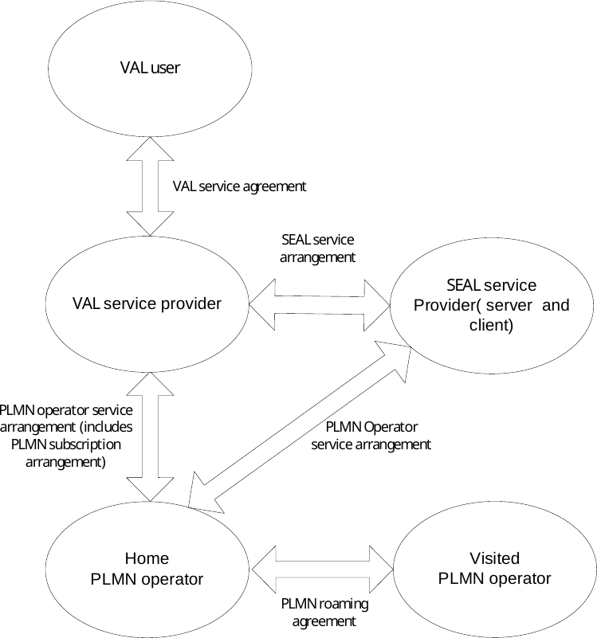
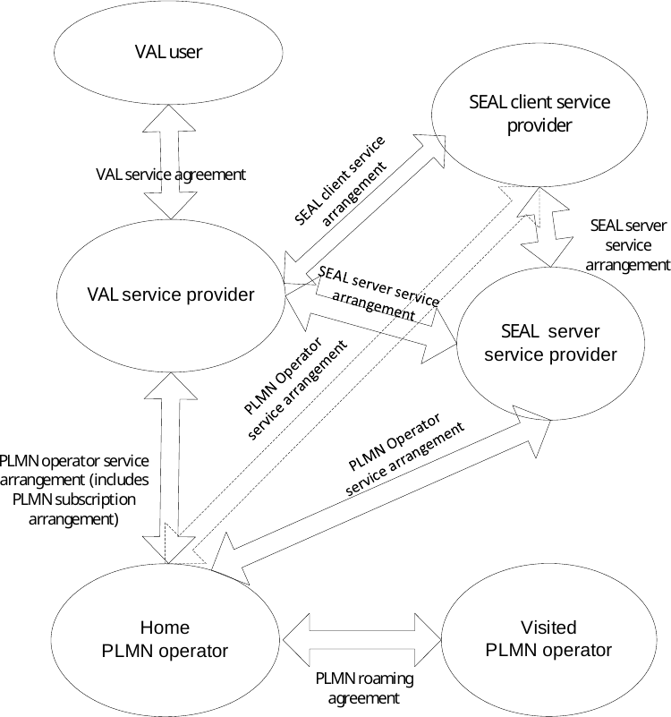

# 5 Involved business relationships

## 5.1 Business relationships for VAL services

Figure 5.1-1 shows the business relationships that exist and that are needed to support a single VAL user.

Figure 5.1-1: Business relationships for VAL services

The VAL user belongs to a VAL service provider based on a VAL service agreement between the VAL user and the VAL service provider. The VAL service provider can have VAL service agreements with several VAL users. The VAL user can have VAL service agreements with several VAL service providers.

The VAL service provider and the home PLMN operator can be part of the same organization, in which case the business relationship between the two is internal to a single organization.

The VAL service provider can have SEAL provider arrangements with multiple SEAL providers and the SEAL provider can have PLMN operator service arrangements with multiple home PLMN operators. The SEAL provider and the VAL service provider or the home PLMN operator can be part of the same organization, in which case the business relationship between the two is internal to a single organization.

The home PLMN operator can have PLMN operator service arrangements with multiple VAL service providers and the VAL service provider can have PLMN operator service arrangements with multiple home PLMN operators. As part of the PLMN operator service arrangement between the VAL service provider and the home PLMN operator, PLMN subscription arrangements can be provided which allows the VAL UEs to register with home PLMN operator network.

The home PLMN operator can have PLMN roaming agreements with multiple visited PLMN operators and the visited PLMN operator can have PLMN roaming agreements with multiple home PLMN operators.

## 5.2 Business relationships for VAL services with satellite connectivity

Figure 5.2-1 shows the business relationship for VAL services with satellite connectivity.

Figure 5.2-1: Business relationships for VAL services with satellite connectivity

The PLMN operator has satellite service agreement with the satellite service provider to offer his services e.g. to serve the unconnected areas.

The SEAL provider has satellite service agreement with the satellite service provider to enable SEAL to leverage satellite services to provide enhanced experience to end users of VAL services e.g. S&F, wider coverage.

## 5.3 Business relationships for VAL services involving SEAL client provider

VAL service provider may get SEAL services by the following service agreements:

\- Establishing the service agreement with SEAL server service provider directly as figure 5.3-1 shows, or

\- Indirectly based on the service agreement between VAL service provider and SEAL client service provider, and SEAL client service provider and SEAL server service provider as figure 5.3-2 shows.

As figure 5.3-1 shows, SEAL server services provider may implement both SEAL server and SEAL client. The VAL service provider may signal on the service agreement with SEAL server providers to support VAL client to use SEAL client to consume SEAL services, and VAL server to consume SEAL service offered by SEAL server.

As figure 5.3-2 shows, SEAL client is implemented by a SEAL client provider, who is different with SEAL server provider. So, VAL service provider who own VAL Clients needs to setup service agreement with SEAL client service provider to enable VAL client to use SEAL client service. SEAL client provider should also setup service agreement with SEAL server service provider to enable the SEAL client to consume the service offered SEAL server, then expose to VAL client.

In addition, following business agreement are applicable to both figure 5.3-1 and figure 5.3-2:

\- The VAL user belongs to a VAL service provider based on a VAL service agreement between the VAL user and the VAL service provider. The VAL service provider may have VAL service agreements with several VAL users. The VAL user may have VAL service agreements with several VAL service providers.

\- The SEAL server service provider and the home PLMN operator may be part of the same organization, in which case the business relationship between the two is internal to a single organization.

\- The SEAL client service provider may have service arrangements multiple SEAL server service provider.

\- The VAL service provider may have SEAL service arrangements with multiple SEAL server service providers and the SEAL server service provider may have PLMN operator service arrangements with multiple home PLMN operators. The SEAL server service provider and the VAL service provider or the home PLMN operator may be part of the same organization, in which case the business relationship between the two is internal to a single organization.

\- The home PLMN operator may have PLMN operator service arrangements with multiple VAL service providers and the VAL service provider may have PLMN operator service arrangements with multiple home PLMN operators. As part of the PLMN operator service arrangement between the VAL service provider and the home PLMN operator, PLMN subscription arrangements may be provided which allows the VAL UEs to register with home PLMN operator network.

\- The home PLMN operator may have PLMN roaming agreements with multiple visited PLMN operators and the visited PLMN operator may have PLMN roaming agreements with multiple home PLMN operators.

Figure 5.3-1: Business relationships for VAL services – SEAL client provider and SEAL server provider are the same

Figure 5.3-2: Business relationships for VAL services - SEAL client provider and SEAL client provider are different)
