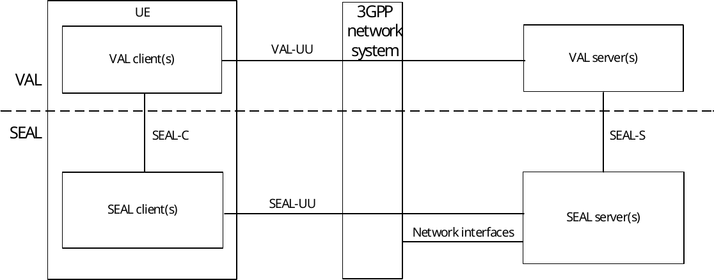
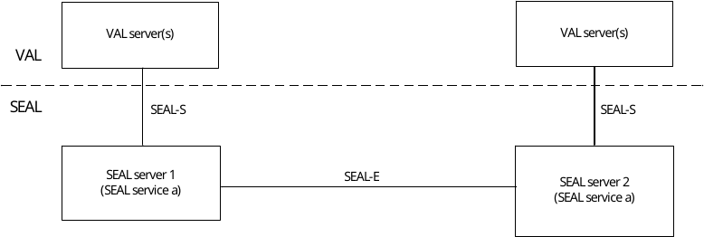
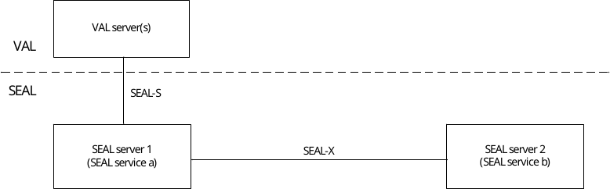
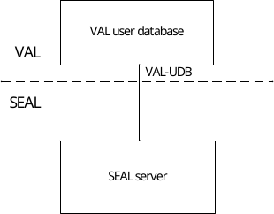
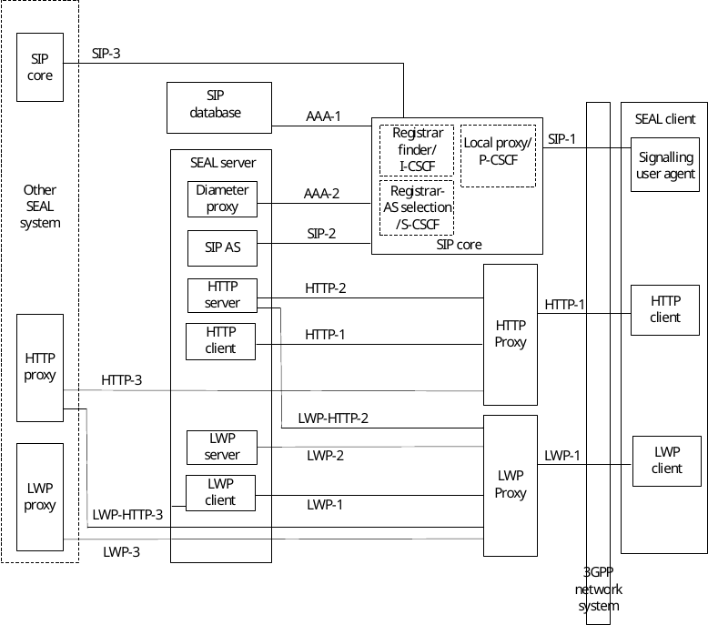

# 6.2 On-network functional model description

Figure 6.2-1 illustrates the generic on-network functional model for SEAL.

Figure 6.2-1: Generic on-network functional model

In the vertical application layer, the VAL client communicates with the VAL server over VAL-UU reference point. VAL-UU supports both unicast and multicast delivery modes.

NOTE 1: The VAL-UU reference point is out of scope of the present document.

The SEAL functional entities on the UE and the server are grouped into SEAL client(s) and SEAL server(s) respectively. The SEAL consists of a common set of services (e.g. group management, location management) and reference points. The SEAL offers its services to the vertical application layer (VAL).

NOTE 2: The functionalities and reference points of the vertical application layer are out of scope of the present document.

NOTE 3: The vertical application layer may further consist of vertical application enabler layer functionalities (specified by 3GPP) and application specific functionalities, which is out of scope of the present document.

NOTE 4: VAL server in this document is showed as one example of SEAL service consumers. Besides VAL sever, other type of SEAL service consumers also play the role of SEAL service API invoker of SEAL-S, as per SEAL architecture and if permitted by SEAL service provider’s policy

The SEAL client(s) communicates with the SEAL server(s) over the SEAL-UU reference points. SEAL-UU supports both unicast and multicast delivery modes. The SEAL client(s) provides the service enabler layer support functions to the VAL client(s) over SEAL-C reference points. The VAL server(s) communicate with the SEAL server(s) over the SEAL-S reference points.

The SEAL server(s) may communicate with the underlying 3GPP network systems using the respective 3GPP interfaces specified by the 3GPP network system (including utilization of the 5GS network services based on the 5GS SBA specified in 3GPP TS 23.501 \[10\], and utilization of OAM system services over the OAM SBMA as 3GPP TS 28.533 \[40\]). The SEAL server(s) may also consume services from the Core Network (5GC, EPC) northbound API entities like SCEF, NEF, SCEF+NEF which act as API Exposing Function as specified in 3GPP TS 23.222 \[8\], if deployed by third party.

NOTE 5: Non-3GPP access used by the UE is out of scope of the present document.

The specific SEAL client(s) and the SEAL server(s) along with their specific SEAL-UU reference points and the specific network interfaces of 3GPP network system used are described in the respective on-network functional model for each SEAL service.

Figure 6.2-2 illustrates the functional model for interconnection between SEAL servers.

Figure 6.2-2: Interconnection between SEAL servers

To support distributed SEAL server deployments, the SEAL server interacts with another SEAL server for the same SEAL service over SEAL-E reference point.

Figure 6.2-3 illustrates the functional model for inter-service communication between SEAL servers.

Figure 6.2-3: Inter-service communication between SEAL servers

The SEAL server interacts with another SEAL server for inter-service communication over SEAL-X reference point.

Figure 6.2-4 illustrates the functional model for communication between SEAL server and VAL user database.

Figure 6.2-4: Communication between SEAL server and VAL user database

The SEAL server interacts with the VAL user database for storing and retrieving user profile over VAL-UDB reference point.

Figure 6.2-5 shows the functional model for the signalling control plane.

Figure 6.2-5: Functional model for signalling control plane

NOTE 6: The Light-weight Protocol (LWP) functional entities and reference points are a generic representation of protocol entities and reference points for use in constrained environments. Realizations of LWP by means of a particular transport protocol are defined in the annex of this specification. Realizations of LWP by means of transport protocols is not limited to those defined in the annex of this specification.
