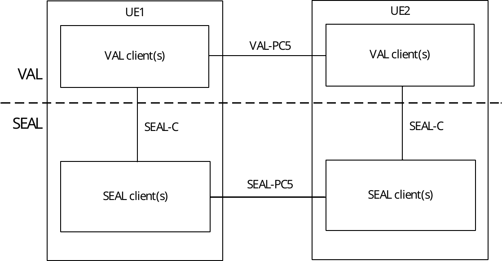

# 6.3 Off-network functional model description

Figure 6.3-1 illustrates the generic off-network functional model for SEAL.

Figure 6.3-1: Generic off-network functional model

In the vertical application layer, the VAL client of UE1 communicates with VAL client of UE2 over VAL-PC5 reference point. A SEAL client of UE1 interacts with the corresponding SEAL client of UE2 over SEAL-PC5 reference points. The UE1, if connected to the network via Uu reference point, can also act as a UE-to-network relay, to enable UE2 to access the VAL server(s) over the VAL-UU reference point.

NOTE: The VAL-PC5 reference point is out of scope of the present document.

The specific SEAL client(s) along with their specific SEAL-PC5 reference points are described in the respective off‑network functional model for each SEAL service.
