# 8 Application of functional model to deployments

## 8.1 General

This clause describes deployments of the functional model specified in clause 6.

## 8.2 Deployment of SEAL server(s)

The SEAL server(s) may be deployed either in the PLMN operator domain or deployed in the VAL service provider domain. The SEAL server(s) connects with the 3GPP network system in one or more PLMN operator domain. The SEAL server(s) may be supporting multiple VAL servers.

### 8.2.1 SEAL server(s) deployment in PLMN operator domain

Figure 8.2.1-1 illustrates deployment of the SEAL server(s) in a single PLMN operator domain and the VAL server(s) in the VAL service provider domain.

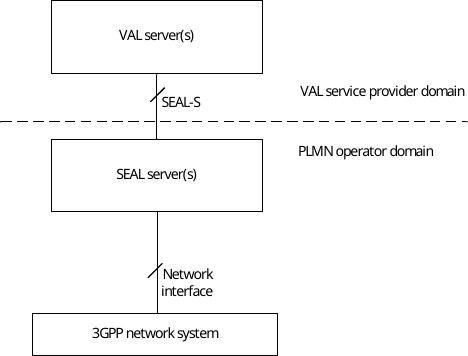

Figure 8.2.1-1: SEAL server(s) deployed in a single PLMN operator domain

Figure 8.2.1-2 illustrates the deployment of SEAL server(s) in multiple PLMN operator domain and provides SEAL services to the VAL server(s) deployed in the VAL service provider domain. SEAL servers deployed in multiple PLMN operator domain are not interconnected.

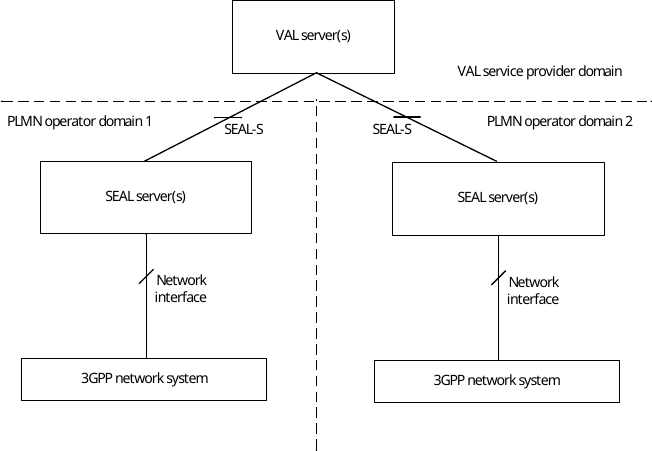

Figure 8.2.1-2: SEAL server(s) deployed in multiple PLMN operator domain without interconnection between SEAL servers

Figure 8.2.1-3 illustrates the deployment of SEAL servers in multiple PLMN operator domain and provides SEAL services to the VAL server(s) deployed in the VAL service provider domain. SEAL servers deployed in multiple PLMN operator domain are interconnected.

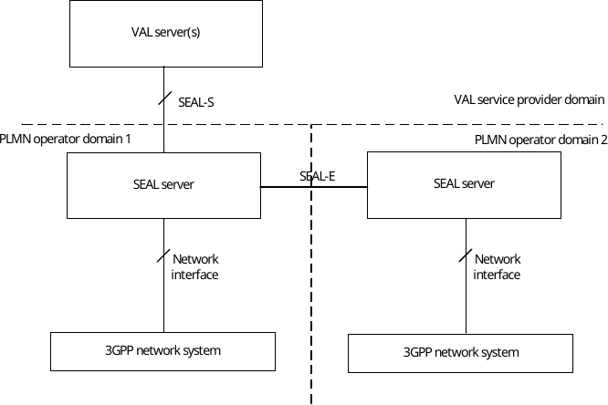

Figure 8.2.1-3: SEAL server(s) deployed in multiple PLMN operator domain with interconnection between SEAL servers

Figure 8.2.1-4 illustrates the deployment of SEAL servers in a single PLMN operator domain and provides SEAL services to the VAL server(s) deployed in the VAL service provider domain. SEAL servers deployed in a single PLMN operator domain are interconnected.

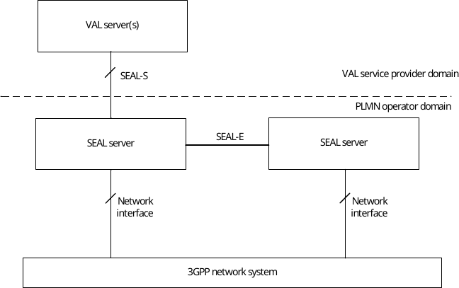

Figure 8.2.1-4: SEAL server(s) deployed in a single PLMN operator domain with interconnection between SEAL servers

### 8.2.2 SEAL server(s) deployment in VAL service provider domain

Figure 8.2.2-1 illustrates deployment of the SEAL server(s) and the VAL server(s) in VAL service provider domain.

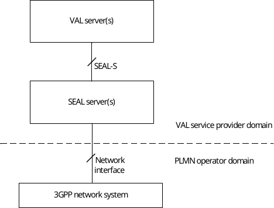

Figure 8.2.2-1: Deployment of SEAL server(s) with connections to 3GPP network system in a single PLMN operator domain

Figure 8.2.2‑2 illustrates deployment of the SEAL server(s) which connects to the 3GPP network system in multiple PLMN operator domain.

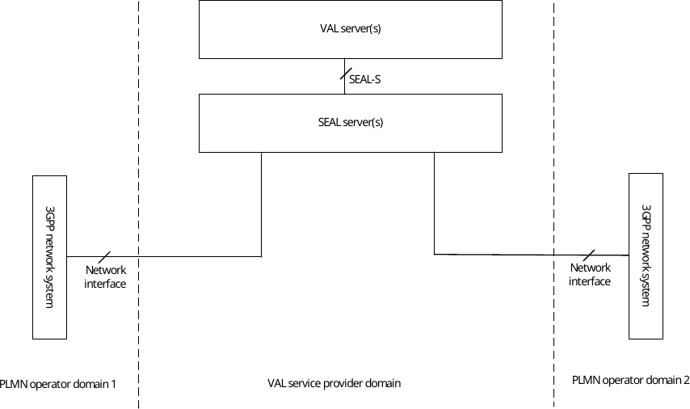

Figure 8.2.2‑2: Deployment of SEAL server(s) with connections to 3GPP network system in multiple PLMN operator domains

Figure 8.2.2‑3 illustrates the deployment of multiple SEAL servers in the VAL service provider domain where SEAL server 1 and SEAL server 2 connect with 3GPP network system of PLMN operator domain 1 and PLMN operator domain 2 respectively. The SEAL servers interconnect via SEAL-E and support the VAL service provider domain applications for the VAL UEs connected via both the PLMN operator domains.

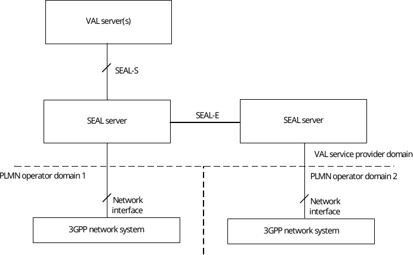

Figure 8.2.2‑3: Distributed deployment of SEAL servers in VAL service provider domain

### 8.2.3 SEAL server(s) deployment outside of VAL service provider domain and PLMN operator domain

Figure 8.2.3-1 illustrates deployment of the SEAL server(s) outside of both the VAL service provider domain and PLMN operator domain i.e. in SEAL provider domain.

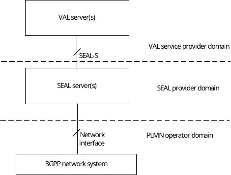

Figure 8.2.3-1: Deployment of SEAL server(s) outside of VAL service domain and PLMN operator domain

## 8.3 Deployment of SEAL client(s)

### 8.3.1 General description

SEAL provider may provide SEAL Client(s) as UE SDK on top of UE OS. SEAL Client(s) may be implemented in UE vendor domain.

### 8.3.2 Deployment of SEAL Client(s) in the same provider domain of SEAL server(s)

Figure 8.3.2-1 illustrates deployment of the SEAL client(s) in the same domain of SEAL server(s). In this case, SEAL server(s) can be deployed in any of the domain described in clause 8.2.1 or 8.2.2, or 8.2.3.

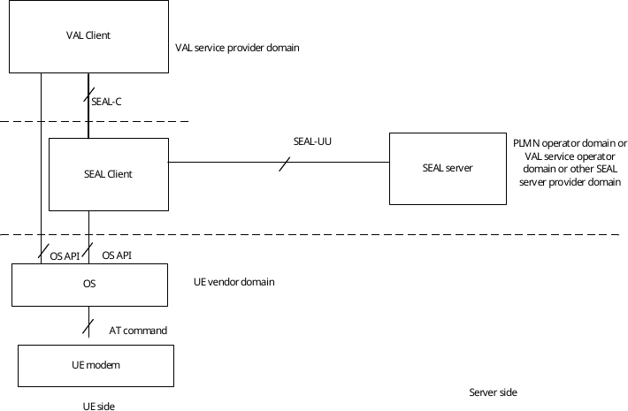

Figure 8.3.2-1: SEAL client(s) deployed in the same domain of SEAL server

### 8.3.3 Deployment of SEAL Client(s) in UE vendor domain

Figure 8.3.3-1 and Figure 8.3.3-2 illustrates deployment of the SEAL client(s) in UE Vendor domain, which is different with the domain of SEAL server. In this case, SEAL server(s) can be deployed in any of the domain described in clause 8.2.1 or 8.2.2, or 8.2.3.

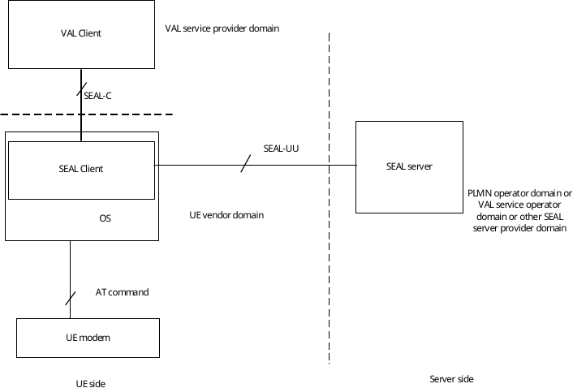

Figure 8.3.3-1: SEAL client(s) deployed in UE vendor domain (within OS)

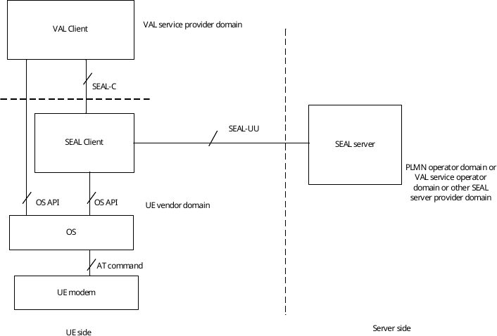

Figure 8.3.3-2: SEAL client(s) deployed UE vendor domain (outside OS)
