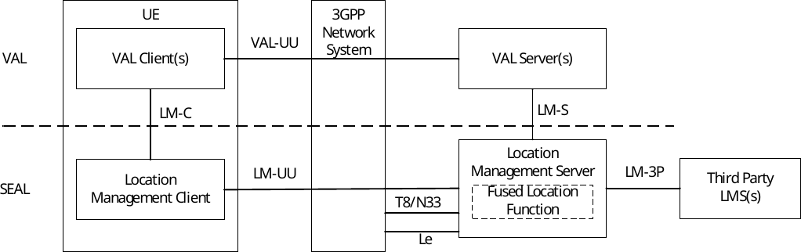
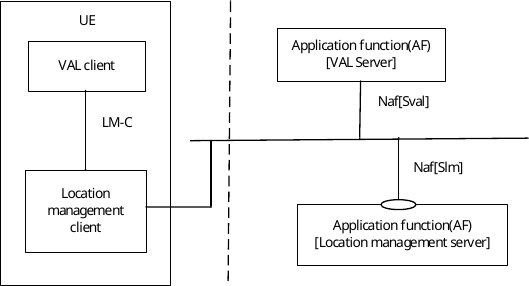
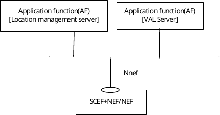
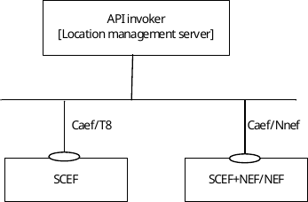
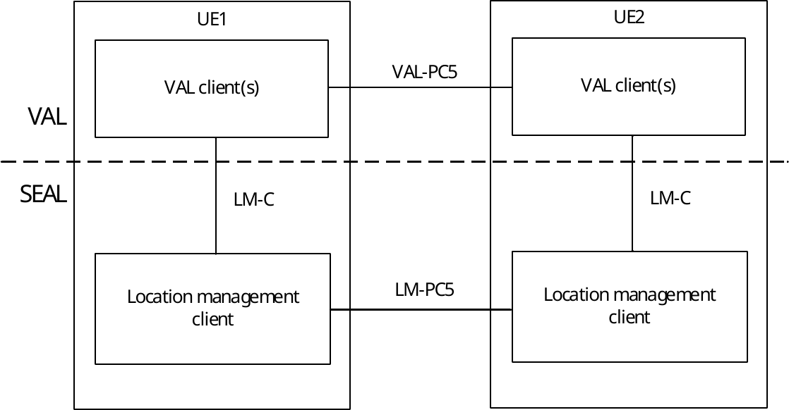

# 9.2 Functional model for location management

## 9.2.1 General

The functional model for the location management is based on the generic functional model specified in clause 6. It is organized into functional entities to describe a functional architecture which addresses the support for location management aspects for vertical applications. The on-network and off-network functional model is specified in this clause.

## 9.2.2 On-network functional model description

Figure 9.2.2-1 illustrates the generic on-network functional model for location management.

Figure 9.2.2-1: On-network functional model for location management

The location management client communicates with the location management server over the LM-UU reference point. The location management client provides the support for location management functions to the VAL client(s) over LM‑C reference point. The VAL server(s) communicate with the location management server over the LM-S reference point. The VAL client communicates with the VAL server over the VAL-UU reference point which is outside the scope of this document.

The location management server communicates with the SCEF via T8 reference point to obtain location information from the underlying 3GPP network system. The location management server obtains location information from the NEF via N33 reference point by mechanism defined in clause 5.2.6.2 of 3GPP TS 23.502 \[11\]. The location management server may obtain location information from the GMLC via Le reference point defined in clause 4.4.1 of 3GPP TS 23.273 \[50\]. The location management server may optionally obtains location information from the 3rd party location server via LM-3P reference point.

When the fused location function is present, the location management server, may use the location information from multiple sources to determine a more accurate UE location. The fused location function may select one or more location sources and location methods based on the requested location QoS which obtained from the location management server.

The location management server supports to report the requested value-added location information (e.g. Geofencing monitoring events, history location data, prediction related to UE location, etc.) to the VAL server over LM-S reference point.

NOTE 1: Location information from LCS of 4G system is not exposed by SCEF.

NOTE 2: Non-3GPP access used by the UE is out of scope of the present document.

Figure 9.2.2-2 exhibits the service-based interfaces for providing and consuming location management services. The location management server could provide service to VAL server and location management client through interface Slm.

Figure 9.2.2-2: Architecture for location management – Service based representation

Figure 9.2.2-3 illustrates the service-based representation for utilization of the 5GS network services based on the 5GS SBA specified in 3GPP TS 23.501 \[10\].

Figure 9.2.2-3: Architecture for location management utilizing the 5GS network services based on the 5GS SBA – Service based representation

Figure 9.2.2-4 illustrates the service-based representation for utilization of the Core Network (5GC, EPC) northbound APIs via CAPIF.

Figure 9.2.2-4: Utilization of Core Network Northbound APIs via CAPIF – service based representation

The Location management server acts as authorized API invoker to consume services from the Core Network (5GC, EPC) northbound API entities like SCEF, NEF, SCEF+NEF which act as API Exposing Function as specified in 3GPP TS 23.222 \[8\].

## 9.2.3 Off-network functional model description

Figure 9.2.3-1 illustrates the off-network functional model for location management.

Figure 9.2.3-1: Off-network functional model for location management

The location management client of the UE1 communicates with the location management client of the UE2 over the LM-PC5 reference point.

## 9.2.4 Functional entities description

### 9.2.4.1 General

The functional entities for location management SEAL service are described in the following subclauses.

### 9.2.4.2 Location management client

The location management client functional entity acts as the application client for location management functions. It interacts with the location management server and may provide UE-based positioning and location-related information. The location management client also supports interactions with the corresponding location management client between the two UEs.

### 9.2.4.3 Location management server

The location management server is a functional entity that receives and stores user location information and provides user location information to the vertical application server. The location management server may also acquire location information provided by PLMN operator via T8, N33, or Le reference points*.* The location management service may optionally obtain location information from 3rd party location servers via LM-3P reference point. The LM-3P reference point is out of scope of this specification*.*

The location management server acts as CAPIF's API exposing function as specified in 3GPP TS 23.222 \[8\]. The location management server also supports interactions with the corresponding location management server in distributed SEAL deployments. The location management server, with the fused location function, may combine/aggregate location information from multiple sources to provide a more accurate UE location. The location management server also supports to report the value-added location information (e.g. Geofencing monitoring events, history location data, prediction related to UE location, etc.) to the VAL server.

NOTE: The accuracy of location information acquired from 4G system via T8 reference point is not higher than cell level (ECGI) for E-UTRAN.

## 9.2.5 Reference points description

### 9.2.5.1 General

The reference points for the functional model for location management are described in the following subclauses.

### 9.2.5.2 LM-UU

The interactions related to location management functions between the location management client and the location management server are supported by LM-UU reference point. This reference point utilizes Uu reference point as described in 3GPP TS 23.401 \[9\] and 3GPP TS 23.501 \[10\].

LM-UU reference point provides a means for the location management server to receive location information report from the location management client. The LM-UU reference point shall use SIP-1 and SIP-2 reference points for subscription/notification related signalling. And for transport and routing of location management related signalling LM-UU reference point uses the HTTP-1 and HTTP-2 signalling control plane reference points.

### 9.2.5.3 LM-PC5

The interactions related to location management functions between the location management clients located in different VAL UEs are supported by LM-PC5 reference point. This reference point utilizes PC5 reference point as described in 3GPP TS 23.303 \[12\].

### 9.2.5.4 LM-C

The interactions related to location management functions between the VAL client(s) and the location management client within a VAL UE are supported by LM-C reference point.

### 9.2.5.5 LM-S

The interactions related to location management functions between the VAL server(s) and the location management server are supported by LM-S reference point. This reference point is an instance of CAPIF-2 reference point as specified in 3GPP TS 23.222 \[8\].

LM-S reference point is used by the VAL server to request and receive location information from location management server. The LM-S reference point shall use SIP-1 and SIP-2 reference points for subscription/notification related signalling. And for transport and routing of location management related signalling LM-S reference point uses the HTTP-1 and HTTP-2 signalling control plane reference points.

### 9.2.5.6 LM-E

The interactions related to location management functions between the location management servers in a distributed deployment are supported by LM-E reference point.

### 9.2.5.7 T8

The reference point T8 supports the interactions between the location management server and the SCEF and is specified in 3GPP TS 23.682 \[13\]. The functions related to location management of T8 are supported by the location management server.

### 9.2.5.8 Le

The reference point Le supports the interactions between the location management server and the GMLC and is specified in 3GPP TS 23.273 \[50\].

### 9.2.5.9 LM-3P

The reference point LM-3P is used for location retrieval of the target UE from a third-party location server.

NOTE: Further definition of LM-3P is out of scope of this specification.

### 9.2.5.10 N33

The reference point N33 supports the interactions between the location management server and the NEF and is specified in 3GPP TS 23.501 \[10\] and 3GPP TS 23.502 \[11\]. The functions related to location management of N33 are supported by the location management server.
