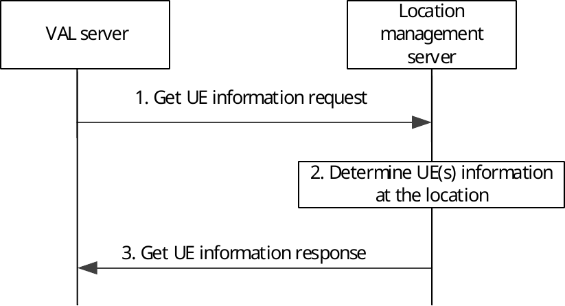

# 9.3.10 Obtaining UE(s) information at a location

Figure 9.3.10-1 describes the procedure for obtaining UE(s) information at a location. This procedure also applies for the Geofencing service that the VAL server may request the UE(s) information when the UE entering the Geofencing location area.

Pre-condition:

\- The VAL server has a jurisdiction over a geographical area for which the location management server is configured to operate.

\- The UE(s) in the geographical area have provided its location information to the location management server.

\- The location management server has obtained the requested UE location information either from 3GPP CN or the target location management client/VAL UE.

Figure 9.3.10-1: Obtaining UE(s) information at a location

1\. The consumer (VAL server or group management server) sends get UE information request to the location management server. The request contains the location information (e.g. geographic area, VAL service area identified by the VAL service area ID, Geofencing location area represented by different types of shape, etc) and application defined proximity range as defined in table 9.3.2.9-1.

2\. The location management server authorizes the request and determines the VAL UE(s) or VAL User(s) whose location are within the application defined proximity range of the location information or VAL service area identified by the VAL service area ID or Geofencing location area provided in step 1.

3\. The location management server sends get UE information response to the VAL server with a list of VAL UE(s) or VAL user(s) and its corresponding location information as determined in step 1.
