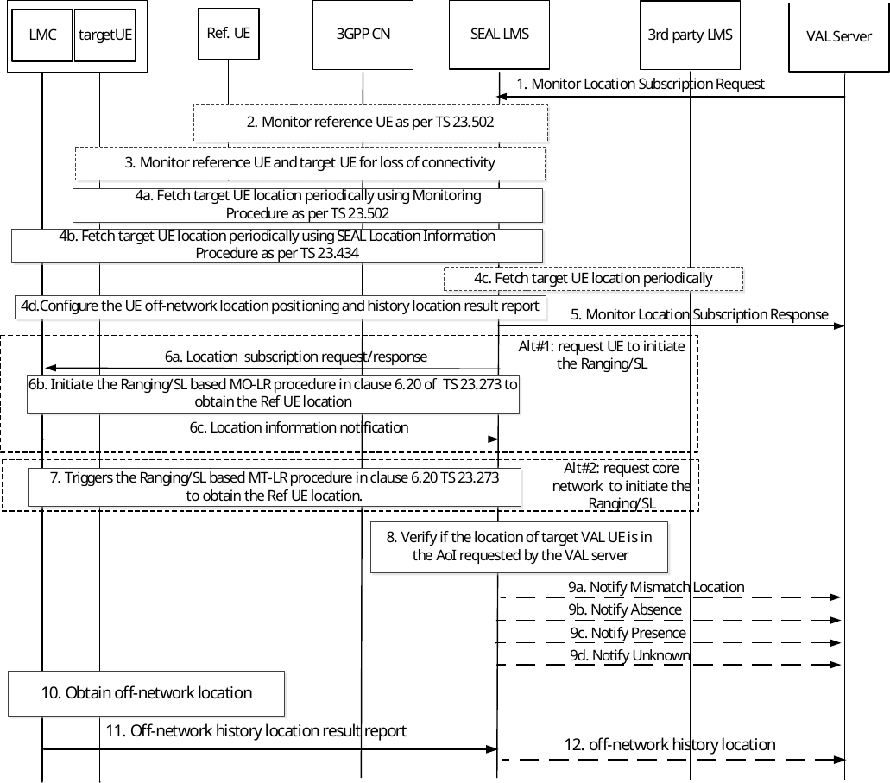

# 9.3.11 Monitoring Location Deviation

## 9.3.11.1 General

The VAL server requests the location management server to monitor the location of the VAL UE in relation to an area of interest. The LMS fetches the VAL UE's location information periodically from 3GPP core network as specified in 3GPP TS 23.502 \[11\] and also, using the Location Information procedures specified in clause 9.3.7 and clause 9.3.10. With the periodic location information of the UE from 3GPP core network and SEAL procedures, the location management server evaluates the current location of the VAL UE in relation to the area of interest configured by the VAL server. If subscribed, the VAL server is notified by the location management server when the VAL UE relationship (e.g. inside or outside) to the area of interest changes along with current location information of the VAL UE. The area of interest can be predefined or mobile where the latter one is used to support dynamic geofencing function.

## 9.3.11.2 Monitoring Location Deviation procedure

Figure 9.3.11.2-1 describes the procedure for monitoring the VAL UE's location in a given area of interest.

Pre-condition:

\- The location management server authorized to consume the 3GPP core network service (Monitoring events provided by NEF as specified in 3GPP TS 23.502 \[11\]).

Figure 9.3.11.2-1: Monitoring VAL UE's location at a given location

1\. The VAL server sends Monitor Location Subscription Request to location management server including target VAL UE Identifier(s), predetermined or dynamic area of interest information, notification interval and notification URI where the VAL server intends to receive the notifications from LM server regarding target VAL UE's presence in a given area, interested notification information, dynamic geofencing conditions.

\- "Area of interest" is the location information, which the VAL server wishes to monitor the target VAL UE's location adherence. This parameter can include an area of interest information and other relevant parameters. In the case of dynamic area of interest, it includes a reference VAL UE Identifier and its proximity range.

\- "Notify_Interval" represents the periodic interval in which the location management server needs to notify target VAL UE's location information to the VAL server. When the target VAL UE moves away from the "Area of interest", then the location management server ignores the "Notify_Interval" and sends the location notification to the VAL server immediately.

\- "dynamic geofencing conditions" includes a temporal condition(s) (e.g. time of day and day of week), connectivity condition(s) (e.g. operator information, roaming status, access type) and/or a spatial condition(s) (e.g. location area(s)), VAL UE capability (e.g. battery power), agreement (e.g. to serve as reference VAL UE for a time period) for the reference VAL UE. For instance, the monitoring is valid when a reference VAL UE is served by operator A without using satellite in location area X from 7:00am to 9:00am on working days.

2\. If dynamic area of interest information and dynamic geofencing conditions are received, the location management server requests 3GPP CN (e.g. NEF service for location, access type and roaming status monitoring as specified in 3GPP TS 23.502 \[11\]) to monitor the reference VAL UE location change, access type change and roaming status change, in order to determine spatial dynamicity in area of interest related to the target UE(s). If spatial condition is received, the location management server also requests 3GPP CN (i.e. NEF service for area of interest monitoring as specified in 3GPP TS 23.502 \[11\]) to know whether the reference VAL UE is in the VAL server's predetermined area (e.g. PLMN x). The location management server will process the monitoring considering the received dynamic geofencing conditions for the reference UE.

3\. If dynamic area of interest information is received, the location management server requests 3GPP CN (i.e. NEF service for loss of connectivity as specified in 3GPP TS 23.502 \[11\]) for both target UE(s) and reference UE.

4a. Location management server processes the Area of interest information in the request, and then subscribes to target VAL UE location monitoring as specified in 3GPP TS 23.502 \[11\] with appropriate parameters mapping. Based on the subscription, the location management server receives the target VAL UE location information periodically from the 3GPP core network. The LM server also invokes NEF service for Area of Interest monitoring as specified in clause 5.3.3 of 3GPP TS 23.256 \[52\] to know whether the target VAL UE is in the VAL server's predetermined or dynamic area of interest.

4b. LM server shall use the Location information procedures as specified in clause 9.3.7 and clause 9.3.10 to periodically obtain the target VAL UE location information. Based on the geographic information from the VAL server, the LM server may determine to additionally include the positioning methods in SEAL LMS procedures to obtain location information.

4c. LMS may periodically obtain the target VAL UE location information from the 3rd party location management server based on the geographic information from the VAL server.

4d. LM server may configure the off-network position and report policy to the target VAL UE and/or reference VAL UE as described in clause 9.3.21.4.1 when they still have connectivity. This is to initiate the UE-only Operation SL/Ranging as described in 3GPP TS 23.586 \[57\], cache the location, and report the location result when the connectivity is back. Time duration is included if the dynamic geofencing conditions is specified in step 1.

NOTE 1: How the LMS obtains the target VAL UE location from the 3rd party location management server is out of scope of this specification.

NOTE 2: Step 4a to 4d are performed for each target VAL UE if multiple target VAL UE identifiers are provided by the VAL server.

5\. Location management server, after successful subscription according to steps 2~4, sends Monitor Location Subscription response, indicating that the location management server accepts the VAL server's request and will monitor the location of the target VAL UE(s) to verify if the target VAL UE(s) is in the area of interest.

NOTE 3: Either step 6 or step 7 is performed if it is notified about loss of connectivity for the reference VAL UE and target VAL UE(s).

6\. The location management server requests the target VAL UE to obtain the reference UE's location information (i.e., the absolute location or the relative location between the reference UE and the target UE).

NOTE 4: In this figure, it assumes the reference VAL UE lost connectivity and the target VAL UE still has the connectivity. If the target VAL UE lost connectivity and the reference VAL UE has the connectivity, location management server requests the reference VAL UE to obtain the target VAL UE's location information.

6a. The location management server determines the reference VAL UE lost connectivity and the target VAL UE still has the connectivity, the location management server sends location subscription request to the target VAL UE. The reference VAL UE identity and the Ranging/SL positioning method, location type (i.e., the absolute location or the relative location) are included. The location management client in the target VAL UE returns a location subscription response.

Alternatively, if there is other target VAL UE also has the connectivity (which agreed to be reference UE in step 1), the location management server selects it as the Reference UE and sends location subscription request to the selected target VAL UE and indicate it to take up the role of reference UE for the dynamic geofence.

NOTE 5: In this release, the location management server can select an alternative reference UE (in case of loss of connectivity of the reference UE) for a geofencing service based on VAL UEs information provided by the VAL server during the Monitor Location Subscription procedure

6b. The target VAL UE initiates the Ranging/SL based MO-LR procedure as described in clause 6.20 of 3GPP TS23.273 \[50\] to obtain the reference VAL UE location information. The target VAL UE obtains the reference UE's location information.

6c. The target VAL UE sends the location notification with the reference UE's location information.

7\. Alternatively, the LM server requests the target UE's location information from the core network. The core network initiates the Ranging/SL based MT-LR procedure as described in clause 6.20 of 3GPP TS 23.273 \[50\] and obtains the target VAL UE location information.

8\. Location management server processes the location information received from SEAL Location Information procedures, the 3GPP core network and/or the 3rd party location management server, and validates the information. If the location information is matching, then the Location management server shall check if the VAL UE's current location is within the predetermined or dynamic area of interest received in step 1.

NOTE 6: The location information received from the 3GPP core network and from location management client does not necessarily be exactly the same, the location management server can aggregate the location information if there is no big deviation.

> Location management server verifies its determined target VAL UE location status (i.e. presence or absence with regard to the predetermined area of interest) with the retrieved 3GPP core network result from the NEF monitoring service for Area of Interest. The location management server will continue with step 7, step 8 and step 9 as applicable.

9a. If the location information received from location management client, the 3GPP core network and/or the 3rd party location management server do not match or the NEF reported Area of Interest monitoring result does not match with the determined target VAL UE location status (present/absence) in location management server, then the location management server shall consider the target VAL UE as outside from its specified area of interest and shall notify ("Notify Mismatch Location" message) the VAL server of the same, including target VAL UE ID and the location information from location management server, the 3GPP core network and/or the 3rd party location management server in the notification message.

9b. If the target VAL UE's current location is from location management client, the 3GPP core network and/or the 3rd party location management server matches, and either not in the predetermined area of interest received from VAL server in Monitor Location Subscription Request message or not within the proximity range of the reference UE, and such out of area of interest result is also aligned with the NEF reported area of interest monitoring result if available, then the location management server considers the target VAL UE as outside from its specified area of interest and shall notify the VAL server that the target VAL UE's current location is outside of area of interest and target VAL UE ID in "Notify Absence" message.

> If either the target VAL UE or the reference VAL UE lost connectivity, the location management server determines the target VAL UE is outside the predetermined area of interest or dynamic area of interest as follows.

\- If the target VAL UE lost connectivity, and the target VAL UE's current absolute location is obtained in step 6 or step 7, the LMS server determines the target VAL UE is outside the predetermined area of interest according to the target VAL UE's absolute location. The location management server determines the target VAL UE is not within the proximity range of the reference VAL UE based on the reference UEs' location obtained in step 4 and the target VAL UE's absolute location in step 6 or step 7.

\- If the target VAL UE lost connectivity, and target VAL UE's current relative location to the reference UE is obtained in step 6 or step 7, the LM server determines the target VAL UE is not in the predetermined area of interest or not within the proximity range of the reference VAL UE based on the reference VAL UEs' location obtained in step 4 and the target VAL UE's relative location to the reference UE in step 6 or step 7.

\- If the reference VAL UE lost connectivity, and the reference VAL UE's absolute location or relative location to the reference UE is obtained in step 6 or step 7, the location management server determines the target VAL UE is not within the proximity range of the reference VAL UE based on the target VAL UEs' location obtained in step 4 and the reference VAL UE's absolute or relative location to the reference UE in step 6 or step 7.

> The LM server notifies the VAL server "Notify Absence" message.

9c. When the target VAL UE's current location is either in the predetermined area of interest or in the proximity range of the reference UE, and such in area of interest result is also aligned with the NEF reported area of interest monitoring result if available, then the LM server shall notify ("Notify Presence" message) the VAL server periodically, according to the "Notify_Interval" value in "Monitor Location Subscription Request" message, indicating the VAL server that the target VAL UE is within the area of interest, along with target VAL UE's current location information.

> If either the target VAL UE or the reference VAL UE lost connectivity, the LM server determines the target VAL UE is within the predetermined area of interest or dynamic area of interest as follows.

\- If the target VAL UE lost connectivity, and the target VAL UE's current absolute location is obtained in step 6 or step 7, the LMS server determines the target VAL UE is within the predetermined area of interest according to the target VALUE’s absolute location. The LM server determines the target VAL UE is within the proximity range of the reference VAL UE based on the reference VAL UEs' location obtained in step 4 and the target VAL UE’s absolute location in step 6 or step 7.

\- If the target VAL UE lost connectivity, and target VAL UE's current relative location to the reference UE is obtained in step 6 or step 7, the LM server determines the target VAL UE is within the predetermined area of interest or within the proximity range of the reference VAL UE based on the reference VAL UEs’ location obtained in step 4 and the target UE's relative location to the reference UE in step 6 or step 7.

\- If the reference VAL UE lost connectivity, and the reference VAL UE's absolute location or relative location to the reference UE is obtained in step 6 or step 7, the LM server determines the target VAL UE is within the proximity range of the reference VAL UE based on the target VAL UEs’ location obtained in step 4 and the reference VAL UE's absolute or relative location to the reference UE in step 6 or step 7.

> And the location management server shall notify the VAL server "Notify Presence" message.

9d. If the location management server is notified by the 3GPP CN about loss of connectivity for the reference VAL UE and target VAL UE(s), or fails to obtains the target VAL UE's location or the reference UE' location in step 6 or step 7 (e.g., due to the target VAL UE and reference VAL UE are beyond the Ranging/SL range) or fails to select an alternative reference VAL UE in case of dynamic geofencing as defined in step 6a, considering the location of the target VAL UEs, then the location management server notifies ("Notify Unknown" message with detailed reason) the VAL server indicating that the location management server does not know whether the target VAL UE/reference VAL UE is "Presence" or “Absence", therefore the dynamic geofencing monitoring for the impacted target UE(s) is suspended.

NOTE 7: Upon "Notify Unknown", the VAL server can remind end user to check status for the reference/target UE, which is out of 3GPP scope.

NOTE 8: Notifications in step 9 can be subject to explicit notification indication from the VAL server, for instance, the VAL server can be interested to know only "Notify Absence" and "Notify Unknown".

NOTE 9: Void

10\. If both the target VAL UE and/or reference VAL UE lost the connectivity, the off-network target VAL UE and/or reference VAL UE initiate the UE-only Operation SL/Ranging as described in 3GPP TS 23.586 \[57\] or the procedure as defined in clause 9.5.3 and clause 9.5.4, and cache the location result as configured in step 4d.

11\. If the connectivity is back, the target VAL UE and/or reference VAL UE check whether it is still within the valid duration if configured. If yes, the the target UE and/or reference VAL UE report the cached history location to the location management server as described in clause 9.3.21.4.2.

12\. The location management server may use the cached history location e.g., to notify the VAL server about the history target VAL UE location status during the loss of connectivity.
