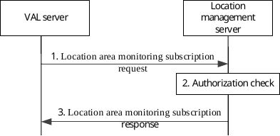
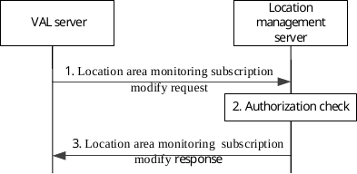
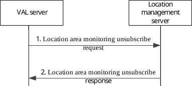
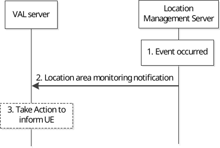

# 9.3.12 Location area monitoring information procedure

## 9.3.12.1 Location area monitoring subscription procedure

Figure 9.3.12.1-1 illustrates the high level procedure of location area monitoring subscription request. The same procedure can be applied for location management client and other SEAL servers that would like to subscribe to the list of UEs moving in or moving out of the specific location area. The subscription request can be for a reference UE for which the subscriber is authorized to monitor location information.

The procedure is also applied for Geofencing service which initiated via VAL server to subscribe to the location management server to report the Geofencing monitoring events.

Figure 9.3.12.1-1: Location area monitoring subscription procedure

1\. The VAL server sends a location area monitoring subscription request to the location management server to subscribe to the list of UEs moving in or moving out of the specific location area. In the request message, the VAL server includes the information as specified in Table 9.3.2.14-1. The location information criteria may include the geographic location information or the VAL service area identified by the VAL service area ID where the UEs moving in or moving out to be monitored, or it may include reference UE information where in the UEs moving in or moving out of given application defined proximity range from the reference UE (target UE) to be monitored. The reference UE information may include VAL UE ID.

If the VAL server initiates the subscription for the Geofencing service, the Geofencing monitoring events (i.e. the UEs moving in/out of the pre-defined location area, the number of UEs moving in/out of the pre-defined location area, the time period of UEs enter/leave the pre-defined location area) may be included in the request message as specified in Table 9.3.2.14-1.

2\. The location management server shall check if the VAL server is authorized to initiate the location area monitoring subscription request.

3\. The location management server replies with a location area monitoring subscription response indicating the subscription status. In the response message, the location management server includes the information as specified in Table 9.3.2.15-1.

## 9.3.12.2 Location area monitoring subscription modify procedure

Figure 9.3.12.2-1 illustrates the high level procedure of location area monitoring subscription modify request. The same procedure can be applied for location management client and other SEAL servers that would like to modify the subscription to the list of UEs moving in or moving out of the specific location area. The subscribe modify request can be for a reference UE for which the subscriber is authorized to monitor location information.

The procedure is also applied for Geofencing service that the VAL server modifies the subscription to the location management server to report the Geofencing monitoring events.

Figure 9.3.12.2-1: Location area monitoring subscription modify procedure

1\. The VAL server sends a location area monitoring subscription modify request to the location management server to modify the subscription to the list of UEs moving in or moving out of the specific location area or the Geofencing monitoring events. In the request message, the VAL server includes the information as specified in Table 9.3.2.17-1.

2\. The location management server shall check if the VAL server is authorized to initiate the location area monitoring subscription modify request.

3\. The location management server replies with a location area monitoring subscription modify response indicating the subscription status. In the response message, the location management server includes the information as specified in Table 9.3.2.18-1.

## 9.3.12.3 Location area monitoring unsubscribe procedure

Figure 9.3.12.3-1 illustrates the high level procedure of location area monitoring unsubscribe request. The same procedure can be applied for location management client and other SEAL servers that would like to unsubscribe to the list of UEs moving in or moving out of the specific location area. The unsubscribe request can be for a reference UE for which the subscriber is authorized to monitor location information.

The procedure is also applied for Geofencing service that the VAL server unsubscribes to the location management server to report the Geofencing monitoring events.

Figure 9.3.12.3-1: Location area monitoring unsubscribe procedure

1\. The VAL server sends a location area monitoring unsubscribe request to the location management server to unsubscribe to the subscription to the list of UEs moving in or moving out of the specific location area or the Geofencing monitoring events. In the request message, the VAL server includes the information as specified in Table 9.3.2.19-1.

2\. The location management server replies with a location area monitoring unsubscribe response indicating the subscription status. In the response message, the location management server includes the information as specified in Table 9.3.2.20-1.

## 9.3.12.4 Location area monitoring notification procedure

Figure 9.3.12.4-1 illustrates the high level procedure of location area monitoring notification. The same procedure can be applied for location management client and other SEAL servers who have subscribe to the list of the UEs moving in or moving out of the specific location area.

The procedure is also applied for Geofencing service which requests the location management server to report the Geofencing monitoring events.

Figure 9.3.12.4-1: Location area monitoring notification procedure

1\. One of the events occurs at the location management server as specified in the subscribe request. The location management server identifies the UEs which are moved into the area or moved out of the area based on the received UEs location data and time stamp of the location. The LMS may report the list of all UEs in the given location or UEs moved in and moved out.

When the Geofencing service is triggered, the location management server also checks whether the UE is inside/outside the area based on the location information criteria as defined in Table 9.3.2.14-1 and the received UE location data. Further, the LM Server statistics and reports the Geofencing monitoring events (e.g. the list of UEs moving in/out of the location area, the number of UEs moving in/out of the location area, the time period of UEs enter/leave the location area, etc.) to the VAL server.

2\. The location management server sends a location area monitoring notification to the VAL server. In the notification message, the location management server includes the information as specified in Table 9.3.2.16-1.

> If the location management server didn't obtain any UE location information due to UE issues or network issues in step 1, it informs the VAL server with the proper reason (e.g., "UE cannot be connected") in the notification report.

3\. After received the Geofencing information report from the location management server, the VAL server may take some actions to inform the VAL UE (e.g. send the alarms or warnings to the UE).

NOTE: The step 3 is out of 3GPP scope.
