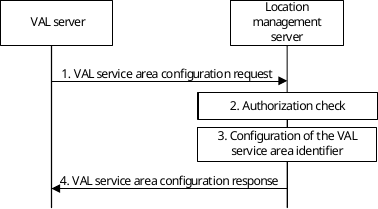
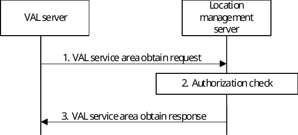
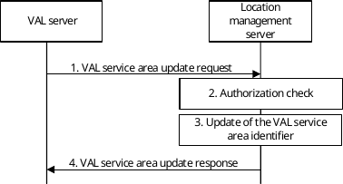
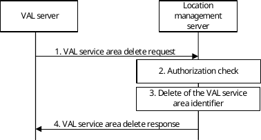
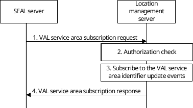
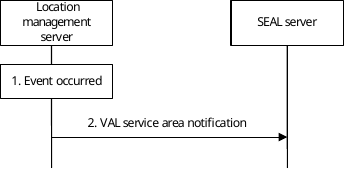
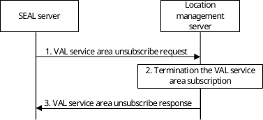
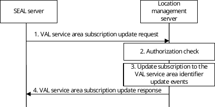

# 9.3.13 VAL Service Area configuration

## 9.3.13.1 General

The VAL service area refers to the geographical area(s) (e.g., coordinates, civic addresses, network areas) served by a VAL server. The VAL service area is identified by the VAL service area identifier (ID). The VAL server may have more than one VAL service area defined. These VAL service areas are configured by the VAL server to the location management server and are assigned with a unique VAL service area identifier. When the VAL service area configurations are in place the VAL server may use the VAL service area ID as part of the location information in the SEAL APIs requiring location information. These configurations can be updated by the VAL server in-order to modify the geographical area(s) associated with the VAL service area and when is updated, the SEAL internally manage the updates without requiring the VAL server to re-invoke the APIs where the updated VAL service area are being used.

## 9.3.13.2 Configure VAL service area identifier procedure

Figure 9.3.13.2-1 illustrates the high level procedure of the VAL service area identifier configuration.

Figure 9.3.13.2-1: Configure VAL service area identifier procedure

1\. The VAL server sends the VAL service area configuration request to the location management server to configure a new VAL service area identifier. In the request message, the VAL server includes the information as specified in table 9.3.2.21-1.

2\. The location management server shall check if the VAL server is authorized to initiate VAL service area identifier configuration request.

3\. If the VAL server is authorized to configure the VAL service area identifiers, the location management server checks the consistency of the provided identifiers (e.g., all VAL service area identifiers shall be unique) and configures the provided VAL service area identifiers.

4\. The location management server sends the VAL service area configuration response with the information as specified in table 9.3.2.22-1.

## 9.3.13.3 Obtain VAL service area identifier procedure

Figure 9.3.13.3-1 illustrates the high level procedure of the VAL service area retrieval.

Figure 9.3.13.3-1: Obtain VAL service area procedure

1\. The VAL server sends the VAL service area obtain request to the location management server to retrieve the VAL service area identifiers. In the request message, the VAL server includes the information as specified in table 9.3.2.26-1.

2\. The location management server shall check if the VAL server is authorized to initiate VAL service area obtain request.

3\. If the VAL server is authorized to obtain the VAL service area identifiers, the location management server sends the VAL service area obtain response with the information as specified in table 9.3.2.27-1.

## 9.3.13.4 Update VAL service area identifier procedure

Figure 9.3.13.4-1 illustrates the high level procedure of the VAL service area update.

Figure 9.3.13.4-1: Update VAL service area procedure

1\. The VAL server sends the VAL service area update request to the location management server to update the VAL service area identifier(s) configured by the VAL server. In the request message, the VAL server includes the information as specified in table 9.3.2.28-1.

2\. The location management server shall check if the VAL server is authorized to initiate VAL service area update request.

3\. The location management server checks whether the VAL service area IDs exist and then updates the VAL service area identifier(s).

4\. The location management server sends the VAL service area update response with the information as specified in table 9.3.2.29-1.

## 9.3.13.5 Delete VAL service area identifier procedure

Figure 9.3.13.5-1 illustrates the high level procedure of the VAL service area delete.

Figure 9.3.13.5-1: Delete VAL service area procedure

1\. The VAL server sends the VAL service area delete request to the location management server to delete the VAL service area identifier(s) configured by the VAL server. In the request message, the VAL server includes the information as specified in table 9.3.2.30-1.

2\. The location management server shall check if the VAL server is authorized to initiate VAL service area delete request.

3\. The location management server checks whether the VAL service area IDs exist and then deletes the VAL service area identifier(s).

NOTE: An deletion of the VAL service area ID(s) does not affect the existing subscriptions in the SEAL layer.

4\. The location management server sends the VAL service area delete response with the information as specified in table 9.3.2.31-1.

## 9.3.13.6 VAL service area identifier subscribe procedure

Figure 9.3.13.6-1 illustrates the high level procedure of the subscribe VAL service area update events.

Figure 9.3.13.6-1: Subscribe VAL service area procedure

1\. The SEAL server sends the VAL service area subscription request to the location management server to subscribe for the VAL service area identifier(s) update events. In the request message, the SEAL server includes the information as specified in table 9.3.2.42-1.

2\. The location management server shall check if the SEAL server is authorized to susbcribe for the VAL service area identifier(s) update event(s).

3\. if the SEAL server is authorized to subscribe for the VAL service area identifier(s) update events, the location management server creates the subscription based on the provided parameters in the request.

4\. The location management server sends the VAL service area subscription response with the information as specified in table 9.3.2.43-1.

## 9.3.13.7 VAL service area identifier notify procedure

Figure 9.3.13.7-1 illustrates the high level procedure for notification of a SEAL server about the VAL service area identifier update events at the location management server.

Pre-conditions:

\- the SEAL server has an active VAL service area subscription at the location management server; and

\- the subscribed event has occurred.

Figure 9.3.13.7-1: Notify VAL service area procedure

1\. The location management server identifies the list of the occurred events for which the SEAL server subscribed.

2\. The location management server sends a VAL service area notification to the SEAL server. In the notification message, the location management server includes the information as specified in table 9.3.2.44-1.

## 9.3.13.8 VAL service area identifier unsubscribe procedure

Figure 9.3.13.8-1 illustrates the high level procedure for a SEAL server to unsubscribe the notifications about the VAL service area identifier update events at the location management server.

Pre-conditions:

\- the SEAL server has an active VAL service area subscription at the location management server.

Figure 9.3.13.8-1: Unsubscribe VAL service area procedure

1\. When the SEAL server decides to terminate a VAL service area subscription, it sends a VAL service area unsubscribe request to the location management server. In the request message, the SEAL server includes the information as specified in table 9.3.2.45-1.

2\. If the SEAL server is authorized to terminate the subscription, the location management server terminates the VAL service area subscription.

3\. The location management server sends a VAL service area unsubscribe response to the SEAL server, the location management server includes the information as specified in table 9.3.2.46-1.

## 9.3.13.9 VAL service area identifier subscription update procedure

Figure 9.3.13.9-1 illustrates the high level procedure of the update subscription for the VAL service area update events.

Figure 9.3.13.9-1: VAL service area identifier subscription update procedure

1\. The SEAL server sends the VAL service area subscription update request to the location management server to update the existing subscription for the VAL service area identifier(s) update events. In the request message, the SEAL server includes the information as specified in table 9.3.2.42-1.

2\. The location management server shall check if the SEAL server is authorized to update the subscription for the VAL service area identifier(s) update event(s).

3\. if the SEAL server is authorized, the location management server checks whether the target susbcription exists and then updates the subscription for the VAL service area identifier(s) update events.

4\. The location management server sends the VAL service area subscription update response with the information as specified in table 9.3.2.43-1.
