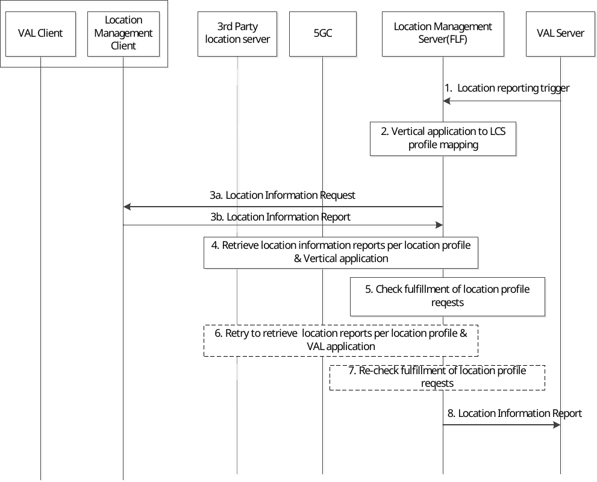

# 9.3.14 Location profiling for supporting location service enablement

## 9.3.14.1 Location profiling

The location management server enhanced with the Fuse Location Function(FLF) supports the creation of location profiles for location service at the application enablement layer and the mapping of location profiles to one or more vertical applications. Location profiling is based on the vertical driven hybrid positioning requirements and policies.

The example of attributes that can be used for the location profiles is specified in Annex D.

## 9.3.14.2 Procedure of Location profiling for location service

The procedure includes the translation of the vertical request to a location profile and the derivation of the requested location information report.

Pre-condition: The location management server has configured a set of location service profiles.

Figure 9.3.14.2-1: Location profiling for location derivation and exposure

1\. The location management server receives a location reporting trigger from VAL server and activates a location reporting procedure as defined in clause 9.3.5.

2\. The fused location function determines a mapping of the vertical location services to a location service profile based on the location request information, the location profiles and the location capability of VAL UE which registered to the location management server before.

3a. The location management server requests from the LMC the location information of the target VAL UE optionally with the requested location information (the access type, positioning method) based on the determined location profiles in location management server obtained in step 2.

3b. The location management client responds to the location management server the location report based on the request.

4\. The location management server performs a location information request to one or more of the following (based on the location profile):

\- to GMLC directly or via NEF (as defined in TS 23.273 \[50\]), acting as AF.

\- to 3rd party location servers.

5\. The fused location function calculates the location information based on combined location reports from step 3~4 and checks whether the location reports fulfil the location profile requirements.

6-7. If the requirements are not fulfilled, the location management server will repeat the step 3~5 iteratively to request location information and re-check whether the requirements are met or not.

8\. If the requirements are fulfilled, the location management server sends the location information report to the VAL server.
