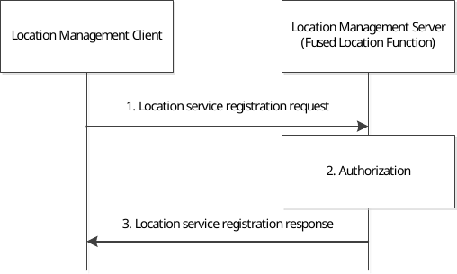

# 9.3.15 Location service registration procedure

Before the location management server requesting the location information for the target UE, the location management client may register the available location services to the location management server to report the UE's location capabilities.

Figure 9.3.15-1 illustrates the procedure of client-triggered location service registration.

Figure 9.3.15-1: Location service registration procedure

1\. The location management client of a VAL UE sends location service registration request to the location management server, with the identifier of the UE (e.g. GPSI) and UE-based location capabilities, the associated ID with other UEs, etc.

2\. The location management server checks authorization for the VAL UE's registration request.

3\. After successful authorization, location management server sends location service registration response to the location management client and stores the UE's information received in step 1.
